# Chapter 1: OLAP Fundamentals

This chapter lays the conceptual groundwork for everything that follows in RainDB. We start with workload taxonomy, dimensional modeling, and how analytical database design evolved. Once those ideas are in place, we connect them to RainDB's columnar batches, vectorized execution, and embedded engine architecture.

# Part I: Concepts and Theory

## 1.1 Two families of database workloads

Talk to any DBA long enough and you'll hear the same split: some databases are built for **transactions**, others for **analysis**. The labels are OLTP and OLAP, but the real divide is access pattern — and that pattern drives every downstream decision about layout, concurrency, and execution.

### OLTP: Online Transaction Processing

OLTP systems live and die on **short, precise operations**: fetch one order, debit one account, insert one row. Latency is measured in milliseconds; consistency is non-negotiable.

| Characteristic | Typical OLTP behavior |
|----------------|----------------------|
| Access pattern | Point lookups, small range scans, inserts/updates/deletes |
| Query shape | `SELECT * FROM orders WHERE id = ?` |
| Latency target | Milliseconds per request |
| Concurrency | Many short concurrent transactions |
| Storage layout | **Row-oriented** — all columns of one row live adjacent in memory or on disk |
| Indexing | B-trees, hash indexes on primary/foreign keys |

Row stores fit because a single-row read is one contiguous fetch. Updating a customer's address rewrites that row's columns together. ACID semantics and row-level locking align naturally with the layout.

### OLAP: Online Analytical Processing

OLAP systems chew through **large slices of data** to produce aggregates, joins across fact and dimension tables, and windowed statistics. Throughput and scan efficiency matter more than single-row latency.

| Characteristic | Typical OLAP behavior |
|----------------|----------------------|
| Access pattern | Full or partial table scans, group-by, sort, join |
| Query shape | `SELECT region, SUM(revenue) FROM sales GROUP BY region` |
| Latency target | Seconds to minutes for large datasets (batch acceptable) |
| Concurrency | Fewer, heavier queries; often read-mostly |
| Storage layout | **Column-oriented** — values of one column are stored contiguously |
| Indexing | Zone maps, min/max metadata, sort orders; less emphasis on point indexes |

Column stores win when queries need only a few columns. A revenue rollup touches `amount` and `region`; it never reads `customer_notes` or `ship_date`. Projecting only the columns you need shrinks I/O and memory bandwidth roughly in proportion to how selective the projection is.

### The fundamental tension

No layout optimizes both workloads. Row stores keep per-row update cost low; column stores keep per-column scan cost low. HTAP hybrids exist, but complexity rises fast. RainDB commits to OLAP — deliberately, without apology.

---

## 1.2 Dimensional modeling: star and snowflake schemas

Before you can reason about execution, you need a picture of how analytical data is **organized**. Data warehousing settled on the **dimensional model** — Ralph Kimball's contribution in the 1990s — where measurable events (facts) sit at the center and descriptive context (dimensions) radiate outward.

### Fact tables

A **fact table** records business events at a grain the analyst chooses. Each row is one atomic measurement: a sale, a click, a shipment, a sensor reading.

| Property | Description |
|----------|-------------|
| Grain | The finest level of detail (e.g., one line item per row) |
| Measures | Numeric columns aggregated in queries (`quantity`, `revenue`, `margin`) |
| Foreign keys | References to dimension tables (`product_id`, `date_id`, `store_id`) |
| Row volume | Typically the largest table in the warehouse |

Example fact table `order_lines`:

| order_line_id | product_id | date_id | store_id | quantity | line_total |
|---------------|------------|---------|----------|----------|------------|
| 1001 | 42 | 20250911 | 7 | 3 | 89.97 |
| 1002 | 17 | 20250911 | 3 | 1 | 24.50 |

### Dimension tables

**Dimension tables** supply the "who, what, where, when" around facts. They tend to be wider, shorter, and slower-changing than fact tables.

| Dimension | Typical columns | Role |
|-----------|-----------------|------|
| `dim_product` | name, category, brand, unit_cost | Product attributes for slicing |
| `dim_date` | year, quarter, month, day_of_week | Time hierarchies |
| `dim_store` | region, city, format | Geographic rollups |

Dimensions join to facts on surrogate keys. "Revenue by region and quarter" joins `order_lines` to `dim_store` and `dim_date`, then sums `line_total`.

### Star schema

In a **star schema**, the fact table sits at the center and dimensions branch out without further normalization:

```
                    dim_date
                       |
                       |
    dim_product ---- order_lines ---- dim_store
                       |
                       |
                  dim_customer
```

**Advantages:**

- Simple mental model for analysts
- Fewer joins than snowflake (better for wide scans)
- Denormalized dimensions reduce join fan-out

**Disadvantages:**

- Redundant dimension attributes (e.g., `category` repeated per product row if not normalized)
- Larger dimension tables

### Snowflake schema

A **snowflake schema** normalizes dimensions into sub-dimensions:

```
dim_product → dim_category → dim_department
```

`dim_product` holds `category_id`; `dim_category` holds `category_name` and `department_id`; `dim_department` holds `department_name`.

| Aspect | Star | Snowflake |
|--------|------|-----------|
| Join count | Fewer | More |
| Storage | More redundancy | Less redundancy |
| Query complexity | Lower | Higher |
| ETL complexity | Simpler dimension loads | More tables to maintain |

Modern columnar engines join efficiently, so snowflake normalization hurts less than it did on 1990s row stores. Star schemas remain common in embedded and mid-tier analytics because they keep join depth shallow.

### Relational algebra view

A typical OLAP query over a star schema:

```
π_{region, SUM(line_total)} (
  γ_{region; SUM(line_total)} (
    σ_{date.year = 2025} (
      order_lines ⋈_{store_id} dim_store
                 ⋈_{date_id} dim_date
    )
  )
)
```

Where:

- `σ` = selection (filter)
- `⋈` = join
- `γ` = group-by aggregate
- `π` = projection

Each algebraic operator maps to a physical operator in the query plan (scan, hash join, hash aggregate). Knowing the algebra makes EXPLAIN output readable.

---

## 1.3 ETL path versus query path

Analytical systems run two lifecycles with different performance goals. Confusing them leads to bad design decisions.

### ETL: Extract, Transform, Load

**ETL** (or ELT — load first, transform in-warehouse) is the **write path**:

```
Source systems → staging → cleansing → dimensional model → columnar storage
```

| ETL concern | Implication |
|-------------|-------------|
| Throughput | Batch millions of rows per second |
| Idempotency | Re-running a pipeline must not duplicate facts |
| Schema drift | New columns appear; old batches may lack them |
| Compression | Dictionary-encode low-cardinality strings during load |
| Sort order | Clustering by `date_id` enables zone-map pruning |

ETL favors **append-heavy, batch-oriented** writes. Row-at-a-time inserts are avoided; loaders produce 64K–1M row batches aligned with execution vector sizes.

### Query path

The **query path** is read-mostly:

```
SQL / API → parse → logical plan → physical plan → vectorized execution → result
```

| Query concern | Implication |
|---------------|-------------|
| Latency | Minimize bytes read and CPU per row |
| Parallelism | Partition work into independent morsels |
| Memory | Stream batches; spill hash tables if needed |
| Correctness | SQL three-valued logic for NULLs |

### Why the split matters

Tuning ETL and queries at the same time creates friction:

- ETL wants sorted, compressed, wide batches
- Ad-hoc queries want flexible projection and late-binding filters
- Individual fact updates are rare in OLAP; **append-only** storage simplifies both paths

RainDB's `MemoryTable` append model reflects this: batches are immutable after append; scans walk them in insertion order.

```text
ETL path (pseudocode):
  for each source_batch in extractor:
    transformed = transform(source_batch)
    columnar_batch = to_columnar(transformed)
    table.append_batch(columnar_batch)

Query path (pseudocode):
  plan = compile(sql)
  for each batch in table.batches:
    partial = execute_operator(plan, batch)
    merge(partials)
  return final_result
```

---

## 1.4 Amdahl's law and parallel scan

Analytical engines split tables into **morsels** — batch-sized chunks of work that workers can process independently. **Amdahl's law** tells you how much speedup parallelism can actually deliver:

```
Speedup = 1 / (S + P/N)

S = serial fraction (cannot parallelize)
P = parallel fraction (1 - S)
N = number of workers
```

### Applied to table scan

Consider scanning 100 batches on 10 cores:

| Component | Serial? | Notes |
|-----------|---------|-------|
| Plan compilation | Yes | Happens once before scan |
| Per-batch scan | No | Each batch is independent |
| Global aggregate merge | Partially | Combining 10 partial sums is cheap |
| Result ordering | Maybe | `ORDER BY` may require merge sort |

If 95% of scan time parallelizes across batches and 5% is serial setup, maximum speedup at N=∞ is `1/0.05 = 20×` — no matter how many cores you add.

### Practical implications

1. **Batch count must exceed core count** — 4 batches on 32 cores leaves 28 cores idle.
2. **Batch size trades parallelism for overhead** — tiny batches inflate the serial fraction (dispatch, synchronization).
3. **Associative aggregates parallelize cleanly** — `SUM`, `COUNT`, `MIN`, `MAX` combine partials in any order.
4. **Non-associative operations need care** — floating-point `SUM` order affects rounding; `AVG` requires `SUM` + `COUNT` partials.

```text
Parallel scan pseudocode:
  partials = array[N_batches]
  parallel_for i in 0..N_batches-1:
    partials[i] = scan_batch(batches[i], predicate, projection)
  return reduce(partials, combine_fn)
```

RainDB's `VectorizedScanEngine` schedules batch indices across threads and merges partial aggregate results deterministically.

---

## 1.5 History of column stores

Column-oriented storage did not appear overnight. Tracing its development clarifies why modern engines make the choices they do.

### Early motivations (1980s–1990s)

Systems like **Tandem** and **Sybase IQ** showed that storing columns separately on disk improved scan performance for decision-support queries. The bottleneck was **I/O bandwidth**, not CPU cycles.

### MonetDB (1990s–2000s)

**MonetDB** (CWI, Netherlands) introduced the **BAT** (Binary Association Table) model:

- Each column is a `(oid, value)` pair or a dense array
- Operators consume and produce columns, not rows
- Query plans are algebra trees over column vectors

The **X100** research project added **vectorized execution** — processing thousands of values per operator call instead of one row at a time. That pattern became the blueprint for modern OLAP.

### C-Store / Vertica (2005)

**C-Store** (Stonebraker et al., 2005) split storage into read-optimized and write-optimized stores:

| Store | Layout | Purpose |
|-------|--------|---------|
| Read-optimized | Columnar, compressed, sorted | Analytical queries |
| Write-optimized | Row-oriented | Ingest and updates |
| Tuple mover | Background merge | Reconcile stores |

C-Store became commercial **Vertica**. The dual-store pattern influenced **Snowflake** (micro-partitions) and **ClickHouse** (merges).

### Apache Parquet, ORC, Arrow (2010s)

Open columnar formats standardized on-disk and in-memory layouts:

- **Parquet** — nested columnar with page-level statistics (zone maps)
- **ORC** — Hive-optimized with stripe-level indexes
- **Apache Arrow** — in-memory columnar interchange (offset strings, validity bitmaps)

RainDB's `Utf8ColumnChunk` offset layout follows Arrow's string representation philosophy.

### Timeline summary

| Era | System | Contribution |
|-----|--------|--------------|
| 1990s | MonetDB | Column BAT algebra |
| 2000s | Vertica (C-Store) | Dual-store, compression |
| 2010s | DuckDB, ClickHouse | Embedded / real-time OLAP |
| 2020s | RainDB, DataFusion | In-process columnar for application runtimes |

---

## 1.6 Volcano iterator model versus vectorization

How a query engine executes operators is a foundational design choice — one that separates row-store OLTP from column-store OLAP.

### The Volcano (iterator) model

Graefe's **Volcano model** (1993), also called the **iterator** or **tuple-at-a-time** model, chains operators through a uniform pull interface:

```text
interface Operator:
  open()
  next() → Row | EOF
  close()

// Scan
open: position = 0
next: if position < n: return rows[position++]; else EOF

// Filter
open: child.open()
next: while row = child.next():
         if predicate(row): return row
       return EOF
```

**Advantages:**

- Simple composition — every operator exposes `Next()`
- Low memory — only one row resident
- Easy nested-loop join
- Natural for pipelining (producer pushes to consumer)

**Disadvantages for analytics:**

- Virtual dispatch per row (billions of calls)
- Poor CPU cache utilization — jumping between columns and rows
- Hard to apply SIMD — one value per loop iteration
- Function call overhead dominates when scans are billions of rows

### The vectorization model

Columnar engines use the **vectorization model** (batch model, morsel model):

```text
for each batch in table.batches:
  column_vectors = load_columns(batch, needed_indices)
  selection = evaluate_filters(column_vectors)   // dense index list or bitmask
  output = project_columns(column_vectors, selection)
  parent.consume(output)
```

One function invocation processes thousands of rows.

**Advantages:**

- Sequential memory access per column
- SIMD-friendly inner loops
- Amortized dispatch and branch prediction
- Cache-conscious — one column fits in L2/L3 during a pass

**Disadvantages:**

- Higher memory per operator (full batch resident)
- Complex handling of variable-width types
- Selection vectors add indirection for sparse filters

### Comparison table

| Aspect | Volcano | Vectorized |
|--------|---------|------------|
| Unit of work | 1 row | 1 batch (1K–1M rows) |
| Dispatch cost | Per row | Per batch |
| SIMD | Difficult | Natural |
| Memory | Minimal | Batch-sized |
| Pipelining | Tight | Between batches |
| Representative systems | PostgreSQL (row mode), SQLite | MonetDB, DuckDB, RainDB |

### Hybrid models

Modern systems blend approaches:

- **Vectorized scans** with **row-oriented fallbacks** for complex expressions
- **Compiled plans** (LLVM JIT) that fuse operators into tight loops
- **Morsel parallelism** — vectorized within a batch, parallel across batches

RainDB Phase 1 is predominantly vectorized for fixed-width predicates and aggregates, with scalar fallbacks for UTF-8 filters and null-heavy paths.

---

## 1.7 Columnar memory layout (conceptual)

### Row store layout

Imagine a table with three rows and three columns (`id`, `name`, `amount`):

```text
Row store (conceptual memory):

  Row 0: [ id=1 | name="Ada"  | amount=100.0 ]
  Row 1: [ id=2 | name="Bob"  | amount=200.0 ]
  Row 2: [ id=3 | name="Cy"   | amount=150.0 ]

Physical bytes (simplified):

  [1][Ada...][100.0][2][Bob...][200.0][3][Cy...][150.0]
   ^--- row 0 ---^  ^--- row 1 ---^  ^--- row 2 ---^
```

To sum `amount`, the CPU loads entire rows and discards `id` and `name` bytes. Variable-width strings break cache-line alignment between rows.

### Column store layout

```text
Column store (one batch, 3 rows):

  Column "id" (Int32):
    Values:     [ 1 ][ 2 ][ 3 ]     (12 bytes contiguous)
    NullBitmap: (empty — no nulls)

  Column "name" (Utf8):
    Offsets: [0, 3, 6, 8]
    Values:  "AdaBobCy"              (concatenated UTF-8)

  Column "amount" (Float64):
    Values:     [100.0][200.0][150.0]  (24 bytes contiguous)
```

The horizontal slice tying columns together is the **batch**. Row *i* is not an object — it is the tuple `(columns[0].values[i], columns[1].values[i], …)` reconstructed by index.

**Key insight:** Hot-path operators never allocate per-row wrapper objects.

### Why contiguous homogeneous arrays matter

Fixed-width numeric columns store `N` values as `N × width` bytes. The execution engine can:

1. Cast the byte span to a typed span
2. Loop with tight scalar code or SIMD intrinsics
3. Prefetch the next cache line because access is sequential

---

## 1.8 Batches, morsels, and vector sizing

### Terminology

| Term | General meaning | Role in columnar engines |
|------|-----------------|--------------------------|
| **Batch** | Horizontal slice of N rows across all columns | Unit of storage and execution |
| **Morsel** | Unit of parallel work | Typically one batch index per worker |
| **Vector / chunk** | One column's data within a batch | SIMD kernel input |
| **Vectorization** | Applying one operation to many values | Amortizes per-operator overhead |

A table is not one giant array. It is an append-only list of batches. Scans iterate batches, optionally in parallel — each batch is an independent morsel.

### Vector size tradeoffs

| Batch size | Pros | Cons |
|------------|------|------|
| Small (1–100 rows) | Low memory, fast unit tests | High per-batch overhead, poor SIMD |
| Medium (64K rows) | Good SIMD, L2-friendly | Moderate memory per batch |
| Large (1M rows) | Maximum SIMD amortization | May exceed L3, limits parallelism |

Production OLAP engines typically target **64K–1M rows** per vector. RainDB documents this range in `VectorChunkLimits` (see Part II).

---

## 1.9 CPU caches, memory bandwidth, and SIMD

### The memory wall

CPU clock speeds plateaued; core counts multiplied. Analytical performance is now usually **memory-bandwidth bound**, not ALU bound. Summing a billion doubles is fast if the doubles stream from L3 cache; it crawls if each load misses to DRAM.

Columnar layout helps because:

1. **Spatial locality** — summing `Float64` touches only 8 bytes per row, packed sequentially
2. **Temporal locality** — one column fits in cache levels; revisit it for multiple aggregates
3. **Prefetcher friendliness** — hardware prefetchers recognize stride-8 sequential access

### Cache hierarchy intuition

```text
  L1d  (~32 KB per core, ~1 cycle)
    ↑
  L2   (~256 KB–1 MB per core)
    ↑
  L3   (~10–60 MB shared)
    ↑
  DRAM (hundreds of cycles)
```

A 64K-row `Float64` column ≈ 512 KB. It may spill past L1 but often fits L2 per core during a single aggregate pass. A row store scanning the same logical rows might load 200+ bytes per row (strings, metadata), blowing cache budgets.

### SIMD overview

**Single Instruction, Multiple Data** (SIMD) applies one instruction to a vector of values:

```text
Scalar:  sum = a[0]+a[1]+a[2]+a[3]   (4 additions, 4 loads)
SIMD:    sum_vec = ADD(vec_load(a[0..3]), accumulator)  (1 instruction, 1 load)
```

AVX2 on x86 processes 4 `double` values per instruction. Requirements:

- Aligned buffers for optimal loads
- Length multiples of vector width (scalar tail after vector loop)
- Dense non-null data in fast paths (null bitmap checks break vector lanes)

---

## 1.10 When embedded OLAP wins

Not every analytical workload needs a cloud data warehouse. **Embedded OLAP** runs the engine inside your application process — no separate server, no network hop per batch.

### Client-server versus embedded

| Aspect | Client-server (Snowflake, BigQuery) | Embedded (DuckDB, RainDB) |
|--------|-------------------------------------|----------------------------|
| Deployment | Separate service, network | NuGet package, in-process |
| Latency | Network + serialization per batch | Direct memory access |
| Scaling | Independent warehouse scaling | Scales with app process |
| Multi-tenancy | Native | One engine per tenant/instance |
| Operational cost | Infrastructure + billing | Application memory only |

### Embedded OLAP suits

- Application-local reporting caches
- ETL staging before warehouse upload
- Integration tests needing real columnar semantics without Docker
- Demos and prototypes
- Desktop tools and IDE extensions
- Edge analytics on constrained hardware

### Embedded OLAP does not suit

- Multi-tenant cloud warehouses with independent scaling (unless one engine per tenant)
- High-frequency single-row transactional updates
- Cross-application shared storage with centralized governance
- Petabyte-scale datasets exceeding single-machine RAM (without spill/persistence layers)

### Design goals of embedded engines

| Goal | Typical mechanism |
|------|-------------------|
| Zero deployment friction | Single package reference |
| In-process latency | `ReadOnlyMemory<byte>` batches, no wire protocol |
| Composable DI | Constructor-injected catalog, executor, compilers |
| Testability | Swap in-memory catalog, inject custom spill writers |
| Optional persistence | File-backed batch append |

RainDB embodies these goals as a .NET embedded engine.

---

## 1.11 Column stores versus row stores — quantitative comparison

### Worked example: selective aggregation

Table: 10 million rows, 20 columns averaging 40 bytes per row (800 MB total).

Query: `SUM(amount)` where `amount` is 8-byte `Float64`.

| Layout | Bytes read (ideal) | Notes |
|--------|-------------------|-------|
| Row store | ~800 MB | Must touch every column in every row unless covering index |
| Column store | ~80 MB | Only `amount` column (10× reduction) |

With zone maps (min/max per batch), a filtered query `WHERE sale_date BETWEEN '2025-01-01' AND '2025-01-31'` might skip entire batches whose date range does not overlap — further reducing I/O.

### Compression and encoding

Columnar storage enables per-column compression:

- **Dictionary encoding** — low-cardinality strings map to integer codes
- **Run-length encoding (RLE)** — repeated values stored as (value, count) pairs
- **Delta encoding** — sorted integers stored as differences

Homogeneous columns compress far better than heterogeneous rows.

### Write amplification

| Operation | Row store | Column store |
|-----------|-----------|--------------|
| Single-row insert | Append one record | Touch every column |
| Batch insert | Moderate | Amortized across batch |
| Update one column | Rewrite one row | Rewrite one column segment |

OLAP systems favor **append-only batch ingest** to avoid update amplification.

### When row stores still win

- High-frequency OLTP updates
- Queries that always need most columns (`SELECT *`)
- Point lookups on primary key without column projection
- Strong multi-row transactional isolation requirements

---

## 1.12 Building a mental model from scratch

Suppose you had to design a minimal columnar engine before reading any source code. A reasonable path:

### Phase A: Define the cell types

```text
enum PhysicalType { Int32, Int64, Float64, Boolean, Utf8 }
```

Fixed-width types map to `sizeof`; UTF-8 is variable-width.

### Phase B: Define column chunks

Each chunk holds `row_count`, `values` bytes, optional null bitmap.

### Phase C: Define batches

A batch is `(row_count, columns[])` with invariant: all columns share `row_count`.

### Phase D: Define tables as batch lists

Append-only list of batches. Scans are `foreach batch in batches`.

### Phase E: Define one vectorized operator

```text
function SUM(float64_column):
  sum = 0
  for i in 0..column.row_count-1:
    if not is_null(column, i):
      sum += column.values[i]
  return sum
```

### Phase F: Add parallelism

Schedule each batch on a thread pool; combine partial sums with associative reduction.

RainDB implements Phases A–F across its Abstractions, Core, and Query projects. Part II walks the actual types.

---

## 1.13 Exercises (theory)

### Exercise 1.1 — Workload classification

Classify each query as OLTP-leaning or OLAP-leaning and justify:

1. `UPDATE accounts SET balance = balance - 100 WHERE id = 42`
2. `SELECT product_id, AVG(price) FROM sales GROUP BY product_id`
3. `SELECT * FROM users WHERE email = 'a@b.com'`
4. `SELECT COUNT(*) FROM events WHERE ts > '2025-01-01'`

### Exercise 1.2 — Bytes read estimate

A table has 1M rows. Columns: `id` (4 bytes), `payload` (200 bytes average UTF-8), `score` (8 bytes).

How many megabytes does a column store read for `SELECT AVG(score)` versus a row store that must load full rows?

### Exercise 1.3 — Amdahl's law

A scan spends 2% of time in serial plan setup and 98% in parallel batch processing. What is the maximum speedup with 16 cores? With 64 cores?

### Exercise 1.4 — Star versus snowflake

Design a star schema for e-commerce analytics with facts `orders` and dimensions `customer`, `product`, `date`. How many joins for `SUM(revenue) BY region, quarter`?

### Exercise 1.5 — Iterator versus vector pseudocode

Implement pseudocode for `FilterProject` in both iterator and vector styles for predicate `amount > 1000`. Count approximate function calls per 10K rows.

### Exercise 1.6 — Morsel partial aggregation

Given three batches with partial sums `[100, 200, 50]`, explain why final `SUM` is associative and order-independent. When would order matter?

---

# Part II: RainDB Implementation

---

## 1.14 RainDB's position in the OLAP landscape

RainDB is an **embedded OLAP engine** for .NET. It runs inside your process — no separate database server, no network hop for every batch. It targets:

- In-process analytics over columnar tables
- Vectorized scan, filter, project, aggregate, join, sort, and group-by
- A strict SQL subset and a LINQ provider that compile to physical plans

It is **not** optimized for high-frequency single-row updates, foreign-key enforcement, or multi-user transactional isolation. Understanding that boundary prevents misapplying RainDB patterns to OLTP problems.

---

## 1.15 Columnar memory layout in RainDB

RainDB splits the table horizontally into **batches** (morsels). Within each batch, each column is a separate **chunk** — a packed byte buffer.

The horizontal slice tying columns together is `IColumnarBatch`:

```csharp
// src/RainDB.Abstractions/Columnar/IColumnarBatch.cs
public interface IColumnarBatch
{
    int RowCount { get; }
    IReadOnlyList<IColumnChunk> Columns { get; }
}
```

Each column chunk implements `IColumnChunk`:

```csharp
// src/RainDB.Abstractions/Columnar/IColumnChunk.cs
public interface IColumnChunk
{
    RainDbType PhysicalType { get; }
    int RowCount { get; }
    bool HasNulls { get; }
    /// <summary>Packed bits: 1 = null, row i uses bit (i >> 3) mask 1 << (i & 7).</summary>
    ReadOnlyMemory<byte> NullBitmap { get; }
    ReadOnlyMemory<byte> Values { get; }
}
```

**Key insight:** Row *i* is not a .NET object. It is the tuple `(columns[0].values[i], columns[1].values[i], …)` reconstructed by index. Hot-path operators never allocate per-row wrapper objects.

Fixed-width numeric columns (`Int32`, `Int64`, `Float64`, `Boolean`) store `N` values as `N × width` bytes. The execution engine casts via `MemoryMarshal.Cast` and loops with tight scalar or SIMD code. UTF-8 columns use offset table + blob (Chapter 4).

---

## 1.16 Batches, morsels, and vector sizing in RainDB

### Terminology in RainDB

| Term | Meaning in RainDB |
|------|-------------------|
| **Batch** | A `ColumnarBatch` — one horizontal slice with uniform `RowCount` across columns |
| **Morsel** | A unit of parallel work — typically one batch index scheduled to a worker |
| **Vector / chunk** | One column's data within a batch (`IColumnChunk`) |
| **Vectorization** | Applying one operation to many values in a tight loop or SIMD kernel |

A table is not one giant array. `MemoryTable` holds an append-only list of batches:

```csharp
// src/RainDB.Core/Tables/MemoryTable.cs (excerpt)
/// <summary>Columnar segments in insertion order (OLAP scans iterate these).</summary>
public IReadOnlyList<IColumnarBatch> Batches => _batches;
```

Scans iterate `table.Batches[i]`, optionally in parallel — each batch is an independent morsel.

### DuckDB-style vector bounds

RainDB defines optional strict sizing policy in `VectorChunkLimits`:

```csharp
// src/RainDB.Core/Columnar/VectorChunkLimits.cs
public static class VectorChunkLimits
{
    /// <summary>64K rows — lower bound for "wide vector" batches in OLAP engines.</summary>
    public const int MinRows = 64 * 1024;

    /// <summary>1M rows — upper bound to cap resident set per vector.</summary>
    public const int MaxRows = 1024 * 1024;

    public static void ValidateRowCount(int rowCount, bool enforce)
    {
        if (!enforce) return;
        if (rowCount == 0) return;
        if (rowCount < MinRows || rowCount > MaxRows)
            throw new ArgumentOutOfRangeException(nameof(rowCount), rowCount,
                $"When strict vector sizing is enabled, row count must be 0 or in [{MinRows}, {MaxRows}].");
    }
}
```

**Why 64K–1M?**

- **Lower bound (64K):** Amortizes per-batch overhead (virtual calls, branch setup) and keeps SIMD loops long enough to hide latency.
- **Upper bound (1M):** Caps resident set per vector. A 1M-row `Float64` column is ~8 MB — still L3-friendly on modern CPUs; 10M rows might not be.

By default `MemoryTableOptions.StrictVectorChunkRows` is `false`, so unit tests can append tiny 2-row batches. Production ingest pipelines should target 64K+ rows per batch when enforcing strict mode.

### Morsel parallelism in practice

`VectorizedScanEngine` schedules batch indices across threads:

```csharp
// src/RainDB.Query/Execution/VectorizedScanEngine.cs (excerpt)
Parallel.For(
    0,
    n,
    new ParallelOptions { MaxDegreeOfParallelism = dop, CancellationToken = ct },
    i => outArr[i] = ProcessOneBatch(plan, batches[i], context));
```

Each worker processes **whole batches** independently. Results merge in deterministic batch order (`outArr[i]`). This is **morsel-driven parallelism**: share-nothing workers, no locks on row data during scan.

---

## 1.17 Iterator versus vectorization in RainDB

RainDB still exposes `IPhysicalPlan` with an `Explain()` method — the *interface* resembles volcano roots, but **implementations** are batch-oriented engines (`VectorizedScanEngine`, `HashAggregateEngine`, etc.).

`FixedWidthSelectionKernels` illustrate the vectorized pattern — compare an entire `Int32` column against a constant:

```csharp
// src/RainDB.Query/Vectorized/FixedWidthSelectionKernels.cs (excerpt)
var ints = MemoryMarshal.Cast<byte, int>(values);
for (var i = 0; i < ints.Length; i++)
{
    if (SelectionEvaluator.IsNull(nb, i, hasNulls))
        continue;
    if (CompareInt32(ints[i], imm, op))
        dest[count++] = i;
}
```

When nulls are absent and the operator is equality, a SIMD fast path activates:

```csharp
if (!hasNulls && op == ScalarCompareOp.Eq && Vector128.IsHardwareAccelerated)
    return FillInt32EqVectorized(ints, imm, dest);
```

Phase 1 is predominantly vectorized for fixed-width predicates and aggregates, with scalar fallbacks for UTF-8 filters and null-heavy paths.

---

## 1.18 Embedded engine design in RainDB

RainDB is **embedded**, not client-server. Design consequences:

| Goal | RainDB mechanism |
|------|------------------|
| Zero deployment friction | Reference NuGet packages; `RainDbEngine.CreateDefault()` |
| In-process latency | No serialization protocol; batches are `ReadOnlyMemory<byte>` |
| Composable DI | `RainDbEngine` constructor accepts `ICatalog`, `IQueryExecutor`, compilers |
| Testability | Swap `InMemoryCatalog`, inject custom `ISpillWriter` |
| Optional persistence | `RainDbEngine.OpenPersistent(directory)` wires `RainDbFileDatabase` |

The composition root:

```csharp
// src/RainDB.Driver/RainDbEngine.cs (excerpt)
public sealed class RainDbEngine
{
    public static RainDbEngine CreateDefault(ICatalog catalog)
    {
        var buffers = new HybridBufferPool();
        var executor = new DefaultQueryExecutor();
        var sql = new DefaultSqlCompiler();
        var linq = new DefaultLinqCompiler();
        return new RainDbEngine(catalog, buffers, buffers, executor, sql, linq, NoOpSpillWriter.Instance);
    }
}
```

Embedded OLAP suits application-local reporting, ETL staging, integration tests, and demos (`samples/RainDB.AnalyticsDemo`). It does **not** suit multi-tenant cloud warehouses with independent scaling, unless you embed one engine instance per tenant.

---

## 1.19 SIMD in RainDB

`AggregateIntrinsics.SumFloat64` uses AVX2 when available:

```csharp
// src/RainDB.Core/Columnar/AggregateIntrinsics.cs (excerpt)
public static double SumFloat64(ReadOnlySpan<byte> valuesLittleEndian, bool allowAvx2 = true)
{
    var doubles = MemoryMarshal.Cast<byte, double>(valuesLittleEndian);
    if (allowAvx2 && Avx2.IsSupported && doubles.Length >= Vector256<double>.Count)
        return SumDoubleAvx2(doubles);
    return SumDoubleScalar(doubles);
}
```

`VectorizedScanPhysicalPlan` exposes `UseAvx2DoubleSum` so callers opt in per query. SIMD requires:

- Aligned buffers for optimal loads (`HybridBufferPool.RentAligned` guarantees 32-byte alignment)
- Length multiples of vector width (scalar tail handled after the vector loop)
- No nulls in the fast path (null handling branches break vector lanes)

---

## 1.20 End-to-end query path

Tracing `SELECT SUM(line_total) FROM order_lines` through RainDB:

```mermaid
flowchart LR
    SQL["SQL string"] --> Parser["SqlParser.Parse"]
    Parser --> Logical["LogicalTableScan"]
    Logical --> Binder["LogicalTableScanBinder"]
    Binder --> Physical["VectorizedScanPhysicalPlan"]
    Physical --> Session["RainDbExecutionContext"]
    Session --> Executor["DefaultQueryExecutor"]
    Executor --> Engine["VectorizedScanEngine"]
    Engine --> Result["IAggregateQueryResult"]
```



### Step 1: Public API

```csharp
var engine = RainDbEngine.CreateDefault();
await using var result = await engine.ExecuteSqlAsync(
    "SELECT SUM(line_total) FROM order_lines");
var agg = (IAggregateQueryResult)result;
```

### Step 2: Session creation

```csharp
// src/RainDB.Driver/RainDbEngine.cs
public IExecutionContext CreateSession(CancellationToken cancellationToken = default) =>
    new RainDbExecutionContext(Catalog, BufferPool, AlignedBufferPool, SpillWriter, cancellationToken);
```

The session carries catalog lookup, buffer pools for output materialization, spill hooks, and cancellation.

### Step 3: SQL compilation

```csharp
// src/RainDB.Sql/Compilation/DefaultSqlCompiler.cs
var logical = SqlParser.Parse(sql);
IPhysicalPlan plan = logical.Root switch
{
    LogicalTableScan s => LogicalTableScanBinder.BindAndLower(s, catalog, _defaultScanOptions),
    LogicalInnerJoin j => LogicalJoinBinder.BindAndLower(j, catalog, PhysicalJoinAlgorithm.Hash, _defaultScanOptions),
    _ => throw new InvalidOperationException($"Unsupported logical root {logical.Root.GetType().Name}."),
};
```

Logical IR describes *what* (table name, aggregates, filters). Physical IR describes *how* (column indices, kernel options).

### Step 4: Executor dispatch

```csharp
// src/RainDB.Query/Execution/DefaultQueryExecutor.cs (excerpt)
if (plan is VectorizedScanPhysicalPlan vs)
{
    if (!context.Catalog.TryGetTable(vs.TableId, out var ts) || ts is not IColumnarTableSource cols)
        throw new InvalidOperationException($"Columnar table {vs.TableId} was not found in the catalog.");
    return await VectorizedScanEngine.ExecuteAsync(vs, cols, context).ConfigureAwait(false);
}
```

### Step 5: Vectorized execution

`VectorizedScanEngine` validates the plan, then either:

- Runs `ComputeAggregateAsync` for global aggregates (combines per-batch partials)
- Or `ProjectAllBatchesAsync` for filter/project queries (parallel per morsel)

### Step 6: Result materialization

Global aggregates return `IAggregateQueryResult` with `Float64Value` or `Int64Value`. Projections return `IColumnarQueryResult` with a list of output batches.

You can skip SQL and execute physical plans directly — useful for benchmarks and custom planners:

```csharp
var plan = new VectorizedScanPhysicalPlan(
    table.Id,
    outputColumnIndices: [2],
    aggregate: new AggregateSpec(2, AggregateKind.Sum));
await using var result = await engine.ExecutePhysicalAsync(plan);
```

---

## 1.21 Quantitative comparison in RainDB

RainDB's `ColumnarBatch` enforces that operators touch column chunks independently — projection is literally selecting column indices:

```csharp
// src/RainDB.Query/Plans/VectorizedScanPhysicalPlan.cs
/// <summary>Indices into the table schema / batch column list (deduplicated projection).</summary>
public int[] OutputColumnIndices { get; }
```

Columnar storage enables per-column compression in future phases. RainDB Phase 1 stores raw bytes; the layout is **compression-ready** because each column is homogeneous.

RainDB uses batch append (`MemoryTable.AppendBatch`) to amortize column-store write cost.

---

## 1.22 Worked example: order lines analytics

Sample data (from `samples/RainDB.AnalyticsDemo`):

| region | quantity | line_total |
|--------|----------|------------|
| US-East | 12 | 1200.00 |
| US-West | 4 | 199.50 |
| EU | 20 | 4500.00 |
| US-East | 2 | 49.99 |
| US-West | 1 | 9.99 |
| EU | 50 | 12000.00 |
| US-East | 6 | 300.00 |

Stored as **two batches** (4 rows + 3 rows) to demonstrate morsel parallelism.

**Query:** `SUM(line_total)`

1. Batch 0 partial sum: `1200 + 199.5 + 4500 + 49.99 = 5949.49`
2. Batch 1 partial sum: `9.99 + 12000 + 300 = 12309.99`
3. Combined: `18259.48`

With `UseAvx2DoubleSum: true`, each partial sum may use AVX2 horizontal add on the `Float64` value bytes.

**Query:** `SELECT region, line_total WHERE line_total > 1000`

1. Per batch: `SelectionEvaluator` builds selected row indices on `line_total`
2. `ProjectGather` copies `region` and `line_total` columns for surviving rows
3. Output: two projected batches (not merged into one — preserves morsel boundaries)

---

## 1.23 Common pitfalls

### Pitfall 1: Treating batches as rows

A batch is not a row. Index `r` means row `r` **within that batch**, not global row id. Global row numbers require tracking batch offset.

### Pitfall 2: Ignoring endianness

`FixedWidthColumnChunk` stores native little-endian bytes. Use `BinaryPrimitives.WriteInt32LittleEndian` when building test data on any platform RainDB targets (.NET little-endian).

### Pitfall 3: Mixing row counts across columns

`ColumnarBatch` constructor throws if any column's `RowCount` differs. This invariant is foundational — never bypass it.

### Pitfall 4: Assuming SQL full fidelity

RainDB implements a **strict subset**. Unsupported syntax fails at parse or bind time. Check `StrictSqlSubset` and tests in `SqlStrictSubsetCompilerTests`.

### Pitfall 5: Tiny batches in production with strict sizing

`MemoryTableOptions(StrictVectorChunkRows: true)` rejects batches outside 64K–1M rows. Tests use small batches with default options; production ingest should align.

### Pitfall 6: SIMD with nulls

AVX2 sum fast paths assume dense non-null values. Nullable columns take scalar paths with bitmap checks per row.

### Pitfall 7: Confusing logical and physical plans

`LogicalTableScan` references table **names** and column **names**. `VectorizedScanPhysicalPlan` references `TableId` and column **indices**. Compilation bridges the gap.

---

## 1.24 Exercises (implementation)

### Exercise 1.7 — Trace the path

Draw your own flowchart for `ExecutePhysicalAsync` with a `HashAggregatePhysicalPlan`. Which engine class runs? What does the catalog provide?

### Exercise 1.8 — Batch invariants

Write pseudocode for `ValidateBatch(columns, rowCount)` that checks type consistency and row count alignment. Compare to `TableSchema.MatchesBatch` (Chapter 3).

### Exercise 1.9 — ExecutePhysicalAsync benchmark

Construct a `VectorizedScanPhysicalPlan` with `UseAvx2DoubleSum: true` and compare timing against scalar path on a 1M-row `Float64` column.

---

## 1.25 Chapter summary

| Concept | RainDB artifact |
|---------|-----------------|
| Columnar layout | `IColumnChunk`, `IColumnarBatch` |
| Table storage | `MemoryTable.Batches` |
| Vector bounds | `VectorChunkLimits` |
| Morsel parallelism | `VectorizedScanEngine` + `Parallel.For` / channels |
| SIMD sums | `AggregateIntrinsics`, `UseAvx2DoubleSum` |
| Embedded entry | `RainDbEngine` |
| Query path | SQL → Logical → Physical → Executor → Engine → Result |

The next chapter maps these concepts onto RainDB's six-project architecture, dependency rules, and extension points.
