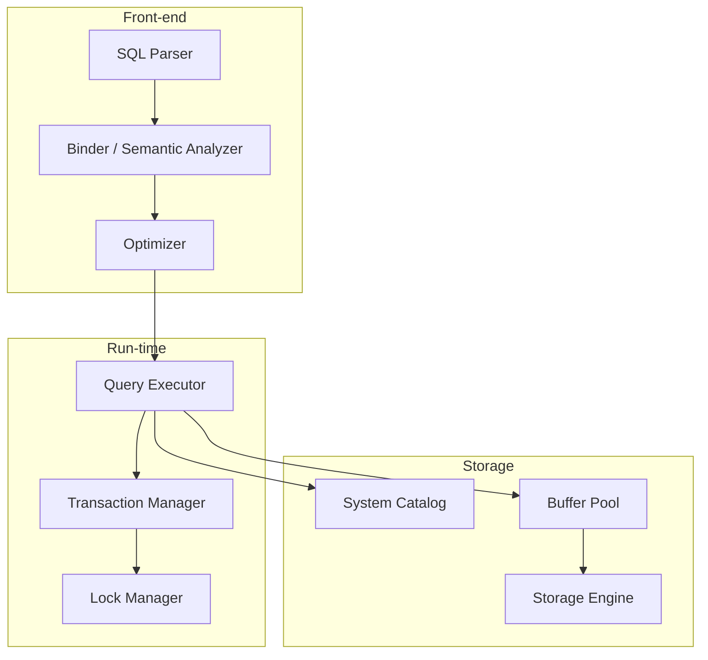
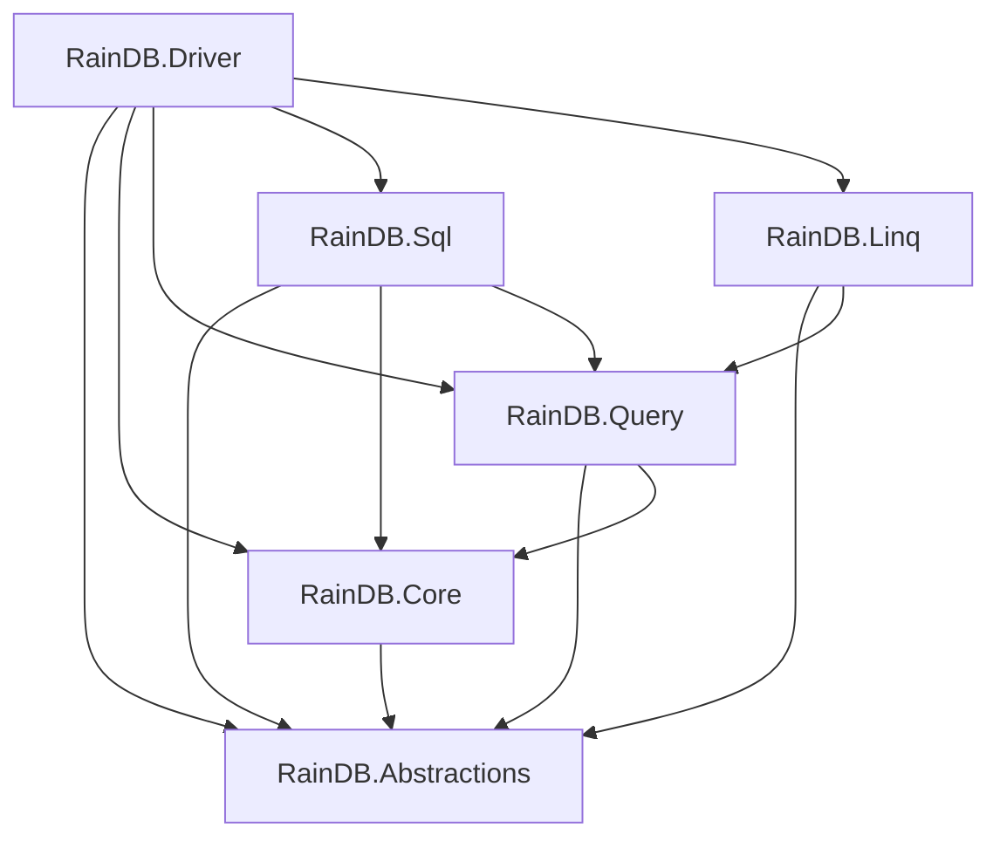
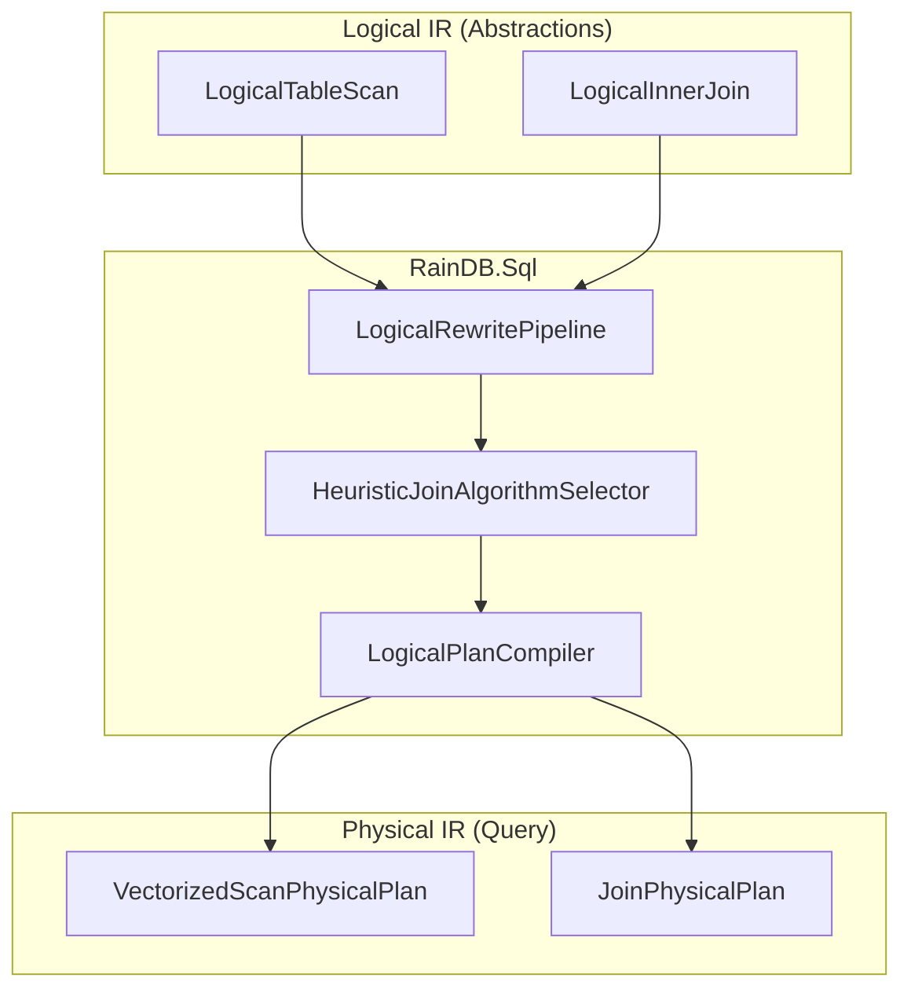
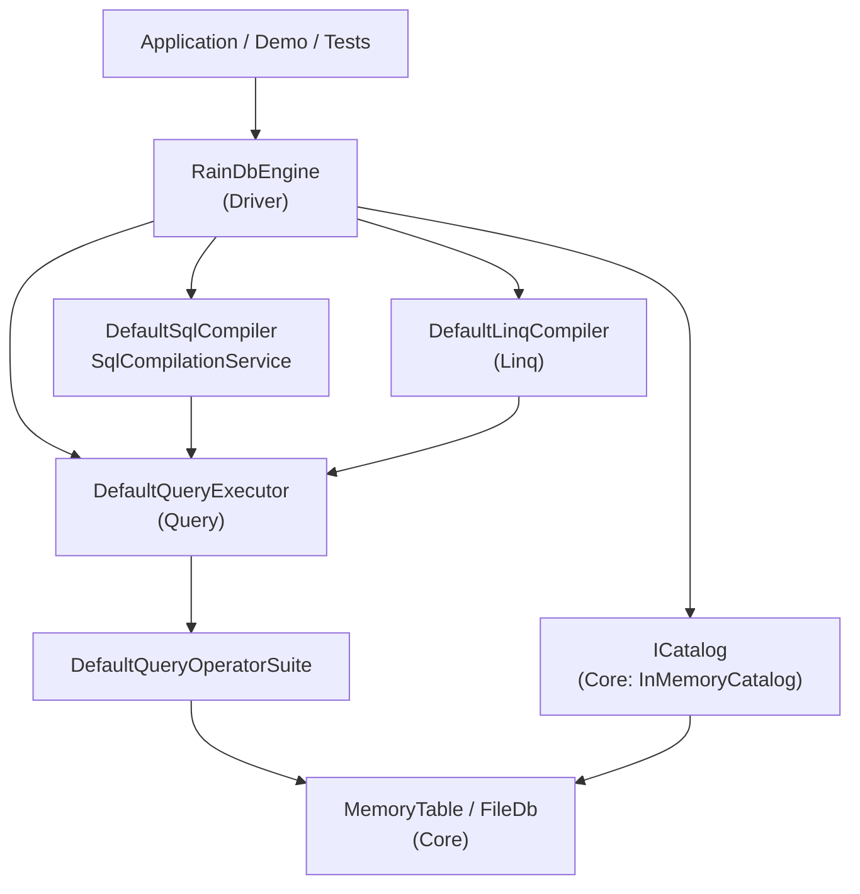

# Chapter 2: Architecture and Modules

RainDB is organized as six .NET projects plus tests and samples. This chapter explains why those boundaries exist, how dependencies flow, and how `RainDbEngine` wires everything together. We begin with general database architecture theory — layered design, plan separation, and extensibility patterns — before mapping each concept onto RainDB's concrete modules.

# Part I: Concepts and Theory

## 2.1 Layered system design

Large systems get easier to reason about when you slice them into **layers** — horizontal bands where upper layers call down, lower layers never call up, and each band exposes a narrow API to the one above.

### The classic layered architecture

```text
┌─────────────────────────────────────┐
│  Application / User Interface       │  ← highest level
├─────────────────────────────────────┤
│  Query Language / API               │
├─────────────────────────────────────┤
│  Query Processor                    │
├─────────────────────────────────────┤
│  Storage Engine                     │
├─────────────────────────────────────┤
│  Operating System / Hardware        │  ← lowest level
└─────────────────────────────────────┘
```

Each layer:

- **Exposes services** upward through a stable interface
- **Depends on services** from the layer below
- **Hides its internals** from everything above

### Benefits of layering

| Benefit | Explanation |
|---------|-------------|
| **Separation of concerns** | Each layer solves one class of problems |
| **Replaceability** | Swap storage engine without rewriting query processor |
| **Testability** | Mock lower layers to test upper layers in isolation |
| **Team parallelism** | Different teams own different layers |
| **Evolution** | Add features within a layer without rippling changes |

### Costs of layering

| Cost | Explanation |
|------|-------------|
| **Indirection overhead** | Every cross-layer call passes through interfaces |
| **Performance** | Extra abstraction can block inlining and fusion |
| **Rigidity** | Strict layering can force unnatural code placement |
| **Duplication** | Similar concepts may appear at multiple layers |

Database teams accept these tradeoffs because a query processor that never parses disk bytes directly is far easier to maintain — and the nanoseconds lost to virtual dispatch are usually noise next to I/O.

### Layering versus modularity

**Layering** is a dependency rule: A may call B only if B sits below A. **Modularity** is a packaging rule: code lives in separate assemblies. RainDB enforces both — six projects with a directed acyclic dependency graph.

---

## 2.2 Separation of concerns in a DBMS

A DBMS is not a single blob of code. It is a federation of subsystems, each with a job description that should not bleed into the next.

### Major DBMS subsystems



### Storage engine

The **storage engine** owns byte layout — on disk and in memory:

- Page or batch allocation
- Columnar or row-oriented encoding
- Compression and decompression
- Write-ahead logging (in transactional systems)
- Index structures (B-trees, zone maps)

It answers: "Given a table and a row range, return these column bytes."

### Query processor

The **query processor** turns a declarative query into a runnable plan and executes it:

- Parse SQL into an abstract syntax tree
- Bind names to catalog objects
- Optimize (rewrite, cost-based plan selection)
- Execute operators (scan, join, aggregate, sort)

It answers: "Given this SQL, compute this result."

### System catalog

The **catalog** (data dictionary, system tables) holds metadata:

- Table names, column names, types
- Statistics (row counts, distinct values, histograms)
- Access paths (indexes, sort orders)
- Permissions and constraints

It answers: "What tables exist, and what is their schema?"

### Why separation matters

| Subsystem | Changes when... | Should not change when... |
|-----------|-----------------|---------------------------|
| Storage engine | Compression algorithm improves | SQL syntax adds `WINDOW` clause |
| Query processor | Join algorithm added | Disk page size changes |
| Catalog | New table registered | Query plan executes |

Stuffing SQL parsing into the storage engine produces a system you cannot test, extend, or explain to a new hire.

### RainDB's mapping (preview)

| DBMS subsystem | RainDB project(s) |
|----------------|-------------------|
| Catalog | `RainDB.Core` (`InMemoryCatalog`) |
| Storage engine | `RainDB.Core` (`MemoryTable`, chunks, persistence) |
| Query processor | `RainDB.Query` (engines, physical plans) |
| SQL front-end | `RainDB.Sql` |
| LINQ front-end | `RainDB.Linq` |
| Composition / API | `RainDB.Driver` (`RainDbEngine`) |
| Contracts | `RainDB.Abstractions` |

---

## 2.3 Logical versus physical plan separation

The single most important split in query processing is between **what** to compute (logical plan) and **how** to compute it (physical plan).

### Logical plans

A **logical plan** describes the query as relational operators:

```text
LogicalTableScan(order_lines)
  WHERE line_total > 1000
  PROJECT region, line_total
  AGGREGATE SUM(line_total) GROUP BY region
```

Properties of logical plans:

- Use **table and column names** (not memory addresses or indices)
- Are **declarative** — no algorithm choices
- Are **rewritable** — optimizer applies equivalence-preserving transformations
- Are **front-end independent** — SQL and LINQ can produce the same logical plan

### Physical plans

A **physical plan** pins down algorithms and data structures:

```text
VectorizedScanPhysicalPlan
  table_id: 0x7f3a...
  output_columns: [0, 2]
  filter: column[2] > 1000.0 (immediate bits)
  aggregate: SUM(column[2]) GROUP BY column[0]
  options: dop=4, avx2_sum=true
```

Properties of physical plans:

- Use **catalog identifiers** (`TableId`) and **column indices**
- Specify **algorithms** (hash join vs sort-merge, vectorized scan vs index scan)
- Include **execution hints** (parallelism, SIMD flags)
- Are **machine-oriented** — ready for the executor

### The compilation pipeline

```text
SQL string
  → Parse → AST
  → Bind → Logical Plan (names resolved)
  → Optimize → Logical Plan (rewritten)
  → Lower → Physical Plan (algorithms chosen)
  → Execute → Result
```

Each stage has a narrow contract. The binder never picks join algorithms; the optimizer never touches byte buffers.

---

## 2.4 System R and the optimizer architecture

**System R** (IBM, 1970s) set the template that relational databases still follow.

### System R contributions

| Contribution | Impact |
|--------------|--------|
| Relational model | Tables, not navigational pointers |
| SQL | Declarative query language |
| Cost-based optimizer | Choose plans by estimated cost, not rules |
| **Logical / physical separation** | Optimizer produces logical plans; code generator produces physical |
| Volcano iterators | Tuple-at-a-time execution (later superseded by vectorization for OLAP) |

### System R optimizer phases

```text
1. Parse SQL → Query Tree (logical)
2. Bind → resolve names via catalog
3. Rewrite → apply algebraic equivalences
   - Push selections down
   - Push projections down
   - Convert subqueries to joins
4. Generate alternatives → enumerate join orders, access paths
5. Cost each alternative → statistics-driven estimation
6. Choose cheapest → physical plan
7. Compile → executable code
```

RainDB follows the same **stages** at a smaller scale: parse → **logical rewrite** (`LogicalRewritePipeline`) → physical bind → execute. Join **algorithm** choice uses row-count heuristics rather than a full System R-style cost model, but the **two-IR architecture** (logical names vs physical ids and algorithms) matches the System R template.

### Algebraic rewrite example

Original:

```text
π_{name}(σ_{age>30}(σ_{city='NYC'}(employees)))
```

After pushing selection:

```text
π_{name}(σ_{age>30 ∧ city='NYC'}(employees))
```

Both are logically equivalent, but the rewritten form scans fewer rows if a zone map on `city` exists. Optimizers apply dozens of such rewrite rules automatically.

---

## 2.5 The Cascades framework

**Cascades** (Graefe, 1995) turned System R's optimizer into a **rule-based, extensible framework** adopted by SQL Server, Greenplum, and others.

### Core ideas

1. **Memoization** — sub-expressions are stored once and shared across alternative plans
2. **Transformation rules** — logical equivalences (e.g., join reordering)
3. **Implementation rules** — map logical operators to physical algorithms
4. **Cost model** — assign cost to each physical expression; search for minimum

```text
Logical:  Join(A, B)
           ↓ implementation rule
Physical: HashJoin(Scan(A), Scan(B))
           ↓ alternative
Physical: SortMergeJoin(Sort(Scan(A)), Sort(Scan(B)))
```

### Cascades versus RainDB

RainDB does not implement a full Cascades memo table. Instead:

- **`LogicalRewritePipeline`** applies ordered **`ILogicalRewriteRule`** implementations before physical binding
- **`LogicalPlanCompiler`** composes binders that lower logical roots to explicit **`IPhysicalPlan`** classes
- **`IQueryOperatorSuite`** maps physical plans to vectorized operator instances; **`DefaultQueryExecutor`** dispatches plan types

The Cascades lesson still applies: **keep logical rewrites separate from physical implementation choices** so each can evolve independently.

### Extensibility pattern from Cascades

| Mechanism | Cascades | RainDB equivalent |
|-----------|----------|-------------------|
| Add logical operator | New logical expression type | New `ILogicalRoot` implementation |
| Add physical algorithm | New implementation rule | New `IPhysicalPlan` + operator + executor branch |
| Add rewrite rule | Transformation rule | `ILogicalRewriteRule` in `LogicalRewritePipeline` |
| Add cost function | Cost method on physical expr | Future: statistics-driven CBO (heuristics today) |

---

## 2.6 Dependency inversion principle

The **Dependency Inversion Principle** (DIP), part of SOLID, boils down to two rules:

1. High-level modules should not depend on low-level modules. Both should depend on abstractions.
2. Abstractions should not depend on details. Details should depend on abstractions.

### Without DIP (bad)

```text
RainDbEngine → MemoryTable (concrete)
             → DefaultQueryExecutor (concrete)
             → HybridBufferPool (concrete)
```

`RainDbEngine` is welded to every implementation detail. Swapping `MemoryTable` for a mmap-backed table means editing the engine.

### With DIP (good)

```text
RainDbEngine → ICatalog (abstraction)
             → IQueryExecutor (abstraction)
             → IBufferPool (abstraction)

InMemoryCatalog : ICatalog
DefaultQueryExecutor : IQueryExecutor
HybridBufferPool : IBufferPool
```

`RainDbEngine` depends only on interfaces in `RainDB.Abstractions`. Implementations live in `RainDB.Core` and `RainDB.Query`.

### DIP in database systems

| Abstraction | Implementations |
|-------------|-----------------|
| `ICatalog` | `InMemoryCatalog`, file-backed catalog |
| `IColumnarTableSource` | `MemoryTable`, `EphemeralColumnarTableSource` |
| `IQueryExecutor` | `DefaultQueryExecutor`, custom distributed executor |
| `ISqlCompiler` | `DefaultSqlCompiler`, strict subset variant |
| `IBufferPool` | `HybridBufferPool`, arena allocator |

Tests inject fakes; production injects defaults. The engine code stays put.

---

## 2.7 Composition root pattern

The **composition root** is the one place in an application where concrete types get instantiated and wired together. Everywhere else, dependencies arrive via constructors.

### Why a composition root?

| Problem without it | Solution |
|---------------------|----------|
| Services create their own dependencies | Root creates all objects and injects them |
| Hidden dependency graphs | Explicit constructor wiring |
| Hard to test | Tests create alternate roots |
| Circular dependencies | Root resolves order |

### Composition root in DI frameworks

```text
// ASP.NET Core Program.cs
builder.Services.AddSingleton<ICatalog, InMemoryCatalog>();
builder.Services.AddSingleton<IQueryExecutor, DefaultQueryExecutor>();
```

### Composition root in embedded libraries

Embedded engines like RainDB expose a **factory method** as the composition root:

```text
RainDbEngine.CreateDefault()
  → new HybridBufferPool()
  → new DefaultQueryExecutor()
  → new DefaultSqlCompiler()
  → new DefaultLinqCompiler()
  → new RainDbEngine(catalog, buffers, executor, sql, linq, spill)
```

Application code calls `CreateDefault()` and gets a fully wired engine. Advanced users call the constructor directly to substitute collaborators.

### Rules for composition roots

1. **One per application** (or per engine instance)
2. **No business logic** — only wiring
3. **Creates the object graph** — everything else receives dependencies via constructors
4. **Lives at the outermost layer** — in RainDB, `RainDB.Driver`

---

## 2.8 Extensibility in database systems

Production databases live for years. New operators, storage formats, query languages, and execution strategies show up long after v1 ships. Architecture has to absorb that growth without a rewrite.

### Extension dimensions

| Dimension | Question | RainDB mechanism |
|-----------|----------|------------------|
| Storage | New table format? | Implement `IColumnarTableSource` |
| Execution | New operator? | New `IPhysicalPlan` + engine + executor dispatch |
| Language | New query front-end? | New compiler implementing `ISqlCompiler` or `ILinqCompiler` |
| Memory | Custom allocator? | Implement `IBufferPool` / `IAlignedBufferPool` |
| Spill | Disk overflow? | Implement `ISpillWriter` |
| Persistence | Cloud storage? | Implement `IRainDbBatchPersistence` |

### Open/Closed Principle

Software entities should be **open for extension, closed for modification**.

- **Open:** Add `HashAggregatePhysicalPlan` without changing `ISqlCompiler`
- **Closed:** `DefaultQueryExecutor` dispatch switch grows, but `IQueryExecutor` interface stays stable

### Plugin architectures in databases

Full plugin systems (PostgreSQL extensions, SQLite VFS) load code dynamically. Embedded engines like RainDB use **compile-time composition** instead:

- Reference the projects you need
- Implement interfaces
- Pass implementations to the constructor

You trade runtime plugin loading for type safety and zero reflection overhead.

### Extension without forking

The ideal extension path:

```text
1. Define interface in Abstractions
2. Implement in new project (or application code)
3. Pass to RainDbEngine constructor
4. No changes to Core or Query required (if interface is sufficient)
```

When the interface is insufficient (new physical operator), you extend Query (new plan + engine) and optionally provide a custom `IQueryExecutor` that delegates to `DefaultQueryExecutor` for known plans.

---

## 2.9 Module coupling and cohesion metrics

Project boundaries should be guided by two metrics:

### Cohesion (within a module)

**High cohesion** means everything inside a module belongs together:

- `RainDB.Core.Columnar` — all chunk and batch types
- `RainDB.Query.Vectorized` — all selection and projection kernels

### Coupling (between modules)

**Low coupling** means modules talk through narrow interfaces:

- `RainDB.Linq` references `RainDB.Query` (plans) but not `RainDB.Core` (storage)
- `RainDB.Sql` references all three but `RainDB.Core` references none of them

### Dependency rule summary

```text
Allowed:    Query → Core → Abstractions
            Sql → Query → Core → Abstractions
            Driver → everything

Forbidden:  Core → Query
            Abstractions → Core
            Sql → Linq (or vice versa)
```

Breaking these rules creates circular dependencies and makes independent testing impossible.

---

## 2.10 Comparison: monolith versus modular embedded engine

| Aspect | Monolith | Modular (RainDB) |
|--------|----------|------------------|
| Build time | Single project, fast | Six projects, incremental |
| Test isolation | Hard to test query without storage | Mock `ICatalog` in query tests |
| Package size | Ship everything | Could ship Core+Query without SQL |
| Onboarding | One large codebase | Navigate by project responsibility |
| Refactoring | Cross-cutting changes easy | Cross-project changes need discipline |

RainDB chose modularity because the engine is a **library** consumed by other applications. Clear boundaries help consumers see which APIs are stable contracts versus internal implementation.

---

## 2.11 Exercises (theory)

### Exercise 2.1 — Layer assignment

For each component, assign it to a DBMS layer: parser, catalog, storage engine, executor.

1. B-tree index lookup
2. SQL `GROUP BY` name resolution
3. Page read from disk
4. Hash join probe phase
5. Column compression on ingest

### Exercise 2.2 — Logical to physical

Write a logical plan and a physical plan for:

```sql
SELECT region, SUM(amount)
FROM sales
WHERE year = 2025
GROUP BY region
```

List what changes between logical and physical representations.

### Exercise 2.3 — DIP sketch

Design interfaces for a hypothetical `IRowStore` and `IColumnStore`. How would a `IQueryExecutor` depend on them without knowing which is used?

### Exercise 2.4 — Cascades rule

Write one **transformation rule** (logical rewrite) and one **implementation rule** (logical → physical) for a `Sort` operator.

### Exercise 2.5 — Composition root

Identify the composition root in a web application using RainDB. What would you inject for integration tests versus production?

### Exercise 2.6 — Extension scenario

You need to add a `ParquetTableSource` that reads Apache Parquet files. Which projects do you modify? Which interfaces do you implement?

### Bridge from Part I to RainDB modules

The theory sections above describe how large DBMSes layer parsers, optimizers, catalogs, and executors. RainDB implements that split across six projects: **`SqlCompilationService`** owns parse → optimize → bind; **`DefaultQueryExecutor`** plus **`DefaultQueryOperatorSuite`** own execution; **`OverlayCatalog`** and **`RainDbExecutionContext.NestedExecutor`** connect derived tables and subqueries without a second engine type. Part II maps each module to those responsibilities.

---

# Part II: RainDB Implementation

---

## 2.12 Solution map

```
RainDB/
├── src/
│   ├── RainDB.Abstractions/   # Contracts (interfaces, logical IR, schema types)
│   ├── RainDB.Core/           # Columnar storage, catalog, memory pools, persistence
│   ├── RainDB.Query/          # Physical plans, vectorized execution engines
│   ├── RainDB.Sql/            # SQL parse → logical → physical (strict subset)
│   ├── RainDB.Linq/           # LINQ IQueryable → physical plans
│   └── RainDB.Driver/         # Composition root, public RainDbEngine API
├── tests/RainDB.Tests/
└── samples/RainDB.AnalyticsDemo/
```

The **Driver** assembly is published as `RainDB` on NuGet (`AssemblyName` = `RainDB`). Application code typically references only `RainDB.Driver` (which transitively pulls the rest).

---

## 2.13 The six projects in depth

### RainDB.Abstractions

**Purpose:** Dependency Inversion Principle (DIP) boundaries. No implementations — only contracts shared across layers.

**Key namespaces:**

| Namespace | Contents |
|-----------|----------|
| `RainDB.Schema` | `RainDbType`, `ColumnDef`, `TableSchema` |
| `RainDB.Columnar` | `IColumnChunk`, `IColumnarBatch` |
| `RainDB.Catalog` | `ICatalog`, `ITableSource`, `IColumnarTableSource`, `TableId` |
| `RainDB.Logical` | `LogicalPlan`, `LogicalTableScan`, `LogicalInnerJoin`, `ILogicalRoot` |
| `RainDB.Execution` | `IPhysicalPlan`, `IQueryExecutor`, `IExecutionContext`, `ISpillWriter` |
| `RainDB.Sql` | `ISqlCompiler` |
| `RainDB.Linq` | `ILinqCompiler` |
| `RainDB.Memory` | `IBufferPool`, `IAlignedBufferPool` |

**Project file:**

```xml
<!-- src/RainDB.Abstractions/RainDB.Abstractions.csproj -->
<Project Sdk="Microsoft.NET.Sdk">
  <PropertyGroup>
    <RootNamespace>RainDB</RootNamespace>
    <AssemblyName>RainDB.Abstractions</AssemblyName>
    <Description>RainDB contracts: storage, catalog, query execution (DIP boundaries).</Description>
  </PropertyGroup>
</Project>
```

No project references — the root of the dependency graph.

### RainDB.Core

**Purpose:** Default implementations for storage, catalog, memory, and file persistence.

**Key types:**

- `ColumnarBatch`, `FixedWidthColumnChunk`, `Utf8ColumnChunk`
- `MemoryTable`, `InMemoryCatalog`
- `HybridBufferPool`
- `RainDbFileDatabase`, `RainDbBatchBinaryCodec`

**Project file:**

```xml
<!-- src/RainDB.Core/RainDB.Core.csproj -->
<Project Sdk="Microsoft.NET.Sdk">
  <PropertyGroup>
    <AllowUnsafeBlocks>true</AllowUnsafeBlocks>
  </PropertyGroup>
  <ItemGroup>
    <ProjectReference Include="..\RainDB.Abstractions\RainDB.Abstractions.csproj" />
  </ItemGroup>
</Project>
```

`AllowUnsafeBlocks` enables pointer arithmetic in aligned buffer rent and mmap readers.

### RainDB.Query

**Purpose:** Physical operator plans, vectorized execution, and the default query executor.

**Key types:**

- Plans: `VectorizedScanPhysicalPlan`, `HashAggregatePhysicalPlan`, `JoinPhysicalPlan`, `SortTopNPhysicalPlan`, `JoinSortTopNPhysicalPlan`, `GroupedJoinPhysicalPlan`, `GroupedJoinSortTopNPhysicalPlan`, `GroupedSortTopNPhysicalPlan`, `DerivedTableScanPhysicalPlan`, `DistinctPhysicalPlan`, `UnionAllPhysicalPlan`, `ExplainBundlePhysicalPlan`
- Operators: `VectorizedScanOperator`, `HashAggregateOperator`, `JoinOperator`, `SortTopNOperator`, `GroupedJoinOperator`, `DistinctOperator` via **`IQueryOperatorSuite`** / **`DefaultQueryOperatorSuite`**
- Shared kernels: internal **`QueryOperatorDependencies`** (selection, project, join materialize, sort selection, group keys, aggregate intrinsics)
- Runtime: `RainDbExecutionContext`, `DefaultQueryExecutor`
- Catalog overlay: execution uses **`OverlayCatalog`** from Core when derived tables or grouped sort need ephemeral tables

**Dependencies:** Abstractions + Core (concrete batches/chunks for validation and materialization).

### RainDB.Sql

**Purpose:** SQL front end — parse, logical optimization, physical binding, caching, and prepared statements.

**Pipeline:** `string` → **`LogicalPlanCompiler.Parse`** → **`LogicalRewritePipeline.Optimize`** → join heuristics → **`LogicalPlanCompiler.CompilePhysical`** → `IPhysicalPlan`

**Facade:** **`SqlCompilationService`** composes the optimizer, **`HeuristicJoinAlgorithmSelector`**, parameter binder, and explain formatter. **`DefaultSqlCompiler`** implements **`ISqlCompiler`** with **`CompiledSqlCache`** and **`CatalogSchemaFingerprint`**.

**Test entry:** **`StrictSqlSubset.Shared`** uses the same compiler graph without **`ISqlCompiler`**.

**Dependencies:** Abstractions, Core, Query (binders emit physical plans defined in Query).

### RainDB.Linq

**Purpose:** Expression-tree-based compilation for `IQueryable` scenarios.

**Dependencies:** Abstractions + Query only (no direct Core reference — uses catalog interfaces).

LINQ compilation reuses physical plans; it does not reimplement execution.

### RainDB.Driver

**Purpose:** Single Responsibility — composition root and public API surface.

```xml
<!-- src/RainDB.Driver/RainDB.Driver.csproj -->
<ItemGroup>
  <ProjectReference Include="..\RainDB.Abstractions\..." />
  <ProjectReference Include="..\RainDB.Core\..." />
  <ProjectReference Include="..\RainDB.Query\..." />
  <ProjectReference Include="..\RainDB.Sql\..." />
  <ProjectReference Include="..\RainDB.Linq\..." />
</ItemGroup>
```

Applications call `RainDbEngine`; they do not construct `DefaultQueryExecutor` directly unless testing.

---

## 2.14 Dependency rules



### Rules (enforce in code reviews)

1. **Abstractions never references implementation projects.**
2. **Core never references Query, Sql, or Linq.** Storage does not know about plans.
3. **Query references Core** for concrete batches/chunks but not Sql/Linq.
4. **Sql and Linq are siblings** — neither imports the other.
5. **Driver is the only project** that references all implementation assemblies.
6. **Tests reference Driver** (or all projects) for integration coverage.

Violating rule 2 creates circular dependencies (Query → Core → Query). Violating rule 4 couples front-end languages.

### Why this layering matters

- Swap `DefaultQueryExecutor` for a distributed executor in tests
- Ship a minimal package with only Core + Query for embedded analytics without SQL
- Add a new front-end (e.g., JSON query DSL) by referencing Abstractions + Query

---

## 2.15 RainDbEngine — full walkthrough

`RainDbEngine` is the composition root. Every collaborator is constructor-injected:

```csharp
// src/RainDB.Driver/RainDbEngine.cs
public sealed class RainDbEngine
{
    public RainDbEngine(
        ICatalog catalog,
        IBufferPool bufferPool,
        IAlignedBufferPool alignedBufferPool,
        IQueryExecutor executor,
        ISqlCompiler sqlCompiler,
        ILinqCompiler linqCompiler,
        ISpillWriter? spillWriter = null,
        RainDbFileDatabase? fileDatabase = null)
    {
        Catalog = catalog;
        BufferPool = bufferPool;
        AlignedBufferPool = alignedBufferPool;
        Executor = executor;
        SqlCompiler = sqlCompiler;
        LinqCompiler = linqCompiler;
        SpillWriter = spillWriter ?? NoOpSpillWriter.Instance;
        FileDatabase = fileDatabase;
    }

    public RainDbFileDatabase? FileDatabase { get; }
    public ICatalog Catalog { get; }
    public IBufferPool BufferPool { get; }
    public IAlignedBufferPool AlignedBufferPool { get; }
    public IQueryExecutor Executor { get; }
    public ISqlCompiler SqlCompiler { get; }
    public ILinqCompiler LinqCompiler { get; }
    public ISpillWriter SpillWriter { get; }
```

### Factory methods

**In-memory default:**

```csharp
public static RainDbEngine CreateDefault() => CreateDefault(new InMemoryCatalog());

public static RainDbEngine CreateDefault(ICatalog catalog)
{
    ArgumentNullException.ThrowIfNull(catalog);
    var buffers = new HybridBufferPool();
    var executor = new DefaultQueryExecutor(new DefaultQueryOperatorSuite());
    var sql = new DefaultSqlCompiler();
    var linq = new DefaultLinqCompiler();
    return new RainDbEngine(catalog, buffers, buffers, executor, sql, linq, NoOpSpillWriter.Instance);
}
```

Note: `HybridBufferPool` implements **both** `IBufferPool` and `IAlignedBufferPool` — passed twice intentionally.

**Persistent:**

```csharp
public static RainDbEngine OpenPersistent(string directoryPath)
{
    ArgumentException.ThrowIfNullOrWhiteSpace(directoryPath);
    var fileDb = RainDbFileDatabase.Open(directoryPath);
    return CreateDefault(fileDb.Catalog, fileDb);
}
```

`FileDatabase` is held on the engine so the backing store is not garbage-collected while queries run.

### Execution entry points

```csharp
public IExecutionContext CreateSession(CancellationToken cancellationToken = default) =>
    CreateSessionWithExecutor(cancellationToken);

private RainDbExecutionContext CreateSessionWithExecutor(CancellationToken cancellationToken = default) =>
    new RainDbExecutionContext(
        Catalog, BufferPool, AlignedBufferPool, SpillWriter, cancellationToken,
        FileDatabase?.MappedBatchScanObserver)
    {
        NestedExecutor = Executor,
    };

public async ValueTask<IQueryResult> ExecuteSqlAsync(string sql, CancellationToken cancellationToken = default)
{
    var ctx = CreateSessionWithExecutor(cancellationToken);
    var plan = await SqlCompiler.CompileAsync(sql, Catalog, cancellationToken).ConfigureAwait(false);
    return await Executor.ExecuteAsync(plan, ctx).ConfigureAwait(false);
}

public async ValueTask<IQueryResult> ExecutePhysicalAsync(IPhysicalPlan plan, CancellationToken cancellationToken = default)
{
    ArgumentNullException.ThrowIfNull(plan);
    var ctx = CreateSessionWithExecutor(cancellationToken);
    return await Executor.ExecuteAsync(plan, ctx).ConfigureAwait(false);
}
```

**Design note:** Each call creates a **fresh session** (`IExecutionContext`). Sessions are not pooled in Phase 1. Long-running apps should pass `CancellationToken` for cooperative cancel.

---

## 2.16 Session context — IExecutionContext

Per-query resources live in `RainDbExecutionContext`:

```csharp
// src/RainDB.Query/Runtime/RainDbExecutionContext.cs
public sealed class RainDbExecutionContext : IExecutionContext
{
    public RainDbExecutionContext(
        ICatalog catalog,
        IBufferPool bufferPool,
        IAlignedBufferPool alignedBufferPool,
        ISpillWriter spillWriter,
        CancellationToken cancellationToken = default,
        IMappedBatchScanObserver? mappedBatchScanObserver = null)
    {
        Catalog = catalog;
        BufferPool = bufferPool;
        AlignedBufferPool = alignedBufferPool;
        SpillWriter = spillWriter ?? NoOpSpillWriter.Instance;
        CancellationToken = cancellationToken;
        MappedBatchScanObserver = mappedBatchScanObserver;
    }

    public ICatalog Catalog { get; }
    public IBufferPool BufferPool { get; }
    public IAlignedBufferPool AlignedBufferPool { get; }
    public ISpillWriter SpillWriter { get; }
    public CancellationToken CancellationToken { get; }
    public IMappedBatchScanObserver? MappedBatchScanObserver { get; }
    public IQueryExecutor? NestedExecutor { get; init; }
}
```

### What each property provides

| Property | Used by | Purpose |
|----------|---------|---------|
| `Catalog` | All operators | Resolve `TableId` → `IColumnarTableSource` (may be **`OverlayCatalog`**) |
| `BufferPool` | Materialization, joins | Rent byte buffers for output chunks |
| `AlignedBufferPool` | SIMD kernels, gather | 32-byte aligned rents for AVX2 |
| `SpillWriter` | Hash aggregate (optional) | Spill partial hash maps when threshold exceeded |
| `CancellationToken` | Parallel loops, channels | Abort long scans |
| `MappedBatchScanObserver` | Vectorized scan on mmap batches | Notify file DB memory manager on batch access |
| `NestedExecutor` | Subquery / correlated paths | Execute nested `IPhysicalPlan` without re-entering SQL compile |

### Extension without modifying operators

`IExecutionContext` is the Open/Closed extension point. Future fields might include query memory limits, tracing spans, and runtime statistics counters. Engines depend on the interface; new context fields do not require changing `VectorizedScanEngine` signatures.

### Custom session example

```csharp
var engine = RainDbEngine.CreateDefault(catalog);
var ctx = engine.CreateSession(cancellationToken: cts.Token);
var plan = await engine.SqlCompiler.CompileAsync(sql, engine.Catalog);
var result = await engine.Executor.ExecuteAsync(plan, ctx);
```

For tests, inject a custom `ISpillWriter` via a custom `RainDbEngine` constructor:

```csharp
var engine = new RainDbEngine(
    catalog, buffers, buffers, executor, sql, linq,
    spillWriter: myRecordingSpillWriter);
```

---

## 2.16a SqlCompilationService and LogicalPlanCompiler

**`SqlCompilationService`** is the SQL compilation **facade** in `RainDB.Sql/Compilation`. It wires:

- **`LogicalPlanCompiler`** — owns **`SqlParser`** and binder graph (`LogicalTableScanBinder`, `LogicalJoinBinder`, `LogicalUnionAllBinder`, `LogicalDerivedTableScanBinder`, `UncorrelatedSubqueryBinder`)
- **`LogicalRewritePipeline`** — rule-based logical optimization before bind
- **`HeuristicJoinAlgorithmSelector`** — hash vs sort-merge for join roots
- **`LogicalParameterBinder`** — `@param` placeholders for prepared SQL
- **`SqlExplainFormatter`** — text bundled into **`ExplainBundlePhysicalPlan`**

**`CompilePhysical`** runs optimize → select join algorithm → **`LogicalPlanCompiler.CompilePhysical`**. When the parsed plan includes an explain level, the service returns **`ExplainBundlePhysicalPlan`** instead of the executable plan alone.

**`DefaultSqlCompiler`** delegates to this service, adds **`CompiledSqlCache`** keyed by SQL text and **`CatalogSchemaFingerprint`**, and implements **`PrepareAsync`** via **`PreparedSqlStatement`**.

---

## 2.16b IQueryOperatorSuite and QueryOperatorDependencies

Execution no longer hard-codes static engine classes in the executor switch. **`DefaultQueryOperatorSuite`** implements **`IQueryOperatorSuite`** and constructs:

- **`VectorizedScanOperator`**, **`HashAggregateOperator`**, **`JoinOperator`**, **`SortTopNOperator`**, **`GroupedJoinOperator`**, **`DistinctOperator`**

All share one **`QueryOperatorDependencies`** instance: **`SelectionEvaluator`**, **`ProjectGather`**, **`JoinBatchMaterializer`**, **`SortTopNRowSelector`**, group-key factories, and **`IColumnarAggregateIntrinsics`**. Custom suites swap individual operators for tests without forking the executor.

---

## 2.16c OverlayCatalog for derived tables

**`OverlayCatalog`** in `RainDB.Core/Catalog` implements **`ICatalog`** by layering ephemeral **`ITableSource`** entries over a base catalog. Lookups by name or **`TableId`** check overlays first, then the base. **`Register`** forwards to the base so application tables remain authoritative.

**`DefaultQueryExecutor`** uses an overlay when executing **`DerivedTableScanPhysicalPlan`**: materialize the subquery, register an **`EphemeralColumnarTableSource`** under the derived alias, run the outer plan in a scoped **`RainDbExecutionContext`** whose **`Catalog`** is the overlay. The same pattern appears when sorting grouped aggregate output via a temporary table id.

---

## 2.17 Executor dispatch — all physical plan types

`DefaultQueryExecutor` accepts **`IQueryOperatorSuite`** (default **`DefaultQueryOperatorSuite`**) and dispatches **`IPhysicalPlan`** types:

```csharp
public sealed class DefaultQueryExecutor : IQueryExecutor
{
    private readonly IQueryOperatorSuite _operators;

    public DefaultQueryExecutor(IQueryOperatorSuite? operators = null) =>
        _operators = operators ?? new DefaultQueryOperatorSuite();

    public async ValueTask<IQueryResult> ExecuteAsync(IPhysicalPlan plan, IExecutionContext context)
    {
        _ = plan.Explain();
        if (plan is VectorizedScanPhysicalPlan vs)
            return await _operators.Scan.ExecuteAsync(vs, RequireColumnarTable(context, vs.TableId), context);
        // HashAggregate, Join, SortTopN, JoinSortTopN, GroupedJoin — via _operators
        // DerivedTableScan, UnionAll, Distinct, Grouped*SortTopN — executor composition
        if (plan is ExplainBundlePhysicalPlan bundle)
            return new ExplainTextQueryResult(bundle.Explain());
        throw new NotSupportedException($"Unsupported physical plan type: {plan.GetType().Name}.");
    }
}
```

### Dispatch table

| Physical plan | Execution |
|---------------|-----------|
| `VectorizedScanPhysicalPlan` | `_operators.Scan` |
| `HashAggregatePhysicalPlan` | `_operators.HashAggregate` |
| `JoinPhysicalPlan` | `_operators.Join` |
| `SortTopNPhysicalPlan` | `_operators.SortTopN.ExecuteTableAsync` |
| `JoinSortTopNPhysicalPlan` | `_operators.SortTopN.ExecuteJoinAsync` |
| `GroupedJoinPhysicalPlan` | `_operators.GroupedJoin` |
| `GroupedJoinSortTopNPhysicalPlan` | Grouped join, then ephemeral + sort |
| `GroupedSortTopNPhysicalPlan` | Execute inner aggregate, overlay + sort |
| `DerivedTableScanPhysicalPlan` | Materialize subquery; **`OverlayCatalog`**; outer plan |
| `DistinctPhysicalPlan` | `_operators.Distinct` (recursive child plans) |
| `UnionAllPhysicalPlan` | Execute each input; concatenate batches |
| `ExplainBundlePhysicalPlan` | **`ExplainTextQueryResult`** |
| `ExplainOnlyPhysicalPlan` | Throws if executed (use EXPLAIN SQL) |

### Derived table pattern

Subquery results become **`EphemeralColumnarTableSource`** entries on an **`OverlayCatalog`**. Scoped sessions copy **`NestedExecutor`**, **`MappedBatchScanObserver`**, and buffer pools from the parent session so nested and outer plans share the same executor instance.

### Unknown plans

Unrecognized plan types throw **`NotSupportedException`**. Custom executors can wrap **`DefaultQueryExecutor`** and delegate after handling proprietary plans.

---

## 2.18 Logical IR versus physical IR

### Logical layer — what, not how

```csharp
// src/RainDB.Abstractions/Logical/LogicalPlan.cs
public sealed class LogicalPlan : ILogicalPlan
{
    public LogicalPlan(ILogicalRoot root) => Root = root;
    public ILogicalRoot Root { get; }
    public string Explain(string indent = "") => Root.Explain(indent);
}
```

Roots implement `ILogicalRoot`:

```csharp
public interface ILogicalRoot
{
    string Explain(string indent = "");
}
```

**`LogicalTableScan`** — single-table queries:

```csharp
// src/RainDB.Abstractions/Logical/LogicalTableScan.cs (selected properties)
public sealed class LogicalTableScan : ILogicalRoot
{
    public required string TableName { get; init; }
    public IReadOnlyList<LogicalColumnProjection>? Projection { get; init; }
    public IReadOnlyList<LogicalColumnProjection>? GroupByColumns { get; init; }
    public IReadOnlyList<LogicalSelectListItem>? SelectList { get; init; }
    public IReadOnlyList<SimpleWhereClause>? WhereConjuncts { get; init; }
    public LogicalAggregate? Aggregate { get; init; }
    public IReadOnlyList<LogicalSortKey>? OrderBy { get; init; }
    public int? Limit { get; init; }
}
```

Logical nodes use **names** (`TableName`, `ColumnName`) and **SQL-shaped** structures (`WhereConjuncts`, `GroupByColumns`).

**`LogicalInnerJoin`** — multi-table queries (see `LogicalJoinBinder`).

### Physical layer — how, with indices and algorithms

```csharp
// src/RainDB.Abstractions/Execution/IPhysicalPlan.cs
public interface IPhysicalPlan
{
    string Explain(string indent = "");
}
```

Example — vectorized scan:

```csharp
// src/RainDB.Query/Plans/VectorizedScanPhysicalPlan.cs
public sealed class VectorizedScanPhysicalPlan : IPhysicalPlan
{
    public TableId TableId { get; }
    public int[] OutputColumnIndices { get; }
    public ColumnCompareFilter[]? Filters { get; }
    public AggregateSpec? Aggregate { get; }
    public VectorizedScanExecutionOptions Options { get; }
}
```

Physical nodes use:

- `TableId` (stable catalog identifier)
- Column **indices** into schema
- `ColumnCompareFilter` with `ImmediateBits` / `Utf8LiteralBytes`
- Execution options (`MaxDegreeOfParallelism`, `UseAvx2DoubleSum`, `UseChannelScheduler`)

### Compilation bridge

```csharp
// DefaultSqlCompiler → SqlCompilationService
public ValueTask<IPhysicalPlan> CompileAsync(string sql, ICatalog catalog, CancellationToken cancellationToken = default)
{
    var parsed = _compilation.PhysicalCompiler.Parse(sql);
    var fingerprint = _schemaFingerprint.Compute(catalog);
    if (!_compilation.ContainsParameters(parsed)
        && _cache.TryGet(sql, fingerprint, out var cached) && cached is not null)
        return ValueTask.FromResult(cached);

    var physical = _compilation.CompilePhysical(parsed, catalog);
    if (!_compilation.ContainsParameters(parsed) && physical is not ExplainBundlePhysicalPlan)
        _cache.Store(sql, fingerprint, physical);
    return ValueTask.FromResult(physical);
}
```

Inside **`SqlCompilationService`**, **`CompilePhysical`** optimizes the logical plan, selects a join algorithm for join roots, and calls **`LogicalPlanCompiler.CompilePhysical`**. **Bind** resolves names to **`TableId`** and column indices; **lower** emits concrete plan types (scan, hash agg, join, derived table, union, distinct, explain bundle).

### IR comparison diagram



### Why two IRs?

1. **SQL/LINQ front-ends differ** but share physical execution.
2. **Catalog binding** happens once at compile time (table renames do not break cached plans if you recompile).
3. **Testing** can construct `VectorizedScanPhysicalPlan` directly without parsing SQL.
4. **EXPLAIN** output is readable at both levels (`logical.Explain()`, `plan.Explain()`).

---

## 2.19 Extension points

| Extension point | Interface | Default | How to extend |
|-----------------|-----------|---------|---------------|
| Catalog | `ICatalog` | `InMemoryCatalog` | Implement table registration, schema lookup |
| Table storage | `IColumnarTableSource` | `MemoryTable` | Custom batch sources (mmap, remote) |
| Query execution | `IQueryExecutor` | `DefaultQueryExecutor` + `DefaultQueryOperatorSuite` | Inject operators or wrap executor |
| SQL compilation | `ISqlCompiler` | `DefaultSqlCompiler` / `SqlCompilationService` | Custom rewrite rules, join selector, cache |
| LINQ compilation | `ILinqCompiler` | `DefaultLinqCompiler` | Custom expression visitors |
| Buffer allocation | `IBufferPool`, `IAlignedBufferPool` | `HybridBufferPool` | Arena allocators, GPU buffers |
| Spill | `ISpillWriter` | `NoOpSpillWriter` | Disk spill for large aggregates |
| Persistence | `IRainDbBatchPersistence` | `RainDbFileDatabase` | Cloud object storage append |
| Physical operators | New `IPhysicalPlan` + engine | — | Register in custom `IQueryExecutor` |

### Injecting a custom executor

```csharp
public sealed class LoggingQueryExecutor : IQueryExecutor
{
    private readonly DefaultQueryExecutor _inner = new();

    public async ValueTask<IQueryResult> ExecuteAsync(IPhysicalPlan plan, IExecutionContext context)
    {
        Console.WriteLine(plan.Explain());
        return await _inner.ExecuteAsync(plan, context);
    }
}

var engine = new RainDbEngine(
    catalog, buffers, buffers,
    new LoggingQueryExecutor(),
    sql, linq);
```

### Direct physical plan execution (bypass SQL)

```csharp
var plan = new HashAggregatePhysicalPlan(
    table.Id,
    groupKeyColumnIndices: [0],
    aggregates: [new AggregateSpec(1, AggregateKind.Sum)]);
await using var result = await engine.ExecutePhysicalAsync(plan);
```

---

## 2.20 Building the solution from an empty repo

### Step 1: Create solution and Abstractions

```bash
dotnet new sln -n RainDB
dotnet new classlib -n RainDB.Abstractions -o src/RainDB.Abstractions
dotnet sln add src/RainDB.Abstractions
```

Add schema and columnar interfaces (`RainDbType`, `IColumnChunk`, `IColumnarBatch`, `TableSchema`).

### Step 2: Core

```bash
dotnet new classlib -n RainDB.Core -o src/RainDB.Core
dotnet add src/RainDB.Core reference src/RainDB.Abstractions
```

Implement `ColumnarBatch`, `FixedWidthColumnChunk`, `MemoryTable`, `InMemoryCatalog`, `HybridBufferPool`.

Enable `AllowUnsafeBlocks` in csproj.

### Step 3: Query

```bash
dotnet new classlib -n RainDB.Query -o src/RainDB.Query
dotnet add src/RainDB.Query reference src/RainDB.Abstractions src/RainDB.Core
```

Add `VectorizedScanPhysicalPlan`, `VectorizedScanEngine`, `DefaultQueryExecutor`, `RainDbExecutionContext`.

### Step 4: Sql and Linq (parallel)

```bash
dotnet new classlib -n RainDB.Sql -o src/RainDB.Sql
dotnet add src/RainDB.Sql reference src/RainDB.Abstractions src/RainDB.Core src/RainDB.Query

dotnet new classlib -n RainDB.Linq -o src/RainDB.Linq
dotnet add src/RainDB.Linq reference src/RainDB.Abstractions src/RainDB.Query
```

### Step 5: Driver

```bash
dotnet new classlib -n RainDB.Driver -o src/RainDB.Driver
# Set AssemblyName to RainDB for NuGet package identity
dotnet add src/RainDB.Driver reference all five implementation projects
```

Implement `RainDbEngine` with `CreateDefault()`.

### Step 6: Tests and sample

```bash
dotnet new xunit -n RainDB.Tests -o tests/RainDB.Tests
dotnet add tests/RainDB.Tests reference src/RainDB.Driver
```

Write `ColumnarAndCatalogTests` before complex SQL tests — validate storage invariants first.

### Recommended build order

1. Abstractions (no deps)
2. Core
3. Query
4. Sql, Linq (parallel)
5. Driver
6. Tests

`dotnet build` on the solution resolves this automatically.

---

## 2.21 End-to-end architecture diagram



---

## 2.22 Worked example: registering and querying

```csharp
using RainDB;
using RainDB.Core.Catalog;
using RainDB.Core.Columnar;
using RainDB.Core.Tables;
using RainDB.Schema;

var engine = RainDbEngine.CreateDefault();
var schema = new TableSchema([
    new ColumnDef("region", RainDbType.Utf8),
    new ColumnDef("amount", RainDbType.Float64),
]);

var table = new MemoryTable("sales", schema);
// ... append batches (Chapter 3) ...
engine.Catalog.Register(table);

await using var result = await engine.ExecuteSqlAsync(
    "SELECT SUM(amount) FROM sales");
```

Internal flow:

1. `ExecuteSqlAsync` → `CreateSessionWithExecutor` (sets **`NestedExecutor`**, optional **`MappedBatchScanObserver`**)
2. `DefaultSqlCompiler.CompileAsync` → parse, optional cache hit, **`SqlCompilationService.CompilePhysical`**
3. `LogicalRewritePipeline` + **`LogicalPlanCompiler`** → e.g. `VectorizedScanPhysicalPlan`
4. `DefaultQueryExecutor` → `_operators.Scan.ExecuteAsync`
5. Returns `IAggregateQueryResult` or `IColumnarQueryResult`

---

## 2.23 Pitfalls

### Pitfall 1: Referencing Core from application UI layer

Pull in `RainDB` (Driver) only. Direct Core references couple you to concrete types (`MemoryTable`) — acceptable for ingest, not for query-only layers.

### Pitfall 2: Sharing one IExecutionContext across concurrent queries

`CreateSession` per query. Buffer pools are shared; context state is per execution.

### Pitfall 3: Forgetting to register tables

Compilation binds names via catalog. `TryGetTable` failure surfaces as `InvalidOperationException` in executor.

### Pitfall 4: Executing ExplainOnlyPhysicalPlan or expecting empty rows for EXPLAIN SQL

**`ExplainOnlyPhysicalPlan`** throws if executed directly. **`EXPLAIN`** SQL compiles to **`ExplainBundlePhysicalPlan`**, which returns **`ExplainTextQueryResult`** — not an empty row set.

### Pitfall 5: Circular project references

If Core accidentally references Query, MSBuild fails. Keep a printed dependency diagram in CONTRIBUTING.

### Pitfall 6: Linq needing Core types at compile time

LINQ provider emits plans referencing `TableId` from catalog at runtime — no Core table concrete types required in Linq project.

---

## 2.24 Exercises (implementation)

### Exercise 2.7 — Dependency audit

List all types in `RainDB.Query` that reference `RainDB.Core.Columnar` namespaces. Why is this allowed?

### Exercise 2.8 — Custom catalog

Sketch an `ICatalog` implementation that resolves tables from a `Dictionary<string, MemoryTable>`. What methods are required?

### Exercise 2.9 — New physical operator

Design a `LimitPhysicalPlan` (table scan + take N rows). Which existing engine would you extend? Where would dispatch go?

### Exercise 2.10 — Trace GroupedJoin

Write the sequence of `await` calls for `GroupedJoinPhysicalPlan` including `DisposeAsync` on join result.

---

## 2.25 Chapter summary

RainDB's six-project layout enforces clear boundaries: **Abstractions** define contracts, **Core** owns data and **`OverlayCatalog`**, **Query** owns physical plans and **`IQueryOperatorSuite`** execution, **Sql** owns **`SqlCompilationService`** (parse, rewrite, bind, cache, prepare), **Linq** remains a stub front end, **Driver** wires the graph. `RainDbEngine` is the single entry point; `RainDbExecutionContext` carries per-query resources including **`NestedExecutor`** and optional **`MappedBatchScanObserver`**; `DefaultQueryExecutor` dispatches every physical plan type through injectable operators. Logical IR preserves SQL semantics; physical IR enables vectorized performance; compilation separates rule-based logical optimization from algorithm selection and binding.

Chapter 3 descends into the columnar storage model — types, validation, and batch construction.
