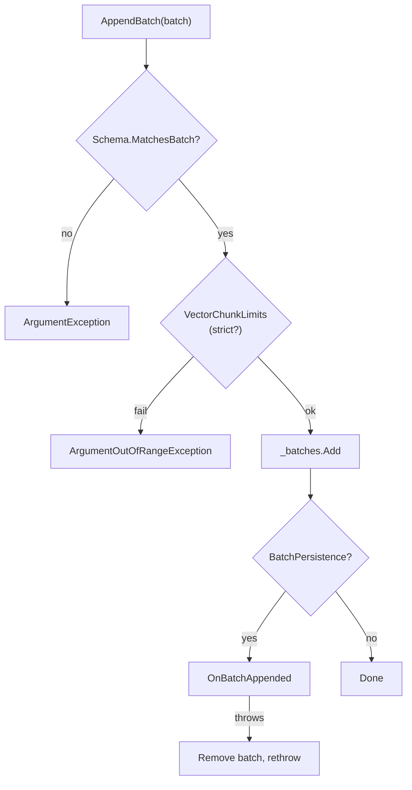

# Chapter 3: Columnar Storage Model

RainDB's storage model is deliberately small: a handful of schema types, two chunk implementations for fixed-width and UTF-8 data, batches that tie columns together, and tables that hold append-only batch lists. This chapter begins with the theoretical foundations of columnar storage — tradeoffs, metadata, cache behavior, and schema evolution — before examining each RainDB type in depth.

# Part I: Concepts and Theory

## 3.1 Columnar versus row-oriented tradeoffs

Row versus column layout is the biggest storage decision in analytical database design. Quantifying the tradeoffs keeps you from assuming "column stores are always faster" without checking what the query actually touches.

### Read amplification

**Read amplification** measures how many bytes must move from storage to answer a query, relative to the bytes the query logically needs.

Consider a table with 10 million rows and 20 columns averaging 40 bytes each (800 MB total):

| Query | Row store bytes read | Column store bytes read | Ratio |
|-------|---------------------|------------------------|-------|
| `SELECT SUM(amount)` (1 of 20 cols) | ~800 MB | ~80 MB | 10× |
| `SELECT *` (all columns) | ~800 MB | ~800 MB | 1× |
| `SELECT id, amount` (2 of 20 cols) | ~800 MB | ~120 MB | 6.7× |

Column stores pay off when **column selectivity** is high — queries touch few columns relative to table width. They offer no advantage when queries need most columns.

### Write amplification

**Write amplification** measures how many bytes must be written per logical insert.

| Operation | Row store | Column store |
|-----------|-----------|--------------|
| Insert 1 row (20 cols) | Write ~800 bytes (one row) | Write ~800 bytes (20 column appends) |
| Insert 64K-row batch | Write ~52 MB (one segment) | Write ~52 MB (batched column appends) |
| Update 1 column in 1 row | Rewrite ~800 bytes (one row) | Rewrite one column segment (may be large) |

Row stores win on **single-row updates**. Column stores win on **batch append** when writes amortize across many rows per column.

### Compression ratio

Homogeneous columns compress far better than heterogeneous rows:

| Column type | Typical compression | Technique |
|-------------|----------------------|-----------|
| Low-cardinality string (`country`) | 10–50× | Dictionary encoding |
| Sorted integer (`timestamp`) | 5–20× | Delta + RLE |
| Random float (`price`) | 1.5–3× | Gorilla / XOR encoding |
| Mixed row (20 columns) | 2–4× | General-purpose (LZ4, Zstd) |

Columnar layout lets you pick a **per-column codec**. A row store must compress the entire row with one algorithm.

### Quantitative summary

| Dimension | Row-oriented | Column-oriented |
|-----------|-------------|-----------------|
| Point lookup (PK) | Excellent | Poor (unless indexed) |
| Full table scan (few cols) | Poor | Excellent |
| Full table scan (all cols) | Comparable | Comparable |
| Single-row update | Excellent | Poor |
| Batch append | Good | Excellent |
| Compression | Moderate | Excellent |
| Schema width sensitivity | Low | High (wider = bigger win) |

---

## 3.2 Zone maps and min/max metadata

**Zone maps** (min/max indexes, column statistics, data skipping) store aggregate metadata per storage zone — a batch, stripe, or page. They let the engine skip zones that cannot satisfy a predicate.

### Structure

For each column in each zone:

```text
Zone(batch_id=7, column="sale_date"):
  min = 2025-01-15
  max = 2025-01-31
  null_count = 0
  row_count = 65536
```

### Predicate evaluation

Query: `WHERE sale_date BETWEEN '2025-01-01' AND '2025-01-20'`

```text
for each zone in table:
  if zone.max(sale_date) < '2025-01-01' OR zone.min(sale_date) > '2025-01-20':
    skip zone    // no rows can match
  else:
    scan zone
```

### Effectiveness conditions

Zone maps work well when:

1. Data is **sorted or clustered** by the filtered column
2. Zones are **large enough** to amortize metadata overhead
3. Queries have **range predicates** on indexed columns

They fail when:

- Data is randomly ordered (every zone's min/max spans the full range)
- Predicates hit high-cardinality columns with uniform distribution
- Zones are too small (metadata cost exceeds skip benefit)

### Beyond min/max

Modern systems extend zone maps with:

| Statistic | Use |
|-----------|-----|
| Distinct count | Join cardinality estimation |
| Histogram | Range selectivity estimation |
| Bloom filter | Membership tests for equality |
| Dictionary | Low-cardinality equality |

RainDB Phase 1 does not implement zone maps, but the **batch-per-zone** model in `MemoryTable.Batches` is the natural attachment point for future min/max metadata per batch.

---

## 3.3 Batch sizing and the cache hierarchy

Analytical engines process data in **batches** (vectors, morsels) sized to fit CPU caches. The cache hierarchy explains why 64K rows keeps showing up as a sweet spot.

### Cache levels

| Level | Typical size | Latency | Scope |
|-------|-------------|---------|-------|
| L1d | 32 KB per core | ~4 cycles | Per core |
| L2 | 256 KB – 1 MB per core | ~12 cycles | Per core |
| L3 | 10 – 60 MB shared | ~40 cycles | Socket |
| DRAM | GBs | ~200 cycles | System |

### Working set calculation

For a batch of `N` rows and a query touching `C` fixed-width columns:

```text
working_set = N × C × column_width + N / 8 × C  (null bitmaps)
```

Example: `N = 65536`, `C = 2` (`Int32` + `Float64`):

```text
working_set = 65536 × (4 + 8) + 65536/8 × 2
            = 786432 + 16384
            = 802816 bytes ≈ 784 KB
```

This fits in L2/L3 on modern CPUs during a single operator pass.

### Batch size tradeoffs

| Batch size | L1 fit? | SIMD efficiency | Parallelism | Memory per operator |
|------------|---------|-----------------|-------------|---------------------|
| 1K rows | Yes | Poor (short loops) | High (many batches) | Low |
| 64K rows | Partial | Good | Moderate | Moderate |
| 1M rows | No (spills L3) | Excellent | Low (few batches) | High |

### The 64K–1M range

Production OLAP engines converge on **64K–1M rows** per vector because:

- **64K** amortizes per-batch dispatch overhead while keeping most single-column working sets in L2/L3
- **1M** caps resident set per operator (a 1M-row `Float64` column is 8 MB)
- Below 64K, SIMD loop overhead dominates; above 1M, cache misses dominate

RainDB encodes this policy in `VectorChunkLimits` (see Part II).

### Multi-column queries

When a query touches many columns, working set grows linearly. A 64K-row batch with 20 `Float64` columns is `65536 × 20 × 8 = 10.5 MB` — exceeding L3. Engines mitigate this by:

- **Late materialization** — filter on one column first, then project survivors
- **Smaller batches** for wide tables
- **Column-at-a-time processing** — load one column, process, evict, load next

---

## 3.4 Append-only analytics storage

Most analytical databases default to **append-only** writes. That choice explains RainDB's `MemoryTable` design.

### Append-only model

```text
Write path:  new_batch → append to batch list (no in-place mutation)
Read path:   scan batch list in order (or parallel per batch)
```

### Advantages

| Advantage | Explanation |
|-----------|-------------|
| **No update locks** | Readers never block writers (MVCC-friendly) |
| **Sequential writes** | Disk and memory bandwidth maximized |
| **Immutability** | Batches can be shared across threads without synchronization |
| **Compaction optional** | Background merge of small batches into larger ones |
| **Time-travel** | Old batches retained for snapshot isolation |

### Disadvantages

| Disadvantage | Mitigation |
|--------------|------------|
| Deletes require tombstones or rewrite | `DELETE` marks rows; compaction removes |
| Updates are copy-on-write | Append corrected batch; mark old batch stale |
| Small frequent appends create many tiny batches | Buffer in memory; flush at threshold |
| Storage grows until compaction | Scheduled merge jobs |

### LSM-tree connection

Log-structured merge (LSM) trees in RocksDB, Cassandra, and many OLAP systems are append-only at the memtable level. Columnar batches are the analytical analogue of LSM **sorted runs** — immutable segments merged in the background.

RainDB's `MemoryTable._batches` list is a simplified append-only log without background compaction in Phase 1.

---

## 3.5 Schema evolution in analytical systems

Analytical tables outlive the code that created them. Schemas change: columns added, types widened, columns retired. **Schema evolution** strategies differ between row and column stores.

### Challenges

| Challenge | Description |
|-----------|-------------|
| **Backward compatibility** | Old batches lack new columns |
| **Forward compatibility** | New code reads old data |
| **Type changes** | `Int32` → `Int64` requires conversion |
| **Column removal** | Old batches still carry removed columns |
| **Rename** | Logical name changes, physical data unchanged |

### Evolution strategies

**1. Schema-on-read (flexible)**

Each batch carries its own schema version. Reader fills missing columns with defaults or NULL.

```text
Batch 0 (schema v1): [id, amount]
Batch 1 (schema v2): [id, amount, region]   ← new column, default NULL for v1 batches
```

**2. Schema-on-write (rigid)**

All batches must match current schema before append. Migration rewrites old batches.

**3. Column mapping (Parquet-style)**

File metadata stores schema evolution history. Reader applies mapping rules.

### Default values and NULL

When a new column `region` is added:

| Strategy | Old batch behavior | Query behavior |
|----------|-------------------|----------------|
| Default literal | `region = 'UNKNOWN'` for all old rows | No NULLs |
| NULL fill | `region = NULL` for all old rows | Three-valued logic |
| Physical rewrite | Rewrite all batches with new column | Uniform schema |

### RainDB's hook

`MemoryTable.BumpSchemaVersion()` increments a version counter and fires `SchemaVersionChanged`. Phase 1 does not expose `ALTER TABLE`, but the hook prepares planners to invalidate cached plans when schema changes.

---

## 3.6 NULL semantics in the SQL standard

NULL is not a value — it is a **marker** for missing or unknown data. SQL's three-valued logic (3VL) governs every NULL interaction.

### Three-valued logic

SQL predicates evaluate to `TRUE`, `FALSE`, or `UNKNOWN` (NULL):

| Expression | Result |
|------------|--------|
| `NULL = NULL` | UNKNOWN (not TRUE!) |
| `NULL = 5` | UNKNOWN |
| `NULL IS NULL` | TRUE |
| `TRUE AND NULL` | UNKNOWN |
| `FALSE AND NULL` | FALSE |
| `NOT NULL` | UNKNOWN |

### WHERE clause behavior

`WHERE` keeps only rows where the predicate is **TRUE**. Rows evaluating to FALSE or UNKNOWN are filtered out.

```sql
SELECT * FROM t WHERE amount > 100;
-- Rows with amount = NULL are excluded (UNKNOWN > 100 is UNKNOWN)
```

### Aggregate behavior

| Aggregate | NULL input behavior |
|-----------|---------------------|
| `COUNT(*)` | Counts all rows including NULLs |
| `COUNT(column)` | Counts non-NULL values only |
| `SUM(column)` | Ignores NULLs; returns NULL if all NULL |
| `AVG(column)` | `SUM / COUNT(non-null)` |
| `MIN/MAX` | Ignores NULLs |

### NULL storage representation

Columnar engines store NULLs via:

1. **Validity bitmap** — one bit per row (1 = null, or 1 = valid, convention varies)
2. **Sentinel values** — reserved value means NULL (e.g., `Int32.MinValue`)
3. **Separate null array** — parallel boolean array

RainDB uses a **validity bitmap** with convention **1 = null**, **0 = non-null**. When `HasNulls` is false, the bitmap is omitted entirely.

### NULL and vectorization

NULL bitmaps complicate SIMD fast paths:

```text
Scalar with nulls:
  for i in 0..N-1:
    if not is_null(bitmap, i):
      sum += values[i]

SIMD without nulls:
  for i in 0..N-1 step 4:
    sum_vec = ADD(sum_vec, LOAD(values[i..i+3]))
```

Engines branch on `HasNulls` once per column, then choose scalar or SIMD path. RainDB's `AggregateIntrinsics.SumFloat64` assumes no nulls; callers filter first.

---

## 3.7 Column homogeneity and type systems

Columnar storage requires **homogeneous columns** — every value in a chunk shares the same physical type. Row stores mix types within a single row.

### Physical versus logical types

| Layer | Example | Purpose |
|-------|---------|---------|
| Logical (SQL) | `VARCHAR(255)`, `DECIMAL(18,2)` | User-facing, constraints |
| Physical (storage) | `Utf8`, `Int64` (fixed-point scaled) | Engine-internal, performance |

RainDB's `RainDbType` enum is the physical type system:

```text
Int32, Int64, Float64, Boolean, Utf8
```

A closed physical type set enables exhaustive switch expressions in kernels and predictable memory layout.

### Type width and alignment

| Type | Width | Alignment concern |
|------|-------|-------------------|
| `Int32` | 4 bytes | Natural for `MemoryMarshal.Cast<byte, int>` |
| `Int64` | 8 bytes | Natural for `Cast<byte, long>` |
| `Float64` | 8 bytes | AVX2 loads require 32-byte alignment for optimal performance |
| `Boolean` | 1 byte | RainDB uses byte-wide, not bit-packed in values |
| `Utf8` | Variable | Offset table + contiguous blob |

---

## 3.8 Immutability in columnar pipelines

Immutability shows up everywhere in analytical engine design. Once a batch is written, nothing mutates it in place.

### Why immutable batches?

| Reason | Benefit |
|--------|---------|
| Thread safety | Multiple workers scan same batch without locks |
| Cache sharing | Read-only memory mapped across processes |
| Simplified reasoning | No read-write races during query execution |
| Cheap "copy" | Output batch is new; input batch unchanged |

### Copy-on-write for operators

```text
Input batch (immutable)
  → Filter → new batch with fewer rows (new chunks, copied values)
  → Project → new batch with subset of columns (may share unchanged column chunks)
  → Aggregate → scalar result (no batch output)
```

Operators that shrink data allocate new chunks. Operators that transform in place (e.g., adding a computed column) produce new batches.

### RainDB's contract

`IColumnChunk.Values` returns `ReadOnlyMemory<byte>`. After `ColumnarBatch` construction, no public API mutates chunk bytes. Query output uses `PooledFixedWidthColumnChunk` with rented buffers that are written once during materialization, then treated as immutable.

---

## 3.9 Storage invariants (general)

Regardless of implementation, columnar storage systems enforce a common set of invariants:

1. **Column homogeneity** — one chunk, one physical type
2. **Row alignment** — all columns in a batch share `RowCount`
3. **Positional correspondence** — row `i` in column A corresponds to row `i` in column B
4. **Schema consistency** — batch column count and types match table schema
5. **Null bitmap consistency** — `HasNulls` flag matches bitmap content

Violating any invariant produces silent data corruption at query time. Validation at construction (not at scan) is the standard defense.

---

## 3.10 Exercises (theory)

### Exercise 3.1 — Read amplification

A table has 50 columns averaging 16 bytes each, 5 million rows. How many MB does a column store read for `SELECT SUM(col_7)` where `col_7` is `Float64`?

### Exercise 3.2 — Zone map skip

A table has 100 batches. Each batch's `date` column has min/max spanning 3 days. A query filters `date = '2025-06-15'`. How many batches can be skipped if data is sorted by date? If randomly ordered?

### Exercise 3.3 — Cache fit

Calculate working set for a 64K-row batch with columns: `Int32`, `Float64`, `Utf8` (avg 20 bytes/string). Does it fit in L2 (512 KB)?

### Exercise 3.4 — NULL logic

Evaluate: `WHERE (amount > 100) AND (discount IS NOT NULL)`. What happens to a row with `amount = NULL, discount = 5`?

### Exercise 3.5 — Schema evolution

A table gains column `tax_rate` (Float64, default 0.0). Describe read behavior for old batches that lack this column under schema-on-read with NULL fill versus default fill.

### Exercise 3.6 — Append-only delete

Design a tombstone strategy for logical row deletion in an append-only column store without rewriting existing batches.

---

# Part II: RainDB Implementation

---

## 3.11 Design principles

Before reading individual types, internalize four invariants RainDB enforces everywhere:

1. **Column homogeneity** — one chunk, one `RainDbType`; no mixed-type arrays inside a chunk.
2. **Row alignment across columns** — within a batch, every column chunk has identical `RowCount`.
3. **Immutable batches after append** — operators read `ReadOnlyMemory<byte>`; mutation happens only when building new output batches.
4. **Schema is logical; chunks are physical** — `TableSchema` describes names and types; `IColumnChunk` holds bytes.

Violating any invariant produces `ArgumentException` at construction or append time, not silent corruption at query time.

---

## 3.12 RainDbType — the physical type system

```csharp
// src/RainDB.Abstractions/Schema/RainDbType.cs
public enum RainDbType
{
    Int32,
    Int64,
    Float64,
    Boolean,
    /// <summary>Length-prefixed UTF-8 or dictionary-encoded string bucket (implementation-specific).</summary>
    Utf8,
}
```

### Semantic mapping

| RainDbType | .NET conceptual type | Storage width | Chunk class |
|------------|---------------------|---------------|-------------|
| `Int32` | `int` | 4 bytes | `FixedWidthColumnChunk` |
| `Int64` | `long` | 8 bytes | `FixedWidthColumnChunk` |
| `Float64` | `double` | 8 bytes | `FixedWidthColumnChunk` |
| `Boolean` | `bool` | 1 byte (`sizeof(byte)`) | `FixedWidthColumnChunk` |
| `Utf8` | string (logical) | variable | `Utf8ColumnChunk` or `Utf8LengthPrefixedColumnChunk` |

### Why a small enum?

OLAP engines benefit from a **closed world** of physical types during Phase 1:

- Switch expressions in kernels (`FixedWidthSelectionKernels`) exhaustively handle known types.
- `ColumnTypeSizes.FixedWidthBytes` throws on `Utf8` — forcing variable-width code paths.
- Future types (`Date32`, `Decimal128`) extend the enum without breaking batch shape.

### ColumnDef — named schema columns

```csharp
// src/RainDB.Abstractions/Schema/ColumnDef.cs
public readonly record struct ColumnDef(string Name, RainDbType Type);
```

`TableSchema` holds an ordered list of `ColumnDef`. Column **index** in the schema equals column index in `batch.Columns[i]`.

---

## 3.13 ColumnTypeSizes — width and null bitmap math

```csharp
// src/RainDB.Core/Columnar/ColumnTypeSizes.cs
public static class ColumnTypeSizes
{
    public static int FixedWidthBytes(RainDbType type) =>
        type switch
        {
            RainDbType.Int32 => sizeof(int),
            RainDbType.Int64 => sizeof(long),
            RainDbType.Float64 => sizeof(double),
            RainDbType.Boolean => sizeof(byte),
            RainDbType.Utf8 => throw new ArgumentException("UTF-8 columns are variable width.", nameof(type)),
            _ => throw new ArgumentOutOfRangeException(nameof(type)),
        };

    public static bool IsFixedWidth(RainDbType type) => type != RainDbType.Utf8;

    public static int NullBitmapBytes(int rowCount) => rowCount == 0 ? 0 : (rowCount + 7) >> 3;
}
```

### FixedWidthBytes

Returns native CLR `sizeof` for each primitive. **Boolean stores one byte per row**, not one bit — simplifies alignment and SIMD-adjacent scalar loops at the cost of space versus packed bits in the values array.

Calling `FixedWidthBytes(RainDbType.Utf8)` throws — UTF-8 payload length is derived from offsets or length prefixes (Chapter 4).

### IsFixedWidth

Gateway for constructors:

```csharp
if (!ColumnTypeSizes.IsFixedWidth(type))
    throw new ArgumentException("Use Utf8ColumnChunk for Utf8.", nameof(type));
```

### NullBitmapBytes — the formula

```
bytes = (rowCount + 7) >> 3   // equivalent to ceil(rowCount / 8)
```

| rowCount | bits needed | bytes |
|----------|-------------|-------|
| 0 | 0 | 0 |
| 1 | 1 | 1 |
| 7 | 7 | 1 |
| 8 | 8 | 1 |
| 9 | 9 | 2 |
| 64 | 64 | 8 |
| 65536 | 65536 | 8192 |

RainDB packs **one bit per row** in the null bitmap. Bit semantics (from `IColumnChunk` documentation):

- **1 = null**
- **0 = non-null**
- Row `i` → byte `i >> 3`, mask `1 << (i & 7)`

When `HasNulls` is `false`, `NullBitmap` may be empty and kernels skip bitmap checks entirely.

---

## 3.14 TableSchema and MatchesBatch

```csharp
// src/RainDB.Abstractions/Schema/TableSchema.cs
public sealed class TableSchema
{
    public TableSchema(IReadOnlyList<ColumnDef> columns)
    {
        ArgumentNullException.ThrowIfNull(columns);
        if (columns.Count == 0)
            throw new ArgumentException("Schema requires at least one column.", nameof(columns));
        Columns = columns;
        var names = new HashSet<string>(StringComparer.Ordinal);
        foreach (var c in columns)
        {
            if (!names.Add(c.Name))
                throw new ArgumentException($"Duplicate column name: {c.Name}", nameof(columns));
        }
    }

    public IReadOnlyList<ColumnDef> Columns { get; }

    public bool MatchesBatch(IColumnarBatch batch)
    {
        ArgumentNullException.ThrowIfNull(batch);
        if (batch.Columns.Count != Columns.Count || batch.RowCount < 0)
            return false;
        if (batch.RowCount == 0)
            return batch.Columns.All(c => c.RowCount == 0);
        for (var i = 0; i < Columns.Count; i++)
        {
            var col = batch.Columns[i];
            if (col.RowCount != batch.RowCount)
                return false;
            if (col.PhysicalType != Columns[i].Type)
                return false;
        }
        return true;
    }
}
```

### Constructor guarantees

- At least one column
- Unique column names (case-sensitive ordinal comparer)

### MatchesBatch algorithm step-by-step

Given `TableSchema` with columns `[region: Utf8, amount: Float64]` and a candidate batch:

1. **Null check** — batch must not be null.
2. **Arity** — `batch.Columns.Count` must equal `Columns.Count` (2).
3. **Row count sign** — `batch.RowCount >= 0`.
4. **Empty batch shortcut** — if `batch.RowCount == 0`, every column chunk must also have `RowCount == 0`.
5. **Per-column loop** — for each index `i`:
   - `batch.Columns[i].RowCount == batch.RowCount`
   - `batch.Columns[i].PhysicalType == Columns[i].Type`

### What MatchesBatch does NOT check

- Column **names** (only positional types matter at storage layer)
- Value ranges (no min/max constraints)
- UTF-8 validity (invalid UTF-8 may throw at decode time)
- Null bitmap consistency with `HasNulls` flag (chunk constructors validate that)

### Worked example — matching batch

Schema:

```csharp
var schema = new TableSchema([
    new ColumnDef("x", RainDbType.Int32),
    new ColumnDef("y", RainDbType.Float64),
]);
```

Valid batch (2 rows):

```csharp
var col0 = new FixedWidthColumnChunk(RainDbType.Int32, 2, new byte[8], ReadOnlyMemory<byte>.Empty, hasNulls: false);
var col1 = new FixedWidthColumnChunk(RainDbType.Float64, 2, new byte[16], ReadOnlyMemory<byte>.Empty, hasNulls: false);
var batch = new ColumnarBatch(2, new IColumnChunk[] { col0, col1 });
Assert.True(schema.MatchesBatch(batch));
```

Invalid — type mismatch at index 0:

```csharp
var bad = new FixedWidthColumnChunk(RainDbType.Int64, 2, new byte[16], ReadOnlyMemory<byte>.Empty, hasNulls: false);
var batch = new ColumnarBatch(2, new IColumnChunk[] { bad, col1 });
Assert.False(schema.MatchesBatch(batch));
```

Test reference:

```csharp
// tests/RainDB.Tests/ColumnarAndCatalogTests.cs
[Fact]
public void MemoryTable_AppendBatch_rejects_type_mismatch()
{
    var schema = new TableSchema([new ColumnDef("x", RainDbType.Int32)]);
    var table = new MemoryTable("t", schema);
    var col = new FixedWidthColumnChunk(RainDbType.Int64, 1, new byte[8], ReadOnlyMemory<byte>.Empty, hasNulls: false);
    var batch = new ColumnarBatch(1, new IColumnChunk[] { col });
    Assert.Throws<ArgumentException>(() => table.AppendBatch(batch));
}
```

---

## 3.15 ColumnarBatch — batch-level validation

```csharp
// src/RainDB.Core/Columnar/ColumnarBatch.cs
public sealed class ColumnarBatch : IColumnarBatch
{
    public ColumnarBatch(int rowCount, IReadOnlyList<IColumnChunk> columns)
    {
        if (rowCount < 0)
            throw new ArgumentOutOfRangeException(nameof(rowCount));
        ArgumentNullException.ThrowIfNull(columns);
        if (columns.Count == 0)
            throw new ArgumentException("At least one column required.", nameof(columns));
        for (var i = 0; i < columns.Count; i++)
        {
            var c = columns[i];
            ArgumentNullException.ThrowIfNull(c);
            if (c.RowCount != rowCount)
                throw new ArgumentException(
                    $"Column {i} row count {c.RowCount} != batch row count {rowCount}.",
                    nameof(columns));
        }

        RowCount = rowCount;
        Columns = columns;
    }

    public int RowCount { get; }
    public IReadOnlyList<IColumnChunk> Columns { get; }
}
```

### Differences from MatchesBatch

| Check | ColumnarBatch ctor | TableSchema.MatchesBatch |
|-------|-------------------|-------------------------|
| Column count > 0 | Yes | Schema already requires ≥1 |
| Non-null columns | Yes | Assumes non-null list elements |
| Row count alignment | Yes | Yes |
| Physical type vs schema | No | Yes |
| Duplicate names | No | At schema level |

**Pattern:** Construct `ColumnarBatch` first (structural validity), then `MemoryTable.AppendBatch` calls `MatchesBatch` (semantic validity against table schema).

### Building from scratch — minimal batch

```csharp
using RainDB.Columnar;
using RainDB.Core.Columnar;
using RainDB.Schema;
using System.Buffers.Binary;

static ColumnarBatch SingleInt32Column(int[] values)
{
    var n = values.Length;
    var bytes = new byte[n * sizeof(int)];
    for (var i = 0; i < n; i++)
        BinaryPrimitives.WriteInt32LittleEndian(bytes.AsSpan(i * 4), values[i]);
    var chunk = new FixedWidthColumnChunk(
        RainDbType.Int32, n, bytes, ReadOnlyMemory<byte>.Empty, hasNulls: false);
    return new ColumnarBatch(n, new IColumnChunk[] { chunk });
}
```

---

## 3.16 VectorChunkLimits — ingest policy

```csharp
// src/RainDB.Core/Columnar/VectorChunkLimits.cs
public static class VectorChunkLimits
{
    public const int MinRows = 64 * 1024;
    public const int MaxRows = 1024 * 1024;

    public static void ValidateRowCount(int rowCount, bool enforce) { /* ... */ }
}
```

### Integration with MemoryTable

```csharp
// src/RainDB.Core/Tables/MemoryTable.cs (AppendCore excerpt)
VectorChunkLimits.ValidateRowCount(batch.RowCount, Options.StrictVectorChunkRows);
_batches.Add(batch);
```

### MemoryTableOptions

```csharp
// src/RainDB.Core/Tables/MemoryTableOptions.cs
public readonly record struct MemoryTableOptions(
    bool StrictVectorChunkRows = false,
    IRainDbBatchPersistence? BatchPersistence = null)
{
    public static MemoryTableOptions Default => default;
}
```

| Mode | StrictVectorChunkRows | Acceptable batch sizes |
|------|----------------------|------------------------|
| Tests / demos | `false` (default) | 1 row to millions |
| Production ingest | `true` | 0 or [65536, 1048576] |

### Strict mode tests

```csharp
// Rejects 2-row batch when strict
var opts = new MemoryTableOptions(StrictVectorChunkRows: true);
var table = new MemoryTable("t", schema, options: opts);
var batch = new ColumnarBatch(2, /* ... */);
Assert.Throws<ArgumentOutOfRangeException>(() => table.AppendBatch(batch));

// Accepts exactly MinRows
const int n = VectorChunkLimits.MinRows;
var values = new byte[n * sizeof(int)];
var col = new FixedWidthColumnChunk(RainDbType.Int32, n, values, ReadOnlyMemory<byte>.Empty, hasNulls: false);
table.AppendBatch(new ColumnarBatch(n, new IColumnChunk[] { col }));
Assert.Equal(n, table.RowCount);
```

### Why separate from ColumnarBatch?

Batch struct validates **shape**; table options validate **policy**. Same 100-row batch is structurally valid but policy-rejected under strict mode.

---

## 3.17 MemoryTable — append-only batch list

```csharp
// src/RainDB.Core/Tables/MemoryTable.cs
public sealed class MemoryTable : ITableSource, IColumnarTableSource
{
    private readonly List<IColumnarBatch> _batches = new();

    public MemoryTable(string name, TableSchema schema, TableId? id = null, MemoryTableOptions options = default)
    {
        ArgumentException.ThrowIfNullOrWhiteSpace(name);
        Name = name;
        Schema = schema;
        Id = id ?? TableId.New();
        Options = options;
    }

    public TableId Id { get; }
    public string Name { get; }
    public TableSchema Schema { get; }
    public MemoryTableOptions Options { get; }
    public IReadOnlyList<IColumnarBatch> Batches => _batches;

    public long RowCount
    {
        get
        {
            long sum = 0;
            foreach (var b in _batches)
                sum += b.RowCount;
            return sum;
        }
    }

    public void AppendBatch(IColumnarBatch batch) => AppendCore(batch, notifyPersistence: true);

    internal void AppendHydratedBatch(IColumnarBatch batch) => AppendCore(batch, notifyPersistence: false);
```

### Append pipeline



### Persistence hook

When `Options.BatchPersistence` is set (file database), failed persistence **rolls back** the in-memory append:

```csharp
try
{
    persistence.OnBatchAppended(Id, Name, _batches.Count - 1, batch);
}
catch
{
    _batches.RemoveAt(_batches.Count - 1);
    throw;
}
```

`AppendHydratedBatch` skips persistence — used when reloading batches from disk to avoid duplicate writes.

### Schema versioning

```csharp
public int BumpSchemaVersion()
{
    var v = Interlocked.Increment(ref _schemaVersion);
    SchemaVersionChanged?.Invoke(this, new SchemaVersionChangedEventArgs(v));
    return v;
}
```

Planners can cache plans keyed by `(TableId, SchemaVersion)` and invalidate on bump. Phase 1 SQL does not expose `ALTER TABLE`, but the hook exists for evolution.

---

## 3.18 Null bitmap — bit math with examples

### Setting and reading bits

```csharp
static void SetNull(Span<byte> bitmap, int row, bool isNull)
{
    var byteIndex = row >> 3;
    var bitMask = (byte)(1 << (row & 7));
    if (isNull)
        bitmap[byteIndex] |= bitMask;
    else
        bitmap[byteIndex] &= (byte)~bitMask;
}

static bool IsNull(ReadOnlySpan<byte> bitmap, int row, bool hasNulls)
{
    if (!hasNulls) return false;
    var byteIndex = row >> 3;
    var bitMask = (byte)(1 << (row & 7));
    return (bitmap[byteIndex] & bitMask) != 0;
}
```

This matches `SelectionEvaluator.IsNull` used in query kernels.

### Worked example — 10 rows, rows 2 and 7 null

```
row:     0  1  2  3  4  5  6  7  8  9
null?:   .  .  N  .  .  .  .  N  .  .

byte 0 (rows 0-7): bit2=1, bit7=1 → 0b10000100 = 0x84
byte 1 (rows 8-9): all zero           → 0b00000000 = 0x00

NullBitmapBytes(10) = (10+7)>>3 = 2 bytes
```

Building the bitmap:

```csharp
var rowCount = 10;
var bitmap = new byte[ColumnTypeSizes.NullBitmapBytes(rowCount)];
SetNull(bitmap, 2, true);
SetNull(bitmap, 7, true);
var chunk = new FixedWidthColumnChunk(
    RainDbType.Int32, rowCount, valuesBytes, bitmap, hasNulls: true);
```

### HasNulls optimization

When no nulls exist in a column:

```csharp
new FixedWidthColumnChunk(type, n, values, ReadOnlyMemory<byte>.Empty, hasNulls: false);
```

Kernels branch on `hasNulls` once per column, not per row in the common non-null case.

### Nullable Int32 values with null at row 1

Sample data: `[100, null, 300]`

```csharp
var values = new byte[12];
BinaryPrimitives.WriteInt32LittleEndian(values.AsSpan(0), 100);
BinaryPrimitives.WriteInt32LittleEndian(values.AsSpan(4), 0);   // placeholder
BinaryPrimitives.WriteInt32LittleEndian(values.AsSpan(8), 300);

var bitmap = new byte[1];
SetNull(bitmap, 1, true);

var chunk = new FixedWidthColumnChunk(RainDbType.Int32, 3, values, bitmap, hasNulls: true);
```

Aggregates must skip row 1 — `VectorizedScanEngine` aggregate paths check null bitmap before accumulating.

---

## 3.19 Complete batch builder tutorial

This tutorial builds the `order_lines` table from `samples/RainDB.AnalyticsDemo` step by step.

### Step 1: Define schema

```csharp
var schema = new TableSchema([
    new ColumnDef("region", RainDbType.Utf8),
    new ColumnDef("quantity", RainDbType.Int32),
    new ColumnDef("line_total", RainDbType.Float64),
]);
var table = new MemoryTable("order_lines", schema);
```

### Step 2: Helper — UTF-8 column from strings

```csharp
using System.Text;

static Utf8ColumnChunk Utf8Column(string[] rows)
{
    var offsets = new int[rows.Length + 1];
    var blob = new List<byte>(rows.Length * 8);
    for (var i = 0; i < rows.Length; i++)
    {
        offsets[i] = blob.Count;
        blob.AddRange(Encoding.UTF8.GetBytes(rows[i]));
    }
    offsets[^1] = blob.Count;
    return new Utf8ColumnChunk(
        rows.Length, offsets, blob.ToArray(),
        ReadOnlyMemory<byte>.Empty, hasNulls: false);
}
```

**Offset invariant:** `offsets[i+1] - offsets[i]` = byte length of row `i`. `offsets[0] == 0`, `offsets[^1] == values.Length`.

### Step 3: Helper — Int32 column

```csharp
static FixedWidthColumnChunk Int32Column(int[] values)
{
    var bytes = new byte[values.Length * sizeof(int)];
    for (var i = 0; i < values.Length; i++)
        BinaryPrimitives.WriteInt32LittleEndian(bytes.AsSpan(i * 4), values[i]);
    return new FixedWidthColumnChunk(
        RainDbType.Int32, values.Length, bytes,
        ReadOnlyMemory<byte>.Empty, hasNulls: false);
}
```

### Step 4: Helper — Float64 column

```csharp
static FixedWidthColumnChunk Float64Column(double[] values)
{
    var bytes = new byte[values.Length * sizeof(double)];
    for (var i = 0; i < values.Length; i++)
        BinaryPrimitives.WriteDoubleLittleEndian(bytes.AsSpan(i * 8), values[i]);
    return new FixedWidthColumnChunk(
        RainDbType.Float64, values.Length, bytes,
        ReadOnlyMemory<byte>.Empty, hasNulls: false);
}
```

### Step 5: Assemble batch 1 (4 rows)

```csharp
table.AppendBatch(new ColumnarBatch(
    4,
    [
        Utf8Column(["US-East", "US-West", "EU", "US-East"]),
        Int32Column([12, 4, 20, 2]),
        Float64Column([1200d, 199.5d, 4500d, 49.99d]),
    ]));
```

### Step 6: Assemble batch 2 (3 rows)

```csharp
table.AppendBatch(new ColumnarBatch(
    3,
    [
        Utf8Column(["US-West", "EU", "US-East"]),
        Int32Column([1, 50, 6]),
        Float64Column([9.99d, 12000d, 300d]),
    ]));
```

### Step 7: Register and verify

```csharp
engine.Catalog.Register(table);
Console.WriteLine($"{table.RowCount} rows in {table.Batches.Count} batches");
// Output: 7 rows in 2 batches
```

### Step 8: Read back UTF-8 row 0 from batch 0

```csharp
var batch = table.Batches[0];
var region = (Utf8ColumnChunk)batch.Columns[0];
var start = region.Offsets.Span[0];
var end = region.Offsets.Span[1];
var text = Encoding.UTF8.GetString(region.Values.Span.Slice(start, end - start));
// "US-East"
```

### Step 9: Read back Float64 row 2

```csharp
var totals = (FixedWidthColumnChunk)batch.Columns[2];
var amount = BinaryPrimitives.ReadDoubleLittleEndian(
    totals.Values.Span.Slice(2 * sizeof(double), sizeof(double)));
// 4500.0
```

---

## 3.20 Multi-column schema evolution considerations

Phase 1 does not support in-place `ALTER TABLE`, but `BumpSchemaVersion` prepares for:

1. New columns appended to schema with default null chunks for old batches
2. Or rewriting batches on migration

When designing ingest pipelines, **freeze schema** per table version and bump version on breaking changes.

---

## 3.21 IColumnarTableSource contract

```csharp
// src/RainDB.Abstractions/Catalog/IColumnarTableSource.cs (conceptual)
public interface IColumnarTableSource : ITableSource
{
    TableSchema Schema { get; }
    IReadOnlyList<IColumnarBatch> Batches { get; }
}
```

Executors require `IColumnarTableSource`, not bare `ITableSource`. Custom sources (ephemeral join results) implement the same interface:

```csharp
var ephemeral = new EphemeralColumnarTableSource(
    tableId, name, outputSchema, colResult.Batches);
```

---

## 3.22 Building the storage layer from scratch

### Milestone 1: Types only

Implement `RainDbType`, `ColumnDef`, `TableSchema`, `ColumnTypeSizes`.

### Milestone 2: Chunks

Implement `FixedWidthColumnChunk` with full constructor validation.

### Milestone 3: Batches

Implement `ColumnarBatch` with row-count loop.

### Milestone 4: Tables

Implement `MemoryTable.AppendBatch` with `MatchesBatch`.

### Milestone 5: Policy

Add `VectorChunkLimits` and `MemoryTableOptions`.

### Milestone 6: UTF-8

Add `Utf8ColumnChunk` (Chapter 4).

### Milestone 7: Tests

Port `ColumnarAndCatalogTests` — alignment, strict mode, schema mismatch.

Each milestone should compile and pass tests before proceeding.

---

## 3.23 Pitfalls

### Pitfall 1: Wrong column order

`MatchesBatch` checks types at indices, not names. Swapping `Int32` and `Float64` columns without swapping schema order passes validation with wrong semantics.

### Pitfall 2: Forgetting little-endian writes

Use `BinaryPrimitives` — never `BitConverter` without confirming endianness on your target.

### Pitfall 3: Null bitmap too short

`FixedWidthColumnChunk` throws if `hasNulls && nullBitmap.Length < NullBitmapBytes(rowCount)`.

### Pitfall 4: Empty batch with non-empty columns

`ColumnarBatch(0, columns)` requires every column `RowCount == 0`. Values buffers may be empty.

### Pitfall 5: Appending same batch instance twice

Allowed — batches are immutable snapshots. Two list entries point to same object (shared memory). Mutating underlying arrays after append breaks immutability — **never mutate** `byte[]` after wrapping in chunks.

### Pitfall 6: Strict mode with demo-sized data

Enable strict mode only when ingest produces 64K+ row batches.

### Pitfall 7: Utf8 in FixedWidthColumnChunk

Constructor throws — use `Utf8ColumnChunk`.

---

## 3.24 Exercises (implementation)

### Exercise 3.7

Compute `NullBitmapBytes` for row counts 1, 8, 9, 65536 by hand. Verify with a one-line C# snippet.

### Exercise 3.8

Build a batch with schema `[id: Int32, active: Boolean]` and 3 rows. Serialize boolean column as bytes `[1, 0, 1]`.

### Exercise 3.9

Write a method `bool ValidateBatchShape(IColumnarBatch b)` mirroring `ColumnarBatch` constructor rules without throwing.

### Exercise 3.10

Create a table with strict mode and a single batch of exactly `VectorChunkLimits.MaxRows` rows. What is the `Int32` values buffer size in bytes?

### Exercise 3.11

Implement `MatchesBatch` failure diagnostics — return a string reason instead of `false`.

### Exercise 3.12

Build a nullable `Float64` column with 5 rows where rows 0 and 4 are null. Print the hex bytes of the null bitmap.

---

## 3.25 Chapter summary

| Component | Responsibility |
|-----------|----------------|
| `RainDbType` | Physical storage class enum |
| `ColumnTypeSizes` | Widths and null bitmap sizing |
| `TableSchema` | Named columns + `MatchesBatch` |
| `ColumnarBatch` | Horizontal slice invariant |
| `VectorChunkLimits` | Optional 64K–1M row policy |
| `MemoryTable` | Append-only batch list + persistence |
| Null bitmap | 1 bit per row, 1 = null |

Chapter 4 examines chunk implementations in detail — constructors, UTF-8 layouts, pooled chunks, and `MemoryMarshal` casting for kernels.
