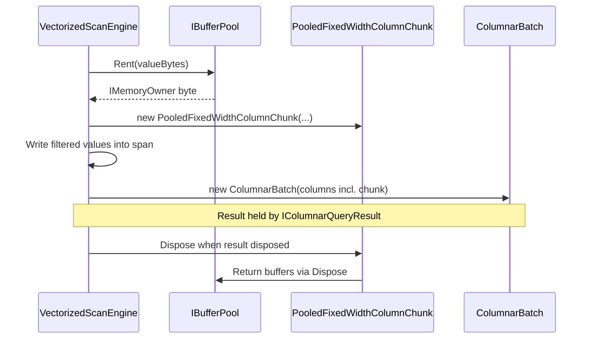

# Chapter 4: Chunk Data Structures

A column chunk is the atomic unit of columnar storage in RainDB. This chapter begins with encoding theory, Arrow layout conventions, null bitmap design, and portability concerns — the general computer science behind chunk representations — before dissecting every RainDB chunk implementation in detail.

# Part I: Concepts and Theory

## 4.1 Columnar encoding theory

Production analytical systems rarely store raw column bytes as-is. **Encoding** reshapes a column into a more compact or faster-to-scan representation while preserving logical semantics.

### Plain encoding

**Plain encoding** (raw, uncompressed) stores values in native binary form with no transformation:

```text
Int32 column [10, 20, 30, 40]:
  bytes: [0A 00 00 00][14 00 00 00][1E 00 00 00][28 00 00 00]
```

| Property | Value |
|----------|-------|
| Compression ratio | 1× (none) |
| Decode cost | Zero — direct memory access |
| Random access | O(1) per row |
| SIMD compatibility | Excellent |

Plain encoding is the baseline. RainDB Phase 1 uses plain encoding exclusively — the layout is **compression-ready** because each column is homogeneous.

### Dictionary encoding

**Dictionary encoding** maps distinct values to integer codes:

```text
Original strings: ["US-East", "EU", "US-East", "US-West", "EU"]
Dictionary:       [0: "US-East", 1: "EU", 2: "US-West"]
Encoded Int32:    [0, 1, 0, 2, 1]
```

| Property | Value |
|----------|-------|
| Compression ratio | High for low-cardinality columns (10–100×) |
| Decode cost | Dictionary lookup per row |
| Random access | O(1) via index into dictionary |
| Best for | Categorical columns, country codes, status enums |

Dictionary encoding shines when **cardinality << row count**. A `country` column with 200 distinct values across 100 million rows compresses dramatically.

### Run-length encoding (RLE)

**Run-length encoding** stores repeated values as `(value, count)` pairs:

```text
Original: [5, 5, 5, 5, 7, 7, 3]
RLE:      [(5, 4), (7, 2), (3, 1)]
```

| Property | Value |
|----------|-------|
| Compression ratio | High for sorted or clustered data |
| Decode cost | Sequential scan with run expansion |
| Random access | O(runs) — requires index into runs |
| Best for | Sorted columns, boolean flags, timestamps with gaps |

RLE pairs naturally with **sorted data**. A column sorted by `date` may have thousands of consecutive identical `region` values.

### Delta encoding

**Delta encoding** stores differences between consecutive values:

```text
Original Int64: [1000, 1005, 1010, 1015]
Delta:          [1000, 5, 5, 5]
```

Often combined with RLE on the delta stream. Effective for monotonically increasing sequences (timestamps, auto-increment IDs).

### Encoding selection matrix

| Column profile | Recommended encoding | Expected ratio |
|----------------|---------------------|----------------|
| Random floats | Plain or Gorilla | 1–2× |
| Low-cardinality strings | Dictionary | 10–50× |
| Sorted integers | Delta + RLE | 5–20× |
| Boolean (sparse) | RLE or bit-packed | 8–64× |
| High-cardinality strings | Plain UTF-8 or FSST | 1–3× |

### Encoding and execution

Encoded columns need **decode steps** before SIMD kernels can operate:

```text
Plain:      load → SIMD sum
Dictionary: load index → lookup dictionary → SIMD sum on decoded buffer
RLE:        expand runs → SIMD sum on expanded buffer
```

Some engines implement **encoded execution** — operating directly on dictionary indices without full decode (e.g., comparing two dictionary-encoded columns by comparing indices).

RainDB stores plain fixed-width bytes in memory for most types. On disk, `RainDbBatchBinaryCodec` may rewrite `Int32` columns as dictionary-encoded kind `4` when a heuristic saves space. RLE and broader encoded execution remain future work; the batch abstraction stays the same.

---

## 4.2 Apache Arrow string layout rationale

**Apache Arrow** defines an in-memory columnar format for zero-copy interchange between systems (Spark, Pandas, DuckDB, Polars). RainDB's `Utf8ColumnChunk` follows Arrow's string layout philosophy.

### Arrow string representation

An Arrow UTF-8 string column consists of:

1. **Offsets buffer** — `int32` or `int64` array of length `N+1`
2. **Data buffer** — contiguous UTF-8 bytes
3. **Validity buffer** — optional null bitmap

```text
strings:  "hello"  "world"  ""  "hi"

offsets:  [0, 5, 10, 10, 12]
data:     h e l l o w o r l d h i
          ^-------^ ^-------^ ^ ^-^
          row 0     row 1     2  3
```

### Why offsets instead of length prefixes?

| Approach | Random access | Append | Cache behavior |
|----------|--------------|--------|----------------|
| Offset table | O(1): `data[offsets[i]..offsets[i+1]]` | O(1) append to data + update last offset | Sequential data scan |
| Length prefix per row | O(n) to reach row i without index | O(1) append | Scattered length reads |
| Fixed-width slots | O(1) | Wastes space for short strings | Poor for variable width |

The offset table gives **O(1) random access** to any row while keeping string data in one contiguous blob — ideal for cache-friendly sequential scans and SIMD on fixed-width derived columns.

### Offset invariants

1. `offsets[0] == 0`
2. `offsets[N] == data.length` (where N = row count)
3. `offsets[i] <= offsets[i+1]` (non-decreasing)
4. `offsets[i+1] - offsets[i]` = byte length of row i

Empty strings have `offsets[i] == offsets[i+1]`.

### Arrow versus length-prefixed

RainDB also implements `Utf8LengthPrefixedColumnChunk` for on-disk serialization:

```text
Arrow (in-memory):     [offsets array] + [data blob]
Length-prefixed (disk): [len][data][len][data][len][data]...
```

Length-prefixed layout is **self-describing** — no separate offsets array needed on disk. Arrow layout is **index-friendly** — offsets enable O(1) access after loading both buffers.

### Interoperability

Following Arrow conventions means:

- Future RainDB export to Arrow/Parquet requires minimal transformation
- String columns can be shared across process boundaries via shared memory
- Tools like `arrow-rs` or `Apache.Arrow` can read RainDB UTF-8 chunks directly

---

## 4.3 Bit-packed null bitmaps in analytics engines

NULL representation cuts across every columnar system. Analytics engines almost universally use **bit-packed validity bitmaps** rather than per-row sentinel values or parallel boolean arrays.

### Why bitmaps?

| Approach | Space (N rows) | Cache efficiency | SIMD impact |
|----------|---------------|------------------|-------------|
| Parallel `bool[]` | N bytes | Poor (1 byte per row) | Cannot vectorize |
| Sentinel in values | 0 extra bytes | Good | Ambiguous with valid sentinel |
| Bit-packed bitmap | N/8 bytes | Excellent | Branch once on `hasNulls` |
| Separate null array | N bytes or N bits | Moderate | Extra indirection |

A bit-packed bitmap uses **8× less space** than a byte-wide boolean array and fits in cache alongside the values column.

### Bitmap conventions

Two conventions exist in the ecosystem:

| System | Bit = 1 means | Bit = 0 means |
|--------|--------------|--------------|
| Apache Arrow | Valid (non-null) | Null |
| RainDB | **Null** | **Non-null** |
| Parquet | Valid (non-null) | Null |

**Always check the convention** when interoperating. RainDB documents: **1 = null, 0 = non-null**.

### Bit addressing

Row `i` maps to:

```text
byte_index = i >> 3        // i / 8
bit_mask   = 1 << (i & 7)  // i % 8
is_null    = (bitmap[byte_index] & bit_mask) != 0
```

This bit-addressing scheme is universal across Arrow, Parquet, DuckDB, and RainDB.

### HasNulls optimization

When a column has no nulls, the bitmap can be omitted entirely:

```text
if not column.has_nulls:
    skip all bitmap checks    // fast path
else:
    check bitmap per row      // scalar path
```

Engines branch on `HasNulls` **once per column**, not per row. Most analytical columns in practice are non-null.

### Bitmap and SIMD interaction

SIMD kernels assume dense, valid data. Common patterns:

1. **Filter first** — build a selection vector excluding null rows, then SIMD on dense subset
2. **Bitmask SIMD** — use AVX2 to check 32 null bits at once, compress valid indices
3. **Skip SIMD** — scalar loop with per-row null check (RainDB Phase 1 default for nullable columns)

---

## 4.4 Immutability in vectorized pipelines

Vectorized query execution depends on **immutable input batches** and **new output batches** for each operator. This is not a style preference — it enables parallelism and simplifies correctness.

### The immutability contract

```text
Input batch (immutable, shared across threads)
  │
  ├─ Filter operator → NEW batch (subset of rows, copied values)
  ├─ Project operator → NEW batch (subset of columns)
  ├─ Aggregate operator → scalar/tuple result (no batch)
  └─ Join operator → NEW batch (combined columns from probe + build)
```

No operator modifies input chunk bytes. Output is always a new allocation (or a pooled buffer written once, then treated as immutable).

### Benefits for parallel execution

```text
Thread 1: scan batch[0]  ─┐
Thread 2: scan batch[1]  ─┤  All read same immutable batches
Thread 3: scan batch[2]  ─┘  No locks, no races
```

If batches were mutable, parallel scan would need synchronization on every row — defeating morsel parallelism.

### Structural sharing

Immutability enables **structural sharing** — unchanged columns can be referenced, not copied:

```text
Project(batch, columns=[0, 2])
  → new batch with 2 columns
  → column 0 and column 2 are SAME chunk objects (shared reference)
  → column 1 is not copied (not in output)
```

RainDB's `ProjectGather` copies only the projected columns into new output chunks (materialization for query results), but the principle of not mutating inputs holds.

### Copy-on-write for ingest

During ingest, builders write into mutable buffers. Once wrapped in `FixedWidthColumnChunk` or `Utf8ColumnChunk` and placed in a `ColumnarBatch`, the bytes become read-only via `ReadOnlyMemory<byte>`. The transition from mutable (build) to immutable (store) is the boundary between ETL and query paths.

### Functional programming connection

Immutable data structures are a cornerstone of functional programming. Columnar pipelines are effectively **dataflow graphs** where each node produces new data from old — the same paradigm as `map`/`filter` in functional languages, but over column vectors instead of lists.

---

## 4.5 Endianness and portability

**Endianness** determines the byte order of multi-byte values in memory. It matters whenever binary column data crosses platforms or gets persisted to disk.

### Little-endian versus big-endian

| Value | Little-endian bytes | Big-endian bytes |
|-------|--------------------|--------------------|
| `Int32(1)` | `01 00 00 00` | `00 00 00 01` |
| `Int32(256)` | `00 01 00 00` | `00 00 01 00` |
| `Float64(1.0)` | `00 00 00 00 00 00 F0 3F` | `3F F0 00 00 00 00 00 00` |

- **Little-endian**: least significant byte first (x86, x64, ARM64 in practice, .NET default)
- **Big-endian**: most significant byte first (network byte order, some legacy systems)

### Why it matters for column stores

Fixed-width columns store native binary values contiguously. If a `Float64` column is written on a little-endian machine and read on a big-endian machine without conversion, every value is corrupted.

### Industry conventions

| System | Endianness policy |
|--------|------------------|
| Apache Parquet | Little-endian (explicit in spec) |
| Apache Arrow | Native endian (usually little-endian) |
| RainDB | **Little-endian only** |
| .NET | Little-endian on all supported platforms |

### RainDB's approach

RainDB uses `BinaryPrimitives.WriteInt32LittleEndian` and `ReadDoubleLittleEndian` for all fixed-width I/O. `Utf8LengthPrefixedColumnChunk` uses `BitConverter.ToInt32` for length prefixes — platform endian. RainDB targets little-endian only; cross-endian is unsupported.

### Portability guidelines

1. **Always use explicit endian APIs** — never assume native byte order in persisted formats
2. **Document endianness** in file format specifications
3. **Test on both endianness** if cross-platform support is required (rare today)
4. **UTF-8 is endian-neutral** — string data has no endian concern

### Alignment and portability

Beyond endianness, **memory alignment** affects SIMD:

| Type | Natural alignment | AVX2 requirement |
|------|------------------|------------------|
| `Int32` | 4 bytes | Works unaligned (slower) |
| `Float64` | 8 bytes | 32-byte alignment optimal for `LoadVector256` |

RainDB's `HybridBufferPool.RentAligned` guarantees 32-byte alignment for SIMD buffers. Ingest buffers from `new byte[]` may be unaligned — scalar paths handle this; AVX2 paths use aligned pool buffers.

---

## 4.6 Chunk as the unit of vectorized execution

In vectorized engines, the **chunk** (column vector) is the granularity at which operators consume and produce data. RainDB's minimal `IColumnChunk` interface follows from that design.

### Chunk properties

Every chunk carries:

| Property | Purpose |
|----------|---------|
| Physical type | Dispatch to correct kernel |
| Row count | Loop bound |
| Values buffer | Contiguous data bytes |
| Null bitmap | Optional validity information |
| Encoding metadata | Future: dictionary, RLE |

### Operator input/output

```text
Scan(table) → chunk per column per batch
Filter(chunk, predicate) → selection indices + original chunks
Project(chunks, indices) → new chunks (gathered rows)
Aggregate(chunk) → scalar
```

Operators never see "rows" as objects — they see chunks and row indices within chunks.

### Chunk lifecycle

```text
1. BUILD (ingest):    mutable buffer → FixedWidthColumnChunk (immutable)
2. STORE (table):     chunk in ColumnarBatch in MemoryTable._batches
3. SCAN (query):      read-only access, parallel across batches
4. MATERIALIZE (output): PooledFixedWidthColumnChunk (rented, written, returned on dispose)
```

---

## 4.7 Comparison of string storage layouts

| Layout | Structure | Best for | Random access |
|--------|-----------|----------|---------------|
| Arrow offsets | `int[N+1]` + `byte[]` | In-memory, zero-copy | O(1) |
| Length-prefixed | `[int32 len][utf8]...` | On-disk, streaming | O(n) without index |
| Fixed-width char(N) | `N bytes per row` | Legacy SQL `CHAR` | O(1), wastes space |
| Dictionary + indices | `dict[]` + `int[N]` | Low cardinality | O(1) via index |

RainDB implements the first two. The choice between them is a build-time / persistence-time decision, not a query-time decision.

---

## 4.8 Exercises (theory)

### Exercise 4.1 — Encoding selection

For each column, choose plain, dictionary, or RLE encoding and justify:

1. `user_id` (UUID string, 100M rows, all unique)
2. `country_code` (ISO 2-letter, 100M rows, 195 distinct)
3. `is_active` (boolean, sorted by user_id, long runs of true)
4. `timestamp_ms` (monotonically increasing Int64)

### Exercise 4.2 — Arrow offsets

Build the offsets array and data buffer for strings `["a", "bb", "", "ccc"]`. Verify all four invariants.

### Exercise 4.3 — Null bitmap

For 12 rows with nulls at positions 0, 3, 7, 11, compute the 2-byte bitmap using RainDB convention (1 = null).

### Exercise 4.4 — Endianness

Write the little-endian bytes for `Int32(0x12345678)`. What does a big-endian reader produce if it interprets them as native?

### Exercise 4.5 — Immutability

Explain why allowing in-place filter (compacting rows within a chunk) would break morsel parallelism.

### Exercise 4.6 — Compression estimate

A `Utf8` column has 1M rows, 50 distinct city names averaging 10 bytes each. Estimate compressed size with dictionary encoding versus plain UTF-8.

---

# Part II: RainDB Implementation

---

## 4.9 IColumnChunk — the contract

```csharp
// src/RainDB.Abstractions/Columnar/IColumnChunk.cs
public interface IColumnChunk
{
    RainDbType PhysicalType { get; }
    int RowCount { get; }
    /// <summary>When false, all rows are non-null and NullBitmap may be empty.</summary>
    bool HasNulls { get; }
    /// <summary>Packed bits: 1 = null, row i uses bit (i >> 3) mask 1 << (i & 7).</summary>
    ReadOnlyMemory<byte> NullBitmap { get; }
    /// <summary>Fixed-width packed values, or UTF-8 payload for Utf8 (see chunk implementation).</summary>
    ReadOnlyMemory<byte> Values { get; }
}
```

Implementations are **sealed classes** in Core (storage) or internal pooled variants in Query (execution output). The interface stays minimal so kernels depend only on bytes + metadata.

### Utf8 and the Values property

For `Utf8ColumnChunk`, `Values` is the concatenated UTF-8 blob — **not** length-prefixed per row. Row boundaries come from `Offsets` (exposed on the concrete type, not the interface). Kernels that only see `IColumnChunk` must type-test or use helper APIs for string operations.

---

## 4.10 FixedWidthColumnChunk — full constructor walkthrough

```csharp
// src/RainDB.Core/Columnar/FixedWidthColumnChunk.cs
public sealed class FixedWidthColumnChunk : IColumnChunk
{
    public FixedWidthColumnChunk(
        RainDbType type,
        int rowCount,
        ReadOnlyMemory<byte> values,
        ReadOnlyMemory<byte> nullBitmap,
        bool hasNulls)
    {
        if (!ColumnTypeSizes.IsFixedWidth(type))
            throw new ArgumentException("Use Utf8ColumnChunk for Utf8.", nameof(type));
        if (rowCount < 0)
            throw new ArgumentOutOfRangeException(nameof(rowCount));
        var w = ColumnTypeSizes.FixedWidthBytes(type);
        if (values.Length != rowCount * w)
            throw new ArgumentException(
                $"Values length {values.Length} != rowCount({rowCount}) * width({w}).", nameof(values));
        var nb = ColumnTypeSizes.NullBitmapBytes(rowCount);
        if (hasNulls && nullBitmap.Length < nb)
            throw new ArgumentException("Null bitmap too short for row count.", nameof(nullBitmap));
        PhysicalType = type;
        RowCount = rowCount;
        Values = values;
        NullBitmap = hasNulls ? nullBitmap[..nb] : ReadOnlyMemory<byte>.Empty;
        HasNulls = hasNulls;
    }

    public RainDbType PhysicalType { get; }
    public int RowCount { get; }
    public bool HasNulls { get; }
    public ReadOnlyMemory<byte> NullBitmap { get; }
    public ReadOnlyMemory<byte> Values { get; }
}
```

### Validation steps (in order)

| Step | Check | Failure |
|------|-------|---------|
| 1 | `IsFixedWidth(type)` | `ArgumentException` for Utf8 |
| 2 | `rowCount >= 0` | `ArgumentOutOfRangeException` |
| 3 | `values.Length == rowCount * FixedWidthBytes(type)` | `ArgumentException` |
| 4 | If `hasNulls`: `nullBitmap.Length >= NullBitmapBytes(rowCount)` | `ArgumentException` |
| 5 | Trim null bitmap to exact `nb` bytes | Slices `[..nb]` |

### Worked example — Int32, 4 rows

Values: `[10, 20, 30, 40]`

```csharp
var rowCount = 4;
var values = new byte[16];
for (var i = 0; i < 4; i++)
    BinaryPrimitives.WriteInt32LittleEndian(values.AsSpan(i * 4), (i + 1) * 10);

var chunk = new FixedWidthColumnChunk(
    RainDbType.Int32, rowCount, values,
    ReadOnlyMemory<byte>.Empty, hasNulls: false);

Assert.Equal(16, chunk.Values.Length);
Assert.Equal(RainDbType.Int32, chunk.PhysicalType);
```

### Worked example — wrong buffer size

```csharp
// 3 rows × 4 bytes = 12 required; passing 8 bytes throws
Assert.Throws<ArgumentException>(() =>
    new FixedWidthColumnChunk(RainDbType.Int32, 3, new byte[8], ReadOnlyMemory<byte>.Empty, false));
```

### Boolean width note

`RainDbType.Boolean` uses **1 byte per row** (`sizeof(byte)`), not one bit. Values `0` = false, non-zero = true (convention in kernels).

---

## 4.11 Reading and writing fixed-width bytes

### Int32

```csharp
// Write row i
void WriteInt32(Span<byte> values, int row, int value) =>
    BinaryPrimitives.WriteInt32LittleEndian(values.Slice(row * 4, 4), value);

// Read row i
int ReadInt32(ReadOnlySpan<byte> values, int row) =>
    BinaryPrimitives.ReadInt32LittleEndian(values.Slice(row * 4, 4));
```

### Int64

```csharp
BinaryPrimitives.WriteInt64LittleEndian(values.AsSpan(row * 8, 8), value);
BinaryPrimitives.ReadInt64LittleEndian(values.Slice(row * 8, 8));
```

### Float64

```csharp
BinaryPrimitives.WriteDoubleLittleEndian(values.AsSpan(row * 8, 8), value);
BinaryPrimitives.ReadDoubleLittleEndian(values.Slice(row * 8, 8));
```

### MemoryMarshal.Cast — zero-copy typed view

```csharp
using System.Runtime.InteropServices;

ReadOnlySpan<byte> bytes = chunk.Values.Span;
ReadOnlySpan<int> ints = MemoryMarshal.Cast<byte, int>(bytes);
// ints.Length == rowCount for Int32 column
int row2 = ints[2];
```

**Requirements for Cast:**

- `bytes.Length` must be divisible by `sizeof(int)`
- On little-endian platforms, `ints[i]` matches `ReadInt32` at row `i`
- Do not use Cast if bytes are not aligned for unaligned access rules on your CPU (RainDB test data uses byte arrays — generally safe for Int32/Int64 on x64/ARM64)

`AggregateIntrinsics` uses Cast for summation:

```csharp
// src/RainDB.Core/Columnar/AggregateIntrinsics.cs
var doubles = MemoryMarshal.Cast<byte, double>(valuesLittleEndian);
```

`FixedWidthSelectionKernels` uses Cast for filters:

```csharp
// src/RainDB.Query/Vectorized/FixedWidthSelectionKernels.cs
var ints = MemoryMarshal.Cast<byte, int>(values);
```

---

## 4.12 Utf8ColumnChunk — Arrow-style offsets

```csharp
// src/RainDB.Core/Columnar/Utf8ColumnChunk.cs
public sealed class Utf8ColumnChunk : IColumnChunk
{
    public Utf8ColumnChunk(
        int rowCount,
        ReadOnlyMemory<int> offsets,
        ReadOnlyMemory<byte> values,
        ReadOnlyMemory<byte> nullBitmap,
        bool hasNulls)
    {
        if (rowCount < 0)
            throw new ArgumentOutOfRangeException(nameof(rowCount));
        if (offsets.Length != rowCount + 1)
            throw new ArgumentException("Offsets must have length rowCount + 1.", nameof(offsets));
        if (offsets.Length > 0 && offsets.Span[0] != 0)
            throw new ArgumentException("Offsets[0] must be 0.", nameof(offsets));
        var last = offsets.Length > 0 ? offsets.Span[^1] : 0;
        if (last != values.Length)
            throw new ArgumentException("Last offset must equal Values.Length.", nameof(offsets));
        for (var i = 1; i < offsets.Length; i++)
        {
            if (offsets.Span[i] < offsets.Span[i - 1])
                throw new ArgumentException("Offsets must be non-decreasing.", nameof(offsets));
        }

        var nb = ColumnTypeSizes.NullBitmapBytes(rowCount);
        if (hasNulls && nullBitmap.Length < nb)
            throw new ArgumentException("Null bitmap too short for row count.", nameof(nullBitmap));
        RowCount = rowCount;
        Offsets = offsets;
        Values = values;
        NullBitmap = hasNulls ? nullBitmap[..nb] : ReadOnlyMemory<byte>.Empty;
        HasNulls = hasNulls;
    }

    public RainDbType PhysicalType => RainDbType.Utf8;
    public int RowCount { get; }
    public bool HasNulls { get; }
    public ReadOnlyMemory<byte> NullBitmap { get; }
    public ReadOnlyMemory<int> Offsets { get; }
    public ReadOnlyMemory<byte> Values { get; }
}
```

### Memory layout diagram

```
rows:     "hi"   "world"   ""     (3 rows)

Offsets:  [0, 2, 7, 7]
           |  |  |  |
           v  v  v  v
Values:   h i w o r l d
          ^^^^^ ^^^^^^^^^
          row0  row1      row2 empty (offsets[2]==offsets[3])
```

### Offset validation rules

1. `offsets.Length == rowCount + 1`
2. `offsets[0] == 0`
3. `offsets[rowCount] == values.Length`
4. Non-decreasing: `offsets[i] >= offsets[i-1]`

Empty string row has `offsets[i] == offsets[i+1]`.

### Reading row i

```csharp
static string GetUtf8Row(Utf8ColumnChunk chunk, int row)
{
    var start = chunk.Offsets.Span[row];
    var end = chunk.Offsets.Span[row + 1];
    return Encoding.UTF8.GetString(chunk.Values.Span.Slice(start, end - start));
}
```

### Writing from string array — building offsets

```csharp
static Utf8ColumnChunk FromStrings(string[] rows, bool[]? nulls = null)
{
    var n = rows.Length;
    var offsets = new int[n + 1];
    var blob = new List<byte>();
    for (var i = 0; i < n; i++)
    {
        offsets[i] = blob.Count;
        if (rows[i] is not null)
            blob.AddRange(Encoding.UTF8.GetBytes(rows[i]));
    }
    offsets[n] = blob.Count;

    ReadOnlyMemory<byte> nb = ReadOnlyMemory<byte>.Empty;
    var hasNulls = false;
    if (nulls is not null)
    {
        hasNulls = nulls.Any(x => x);
        if (hasNulls)
        {
            var bmp = new byte[ColumnTypeSizes.NullBitmapBytes(n)];
            for (var i = 0; i < n; i++)
                if (nulls[i]) SetNullBit(bmp, i);
            nb = bmp;
        }
    }

    return new Utf8ColumnChunk(n, offsets, blob.ToArray(), nb, hasNulls);
}

static void SetNullBit(Span<byte> bmp, int row)
{
    bmp[row >> 3] |= (byte)(1 << (row & 7));
}
```

### Filter semantics for UTF-8

`ColumnCompareFilter` supports only `Eq` and `Ne` for UTF-8 literals (`Utf8LiteralBytes`). Range comparisons on strings use sort engines, not scan filters.

---

## 4.13 Utf8LengthPrefixedColumnChunk — serialized layout

Used when payload is stored as repeated `[int32 length][utf8 bytes]` records (persistence codec path).

```csharp
// src/RainDB.Core/Columnar/Utf8LengthPrefixedColumnChunk.cs
public sealed class Utf8LengthPrefixedColumnChunk : IColumnChunk
{
    private readonly int[] _rowStarts;

    public Utf8LengthPrefixedColumnChunk(
        int rowCount,
        ReadOnlyMemory<byte> values,
        ReadOnlyMemory<byte> nullBitmap,
        bool hasNulls)
    {
        // ... null bitmap validation ...
        _rowStarts = new int[rowCount + 1];
        var span = values.Span;
        var pos = 0;
        for (var r = 0; r < rowCount; r++)
        {
            _rowStarts[r] = pos;
            if (pos + 4 > span.Length)
                throw new ArgumentException("Truncated length prefix in UTF-8 payload.", nameof(values));
            var len = BitConverter.ToInt32(span.Slice(pos, 4));
            if (len < 0)
                throw new ArgumentOutOfRangeException(nameof(values), "Negative UTF-8 length.");
            pos += 4;
            if (pos + len > span.Length)
                throw new ArgumentException("UTF-8 payload extends past buffer.", nameof(values));
            pos += len;
        }
        _rowStarts[rowCount] = pos;
        if (pos != span.Length)
            throw new ArgumentException("Payload has trailing bytes after last row.", nameof(values));
        // ...
    }

    public int GetPayloadStart(int row) => _rowStarts[row] + 4;
    public int GetPayloadLength(int row) => _rowStarts[row + 1] - _rowStarts[row] - 4;
    public ReadOnlySpan<byte> GetPayloadSpan(int row) =>
        Values.Span.Slice(GetPayloadStart(row), GetPayloadLength(row));
}
```

### Byte layout for two rows

Test from `ColumnarAndCatalogTests`:

```csharp
// row0: len=1 "a", row1: len=2 "bc"
var blob = new byte[4 + 1 + 4 + 2];
BitConverter.GetBytes(1).CopyTo(blob, 0);
blob[4] = (byte)'a';
BitConverter.GetBytes(2).CopyTo(blob, 5);
blob[9] = (byte)'b';
blob[10] = (byte)'c';

var chunk = new Utf8LengthPrefixedColumnChunk(2, blob, ReadOnlyMemory<byte>.Empty, hasNulls: false);
Assert.Equal("a", Encoding.UTF8.GetString(chunk.GetPayloadSpan(0)));
Assert.Equal("bc", Encoding.UTF8.GetString(chunk.GetPayloadSpan(1)));
```

### Diagram

```
Row 0:  [01 00 00 00] [61]           "a"
Row 1:  [02 00 00 00] [62 63]         "bc"
        ^-- int32 LE --^ ^- utf8 -^
```

### Utf8ColumnChunk vs Utf8LengthPrefixedColumnChunk

| Aspect | Utf8ColumnChunk | Utf8LengthPrefixedColumnChunk |
|--------|-----------------|-------------------------------|
| Index structure | External `int[]` offsets | Built at construct from length prefixes |
| Random access | O(1) via offsets | O(1) after O(n) prefix scan at construct |
| On-disk friendly | Separate offset + values sections | Single concatenated blob |
| Validation | Offset monotonicity | Exact parse consumes entire buffer |

In-memory ingest typically uses `Utf8ColumnChunk`. Binary codec may emit length-prefixed form.

---

## 4.14 Null bitmap — construction recipes

### Recipe A: All non-null

```csharp
ReadOnlyMemory<byte>.Empty, hasNulls: false
```

Do not allocate a bitmap. Kernels fast-path.

### Recipe B: Build from bool array

```csharp
static (byte[] bmp, bool hasNulls) BuildNullBitmap(bool[] nullFlags)
{
    var hasNulls = nullFlags.Any(x => x);
    if (!hasNulls) return (Array.Empty<byte>(), false);
    var bmp = new byte[ColumnTypeSizes.NullBitmapBytes(nullFlags.Length)];
    for (var i = 0; i < nullFlags.Length; i++)
        if (nullFlags[i])
            bmp[i >> 3] |= (byte)(1 << (i & 7));
    return (bmp, true);
}
```

### Recipe C: Single null row

10 rows, only row 5 null:

```
byte index = 5 >> 3 = 0
bit = 1 << (5 & 7) = 1 << 5 = 0x20
bitmap[0] = 0x20
```

### Recipe D: Verify before chunk construction

```csharp
var nb = ColumnTypeSizes.NullBitmapBytes(rowCount);
if (hasNulls && bitmap.Length < nb)
    throw new InvalidOperationException($"Need {nb} bytes, got {bitmap.Length}");
```

### Interaction with HasNulls flag

If `hasNulls: true` but all bits are 0, behavior is correct but suboptimal — kernels still branch on `hasNulls`. Prefer `hasNulls: false` when no nulls exist.

If `hasNulls: false` but values contain garbage and a predicate checks nulls — **bug**. The flag must be authoritative.

---

## 4.15 PooledFixedWidthColumnChunk — lifecycle

Query execution materializes output batches into pooled buffers to reduce GC pressure.

```csharp
// src/RainDB.Query/Vectorized/PooledFixedWidthColumnChunk.cs
internal sealed class PooledFixedWidthColumnChunk : IColumnChunk, IDisposable
{
    private IMemoryOwner<byte>? _valuesOwner;
    private IMemoryOwner<byte>? _nullBitmapOwner;
    private int _valueBytes;
    private int _nullBitmapBytes;

    public PooledFixedWidthColumnChunk(
        RainDbType type,
        int rowCount,
        IMemoryOwner<byte> valuesOwner,
        int valueBytes,
        IMemoryOwner<byte>? nullBitmapOwner,
        int nullBitmapBytes,
        bool hasNulls)
    {
        if (!ColumnTypeSizes.IsFixedWidth(type))
            throw new ArgumentException("Use Utf8ColumnChunk for Utf8.", nameof(type));
        // ... same size checks as FixedWidthColumnChunk ...
        PhysicalType = type;
        RowCount = rowCount;
        HasNulls = hasNulls;
        _valuesOwner = valuesOwner;
        _valueBytes = valueBytes;
        _nullBitmapOwner = nullBitmapOwner;
        _nullBitmapBytes = hasNulls ? nb : 0;
    }

    public ReadOnlyMemory<byte> Values
    {
        get
        {
            if (_valuesOwner is null)
                throw new ObjectDisposedException(nameof(PooledFixedWidthColumnChunk));
            return _valuesOwner.Memory[.._valueBytes];
        }
    }

    public void Dispose()
    {
        _valuesOwner?.Dispose();
        _valuesOwner = null;
        _nullBitmapOwner?.Dispose();
        _nullBitmapOwner = null;
    }
}
```

### Lifecycle diagram



### Differences from FixedWidthColumnChunk

| | FixedWidthColumnChunk | PooledFixedWidthColumnChunk |
|--|----------------------|----------------------------|
| Memory ownership | Caller owns `byte[]` | `IMemoryOwner<byte>` from pool |
| Disposal | Not disposable | `IDisposable` returns rent |
| Visibility | public | internal |
| Use case | Ingest, tests | Query output materialization |

### Renting pattern (conceptual)

```csharp
var owner = context.BufferPool.Rent(rowCount * sizeof(int));
var span = owner.Memory.Span[..rowCount * sizeof(int)];
// ... fill span ...
var chunk = new PooledFixedWidthColumnChunk(
    RainDbType.Int32, rowCount, owner, rowCount * sizeof(int),
    nullOwner: null, nullBitmapBytes: 0, hasNulls: false);
```

When the query result is disposed, dispose each pooled chunk to return memory.

### Pitfall: use after dispose

Accessing `Values` after `Dispose()` throws `ObjectDisposedException`.

---

## 4.16 MemoryMarshal patterns in execution

### Cast byte span to primitives

```csharp
ReadOnlySpan<double> doubles = MemoryMarshal.Cast<byte, double>(column.Values.Span);
```

Used in: `AggregateIntrinsics`, `FixedWidthSelectionKernels`, join key comparisons.

### GetReference for unsafe-style loops

```csharp
// src/RainDB.Query/Vectorized/FixedWidthSelectionKernels.cs
ref var start = ref MemoryMarshal.GetReference(values);
```

Enables pointer arithmetic in vectorized loops when combined with `unsafe` blocks and SIMD loads.

### Int64BitsToDouble for filter immediates

```csharp
// ColumnCompareFilter stores Float64 immediate as long bits
BitConverter.Int64BitsToDouble(filter.ImmediateBits)
```

Physical plans avoid boxing `double` in filter structs — immediate is bit-cast compatible.

### AVX2 sum requirements

```csharp
if (allowAvx2 && Avx2.IsSupported && doubles.Length >= Vector256<double>.Count)
    return SumDoubleAvx2(doubles);
```

- `HybridBufferPool.RentAligned` provides 32-byte alignment for `LoadVector256`
- Scalar tail loop handles `length % 4 != 0`

---

## 4.17 Building chunks from scratch — complete workshop

### Exercise: sales dimension

Build chunks for:

| product_id (Int32) | price (Float64) | name (Utf8) |
|--------------------|-----------------|-------------|
| 1 | 9.99 | "Apple" |
| 2 | 19.50 | "Banana" |
| 3 | 4.00 | "Cherry" |

```csharp
// Int32 column
var ids = new[] { 1, 2, 3 };
var idBytes = new byte[12];
for (var i = 0; i < 3; i++)
    BinaryPrimitives.WriteInt32LittleEndian(idBytes.AsSpan(i * 4), ids[i]);
var idChunk = new FixedWidthColumnChunk(RainDbType.Int32, 3, idBytes, ReadOnlyMemory<byte>.Empty, false);

// Float64 column
var prices = new[] { 9.99, 19.50, 4.00 };
var priceBytes = new byte[24];
for (var i = 0; i < 3; i++)
    BinaryPrimitives.WriteDoubleLittleEndian(priceBytes.AsSpan(i * 8), prices[i]);
var priceChunk = new FixedWidthColumnChunk(RainDbType.Float64, 3, priceBytes, ReadOnlyMemory<byte>.Empty, false);

// Utf8 column
var nameChunk = Utf8ColumnChunkFromStrings(["Apple", "Banana", "Cherry"]);

var batch = new ColumnarBatch(3, new IColumnChunk[] { idChunk, priceChunk, nameChunk });
```

### Verify with MemoryMarshal

```csharp
var readIds = MemoryMarshal.Cast<byte, int>(idChunk.Values.Span);
Assert.Equal(2, readIds[1]);

var readPrices = MemoryMarshal.Cast<byte, double>(priceChunk.Values.Span);
Assert.Equal(19.50, readPrices[1]);
```

---

## 4.18 Chunk selection guide

```
Is the type Utf8?
  ├─ Yes → In-memory ingest?
  │         ├─ Yes → Utf8ColumnChunk (offsets + blob)
  │         └─ No / wire format → Utf8LengthPrefixedColumnChunk
  └─ No → Fixed width?
            ├─ Ingest / durable → FixedWidthColumnChunk
            └─ Query output → PooledFixedWidthColumnChunk
```

---

## 4.19 Interoperability and endianness

RainDB assumes **little-endian** for all fixed-width binary I/O (`BinaryPrimitives.Write*LittleEndian`). .NET on supported platforms is little-endian.

`Utf8LengthPrefixedColumnChunk` uses `BitConverter.ToInt32` for length prefixes — platform endian. RainDB targets little-endian only; cross-endian is unsupported.

When building test data or integrating with external systems, always use explicit little-endian APIs:

```csharp
// Correct
BinaryPrimitives.WriteInt32LittleEndian(buffer.AsSpan(offset), value);

// Risky for cross-platform persistence
BitConverter.GetBytes(value).CopyTo(buffer, offset);
```

---

## 4.20 Pitfalls

### Pitfall 1: Offsets not monotonic

`Utf8ColumnChunk` constructor throws — common bug when building offsets in parallel without sorting.

### Pitfall 2: Last offset mismatch

Forgetting `offsets[n] = blob.Count` causes `"Last offset must equal Values.Length"`.

### Pitfall 3: Cast on odd-length byte buffer

`MemoryMarshal.Cast<byte, double>` requires `values.Length % 8 == 0`.

### Pitfall 4: Confusing length-prefixed with offset style

Mixing layouts when reading persistence files produces parse exceptions or garbage strings.

### Pitfall 5: Not disposing pooled chunks

Leaks pool capacity — always dispose `IColumnarQueryResult` / pooled owners.

### Pitfall 6: Null UTF-8 row

Null string rows should set null bitmap bit; offset slice may be empty (`start == end`).

### Pitfall 7: Boolean as bit-packed in Values

RainDB uses byte-wide booleans in `Values` — do not pack bits into values array.

### Pitfall 8: Arrow validity convention mismatch

Arrow uses 1 = valid; RainDB uses 1 = null. Do not memcpy Arrow validity buffers without inverting.

---

## 4.21 Exercises (implementation)

### Exercise 4.7

Manually encode `Utf8LengthPrefixedColumnChunk` bytes for rows `["go", ""]`. Write hex dump.

### Exercise 4.8

Construct `Utf8ColumnChunk` for 1000 rows of empty strings. What are `offsets[500]` and `values.Length`?

### Exercise 4.9

Use `MemoryMarshal.Cast` to sum an `Int32` column without a per-row `ReadInt32` call.

### Exercise 4.10

Implement `ConvertLengthPrefixedToOffsets(Utf8LengthPrefixedColumnChunk src) → Utf8ColumnChunk`.

### Exercise 4.11

Create `FixedWidthColumnChunk` with `hasNulls: true` and intentionally short bitmap — capture exception message.

### Exercise 4.12

Trace `PooledFixedWidthColumnChunk.Dispose` — what happens to `IMemoryOwner`?

---

## 4.23 DictionaryEncodedInt32ColumnChunk — lazy materialization

Low-cardinality `Int32` columns often persist as **dictionary + indices** (kind `4` in batch files). In memory, `DictionaryEncodedInt32ColumnChunk` implements `IColumnChunk` while keeping dictionary and index bytes separate from a fully expanded value array.

```csharp
// src/RainDB.Core/Columnar/DictionaryEncodedInt32ColumnChunk.cs
public sealed class DictionaryEncodedInt32ColumnChunk : IColumnChunk
{
    public RainDbType PhysicalType => RainDbType.Int32;
    public ReadOnlyMemory<int> Dictionary { get; }
    public ReadOnlyMemory<byte> Indices { get; }
    public byte IndexWidthBytes { get; }  // 1, 2, or 4 bytes per row index

    public ReadOnlyMemory<byte> Values
    {
        get
        {
            if (_materializedValues.IsEmpty)
                _materializedValues = MaterializeValues();
            return _materializedValues;
        }
    }
}
```

### Layout and validation

| Piece | Role |
|-------|------|
| `Dictionary` | Distinct `Int32` values, ordinals `0 .. dict.Length-1` |
| `Indices` | `rowCount * indexWidthBytes` packed little-endian ordinals |
| `NullBitmap` | Same RainDB convention as other chunks (optional) |
| `_materializedValues` | Cached `rowCount * 4` plain bytes; empty until first `Values` access |

Constructor checks `indices.Length == rowCount * indexWidthBytes` and `indexWidthBytes` is 1, 2, or 4. `MaterializeValues` walks each row, reads an ordinal via `ReadIndex`, bounds-checks against the dictionary, and writes little-endian `Int32` into a newly allocated buffer. Out-of-range ordinals throw `InvalidDataException`.

### Why lazy `Values`?

Kernels and plans that only need `IColumnChunk` often call `Values` immediately — behavior matches `FixedWidthColumnChunk`. Code that understands dictionary form can read `Dictionary` and `Indices` without expanding. **First `Values` access pays the decode cost** and retains the materialized array for later reads on the same chunk instance.

`Materialize()` always builds a `FixedWidthColumnChunk` with the same null metadata — useful after eviction from mmap budget (Chapter 14) when the table holds a fully heap-backed batch.

### Write path coupling

`Int32DictionaryColumnEncoder.TryEncode` decides whether to replace a plain `FixedWidthColumnChunk` at persistence time (minimum four rows, at most 65535 distinct non-null values, encoded size strictly smaller than raw). `RainDbBatchBinaryCodec.WriteColumn` also accepts an already-encoded `DictionaryEncodedInt32ColumnChunk`. See Chapter 14 for `EnableInt32DictionaryEncoding` and on-disk kind `4` layout.

---

## 4.24 Mapped fixed-width columns from batch mmap

Chapter 16 describes two mmap paths. **Batch-level** hydration maps an entire `######.batch` file (`RNBATCH1`) and slices fixed-width payload bytes out of the mapping — no separate `RNBFCOL1` file per column.

`RainDbBatchMmapReader.Open` returns `MappedColumnarBatch`, which pairs:

- `Batch` — a `ColumnarBatch` whose fixed-width columns use `ReadOnlyMemory<byte>` slices into the map
- An internal `IDisposable` that releases the `MemoryMappedFile`, view accessor, and `MemoryManager<byte>`

For **kind 1 (fixed-width)** columns, `ReadMappedFixed` constructs a normal `FixedWidthColumnChunk` whose `Values` (and null bitmap, if present) point into mapped memory:

```csharp
var valuesMem = data.Slice(o, valuesLen);
// ...
return new FixedWidthColumnChunk(phys, rowCount, valuesMem, nbMem, hasNulls);
```

Scan kernels see the same `IColumnChunk` surface as heap chunks; `MemoryMarshal.Cast` over `Values.Span` reads file-backed pages after page faults.

### Lifetime rules

The `ColumnarBatch` inside a hydrated table is **not** self-owning. `MemoryTable.AttachMappedBatch` stores the `MappedColumnarBatch` handle per batch index. `RainDbMappedBatchMemoryManager` registers segments, enforces an optional byte budget, and disposes the map on LRU eviction (replacing the batch with a decoded copy). **Do not dispose the reader while any scan still holds spans** — eviction and table replacement coordinate lifetime.

### What stays copied

Within the same mmap reader, **UTF-8** (kinds 2 and 3) and **dictionary Int32** (kind 4) still copy index/dictionary/blob bytes into managed arrays at hydrate time. Only plain fixed-width value regions (and in-map null bitmaps for kind 1) avoid a userspace copy on load.

| Chunk after batch mmap | Values backing |
|------------------------|----------------|
| Kind 1 fixed-width | Mapped slice |
| Kind 2 / 3 UTF-8 | Copied `byte[]` (+ offsets array for Arrow) |
| Kind 4 dict Int32 | Copied dictionary + indices; `Values` lazy materializes |

---

## 4.25 Chapter summary

| Type | Role |
|------|------|
| `FixedWidthColumnChunk` | Validated immutable storage for numeric/bool columns |
| `DictionaryEncodedInt32ColumnChunk` | Int32 dictionary + indices; materializes on `Values` |
| `Utf8ColumnChunk` | Offset-indexed UTF-8 blob (Arrow-style) |
| `Utf8LengthPrefixedColumnChunk` | Parse-on-construct length-prefixed serialization |
| `PooledFixedWidthColumnChunk` | Rented buffers for query output; must dispose |
| Mapped kind-1 via `RainDbBatchMmapReader` | `FixedWidthColumnChunk` slices into `.batch` mmap |
| `MemoryMarshal.Cast` | Zero-copy typed spans for kernels |

You can now construct batches from raw bytes, validate chunk invariants, and understand how execution reuses pooled chunks. Chapter 5 covers catalog registration and table lifecycle in the broader engine context.
