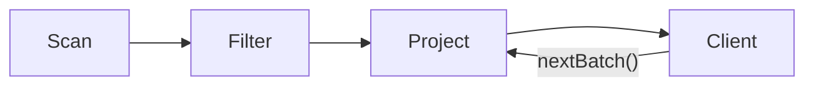
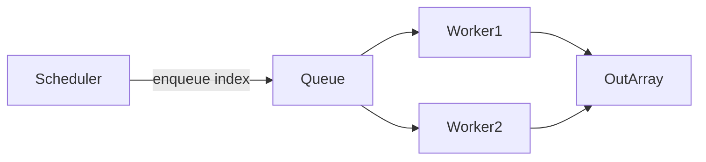

# Chapter 7: Execution Pipeline

A query lives in two phases. **Compilation** turns a declarative request (SQL, LINQ) into a **physical plan** — a data structure naming operators, algorithms, and parameters. **Execution** walks that plan, reads tables, runs kernels, and produces a **result**. The execution pipeline is where declared intent becomes bytes on the wire through the CPU.

**Part I** surveys how the industry runs queries: iterator trees, vectorized batches, compiled code generation, pull versus push dataflow, physical relational operators, and the trade-off between pipelining and materialization. **Part II** documents RainDB's concrete pipeline — `IPhysicalPlan`, `DefaultQueryExecutor`, the operator suite, result types, session context, and determinism guarantees.

---

# Part I: Concepts and Theory

## 7.1 Query execution models

An **execution model** defines how operators call each other and move tuples or vectors through the plan.

### Iterator model (Volcano / tuple-at-a-time)

The **Volcano** model (Graefe, 1990) composes **iterator objects** behind a minimal interface:

```
interface Operator {
    open()
    next() -> Row | END
    close()
}
```

Parents **pull** rows by looping on `next()`. A filter above a scan:

```
Filter.next():
    loop:
        row = child.next()
        if row == END: return END
        if predicate(row): return row
```

| Strength | Weakness |
|----------|----------|
| Uniform composition | Virtual call per row |
| Easy pipelining | Poor CPU cache utilization |
| Extensible operator set | Hard to SIMD without batching |

PostgreSQL, early SQLite, and many teaching systems use Volcano-style iterators.

### Vectorized model (batch-at-a-time)

**Vectorized** execution moves **batches** — hundreds to thousands of rows per `nextBatch()` call:

```
interface VectorOperator {
    open()
    nextBatch() -> Batch | END
    close()
}
```

Inner loops become tight scans over dense arrays, which SIMD and hardware prefetch can accelerate. Columnar storage fits naturally: a batch is a set of parallel column vectors.

| Engine | Vector width (typical) |
|--------|------------------------|
| DuckDB | 2048–65536 rows |
| ClickHouse | block = column chunk |
| RainDB | one `IColumnarBatch` per table segment |

RainDB vectorizes over **existing columnar batches**, not single rows.

### Compiled / code-generation model

**Query compilation** lowers a plan to **native code** (LLVM, machine code, or JVM bytecode) with operators fused into one loop:

```
// conceptual generated loop
for batch in table:
    for i in 0..batch.len:
        if batch.col_amount[i] > 100:
            output.col_region.append(batch.col_region[i])
```

HyPer, Umbra, optional DuckDB paths, and Weld-style systems compile plans. Payoffs:

- Remove virtual dispatch per row or batch
- Let LLVM fuse loops and auto-vectorize
- Specialize per query shape

Trade-offs: compile latency, instruction cache pressure, harder debugging. RainDB uses **interpreted plan dispatch** (`DefaultQueryExecutor` branching on plan types) plus hand-tuned SIMD in vectorized kernels — a middle ground without a JIT tier.

### Model comparison summary

| Model | Unit | Dispatch | SIMD | Compile time |
|-------|------|----------|------|--------------|
| Iterator | 1 row | High | Poor | None |
| Vectorized | N rows | Medium | Good | None |
| Compiled | N rows | Low/inlined | Excellent | High |

---

## 7.2 Pull versus push pipelines

Data can flow **pull-driven** (consumer asks) or **push-driven** (producer sends).

### Pull (demand-driven)

The **root** operator drives the tree:

```
result = root.nextBatch()
  └─ root pulls from child.nextBatch()
       └─ child pulls from scan.nextBatch()
```

Volcano is pull-native. Benefits:

- Natural **pipelining** — produce a batch, consume immediately
- **Lazy** evaluation — `LIMIT` can stop early
- Implicit backpressure — parent requests when ready

### Push (supply-driven)

Producers invoke consumers through callbacks or queues:

```
scan.onBatch(b => filter.onBatch(b => project.onBatch(b => sink)))
```

Push helps **parallel** and **streaming** pipelines:

- Scan threads enqueue morsels
- Workers compete for work
- I/O and compute overlap more easily

RainDB's channel scheduler **pushes batch indices** to workers while each worker **pulls** from `table.Batches[i]` — a hybrid.

### Mermaid: pull pipeline



### Mermaid: push morsel queue



---

## 7.3 Physical operators in relational algebra

Algebra defines *what* to compute; **physical operators** are concrete algorithms with measurable cost.

### Core unary operators

| Algebra | Symbol | Physical operators | Role |
|---------|--------|-------------------|------|
| Scan | — | Sequential scan, index scan | Read base table |
| Selection | σ | Filter, index seek | Predicate on rows |
| Projection | π | Project | Column subset / expression |

`SELECT a, b FROM t WHERE c > 10` becomes:

```
π_{a,b}( σ_{c>10}( Scan(t) ) )
```

### Binary operators

| Algebra | Physical algorithms |
|---------|---------------------|
| Join (⋈) | Nested loop, hash join, sort-merge join |
| Union | Concat, deduplicating hash |
| Group-by | Hash aggregate, sort aggregate |

RainDB ships hash join, sort-merge join, hash aggregate, sort/top-N, vectorized scan/filter/project, distinct, and union-all composition in the executor.

### Operator interface pattern

Physical nodes consume and produce **columnar batches** (RainDB) or **row streams** (Volcano):

```
Scan(table) -> Batch*
Filter(pred, Batch) -> Batch'
Project(cols, Batch') -> Batch''
```

One logical query admits many physical plans — the **optimizer** (or test harness) picks the implementation.

---

## 7.4 Query plan as data structure

A **physical plan** is an immutable **tree or DAG** describing *how* to execute. It is data, not running code — an interpreter or compiler consumes it.

### Plan node contents (typical)

```
ScanNode {
    table_id: ObjectId
    output_columns: [0, 2, 5]
    filters: [ col2 > 100, col0 = 'US' ]
}

HashJoinNode {
    probe: ScanNode(...)
    build: ScanNode(...)
    keys: ([0], [1])
    algorithm: Hash
}
```

### Plans versus interpreters

| Approach | Plan role |
|----------|-----------|
| Interpreter | Executor `switch`es on plan record types |
| JIT compiler | Plan lowers to LLVM / IL |
| Stored procedures | Plan cached and reused |

RainDB defines **records** implementing `IPhysicalPlan` with `Explain()` for debugging. `DefaultQueryExecutor` interprets them and delegates to injectable operator instances.

### Immutability benefits

- Safe to share across planner threads
- Cacheable on `(sql, schema_fingerprint)`
- Stable EXPLAIN output
- No leaked operator state between queries

---

## 7.5 Materialization versus pipelining

**Pipelining** hands batches directly from producer to consumer. **Materialization** stores an intermediate relation before the next operator starts.

### Pipelined execution

```
Scan --batch--> Filter --batch--> Project --batch--> Client
         (no full table copy between operators)
```

Traits:

- Smaller **memory footprint** for selective queries
- Potential **CPU overlap** across operators when threaded
- Awkward for **multi-pass** algorithms (sort, hash join build)

### Materialized execution

```
Join --> full wide result in memory --> HashAggregate
```

RainDB's `GroupedJoinPhysicalPlan` **materializes** join output, wraps it in `EphemeralColumnarTableSource`, then aggregates — straightforward but RAM-heavy. `DerivedTableScanPhysicalPlan` materializes a subquery, registers it on an **overlay catalog**, then runs an outer plan against that ephemeral table.

| Materialize when | Pipeline when |
|------------------|---------------|
| Operator needs a second pass | Single-pass filter/project |
| Intermediate reused | Tight memory budget |
| Derived table / grouped join | Selective, streaming output |

### Spill as materialization to disk

When hash aggregate or sort exceeds RAM, operators **spill** to disk — materialization on a slower medium. RainDB's `ISpillWriter` port reserves a hook for that path.

---

## 7.6 Deterministic parallelism in OLAP

Parallel schedules are **non-deterministic** (thread finish order) but **results must be deterministic** (modulo allowed FP reordering).

### Sources of non-determinism

| Source | Affects result? |
|--------|-----------------|
| Thread completion order | Only if merge is wrong |
| Hash table iteration order | Group output order, not per-group values |
| FP add order | Yes for floats unless compensated |
| Random sort tie-break | Needs a stable rule |

### Deterministic merge patterns

**Index-stable output:** worker `w` writes `output[i]` for a fixed batch index `i`:

```
parallel for i in 0..n-1:
    output[i] = process(input[i])
```

**Deterministic reduction:** fold partials in ascending batch order:

```
total = partial[0]
for i in 1..n-1:
    total = combine(total, partial[i])
```

RainDB's vectorized scan path uses both for project and aggregate paths.

### OLAP parallelism granularity

| Granularity | Description |
|-------------|-------------|
| Query-level | Different queries on different cores |
| Operator-level | Parallel hash build/probe |
| Morsel-level | Parallel batches inside scan |

**Morsel-driven parallelism** (Leis et al.) assigns small **morsels** dynamically for load balance. RainDB assigns one table batch per morsel with static index partitioning.

### Cancellation

Parallel loops should respect **cancellation tokens** — exit cleanly without corrupting shared state. RainDB forwards `context.CancellationToken` to parallel loops and channel workers.

---

## 7.7 Separation of compilation and execution

Production engines draw a hard line:

```
┌──────────────┐     ┌──────────────┐     ┌──────────────┐
│   Parser     │ ──► │   Binder     │ ──► │   Planner    │
│  (syntax)    │     │  (catalog)   │     │  (physical)  │
└──────────────┘     └──────────────┘     └──────┬───────┘
                                                  │
                                                  ▼
                                           IPhysicalPlan
                                                  │
                                                  ▼
                                           IQueryExecutor
```

The executor **never parses SQL**. It takes a plan plus `IExecutionContext` (catalog, buffers, spill, cancellation). Tests call `ExecutePhysicalAsync(plan)` directly, skipping compilation.

---

## 7.8 Result delivery models

Execution can surface several **result shapes**:

| Shape | Use case |
|-------|----------|
| Columnar batches | `SELECT` returning rows |
| Scalar aggregate | `SELECT SUM(x)` |
| Explain text | `EXPLAIN` / `EXPLAIN LOGICAL` / `EXPLAIN PHYSICAL` |
| Empty | Unsupported or zero-row edge cases |

Every shape must **release resources** — pooled buffers, native handles — through `Dispose` / `DisposeAsync`.

---

## 7.9 Summary: Part I checklist

1. **Iterator vs vectorized vs compiled** — RainDB is vectorized with interpreted dispatch.
2. **Pull vs push** — Parents pull batches; parallel morsels push indices to workers.
3. **Physical operators** — Scan, filter, project, join, aggregate implement algebra.
4. **Plan as data** — Immutable records, not self-executing objects.
5. **Pipeline vs materialize** — RainDB pipelines per-batch scan/filter/project; grouped join and derived tables materialize.
6. **Deterministic parallelism** — Fixed output slots and ordered partial combines.

### Bridge to RainDB today

Part I described execution models in the abstract. RainDB's current runtime matches the vectorized, plan-interpreter pattern: compilation (including rule-based logical rewrites and join heuristics) produces `IPhysicalPlan` trees; `DefaultQueryExecutor` dispatches them through **`IQueryOperatorSuite`** rather than monolithic static engine classes. Nested subqueries and derived tables reuse the same executor via **`NestedExecutor`** on the session context.

---

# Part II: RainDB Implementation

## 7.10 Separation of planning and execution

```
  SQL / LINQ string
        │
        ▼
  ISqlCompiler (DefaultSqlCompiler → SqlCompilationService)
        │
        ▼
  IPhysicalPlan
        │
        ▼
  IQueryExecutor.ExecuteAsync(plan, context)
        │
        ├── IQueryOperatorSuite (DefaultQueryOperatorSuite)
        │     Scan, HashAggregate, Join, SortTopN, GroupedJoin, Distinct
        │
        ├── Executor-local composition (UnionAll, DerivedTableScan, grouped sort wrappers)
        │
        ▼
  IQueryResult
```

**Single responsibility:** Parsers, optimizers, and binders live in `RainDB.Sql`. Operator implementations live under `RainDB.Query.Execution.Operators`. The executor resolves catalog tables and routes each plan type; it does not parse SQL.

**Composition root:** `RainDbEngine.CreateDefault()` wires:

```csharp
var executor = new DefaultQueryExecutor(new DefaultQueryOperatorSuite());
var sql = new DefaultSqlCompiler();
```

Sessions are created with **`NestedExecutor`** set to the engine's executor (required for subquery and correlated apply paths) and optional **`MappedBatchScanObserver`** when opened from a file-backed database.

---

## 7.11 IPhysicalPlan: the operator contract

```csharp
public interface IPhysicalPlan
{
    string Explain(string indent = "");
}
```

Every plan implements **`Explain`** for debugging and physical EXPLAIN formatting. There is no `Execute` on the plan itself — **`DefaultQueryExecutor`** is the interpreter.

Plans are **immutable** structures built at compile time: `TableId` values, column indices, filter structs, nested child plans, and execution options.

---

## 7.12 Physical plan taxonomy

RainDB defines thirteen plan types under `RainDB.Query/Plans/`:

| Plan | Role | Typical execution path |
|------|------|------------------------|
| `VectorizedScanPhysicalPlan` | Single-table scan, filter, project, global aggregate | `_operators.Scan` |
| `HashAggregatePhysicalPlan` | `GROUP BY` hash aggregation | `_operators.HashAggregate` |
| `JoinPhysicalPlan` | Equi-join (hash or sort-merge) | `_operators.Join` |
| `SortTopNPhysicalPlan` | Table scan + sort / limit | `_operators.SortTopN.ExecuteTableAsync` |
| `JoinSortTopNPhysicalPlan` | Join + sort / limit on wide output | `_operators.SortTopN.ExecuteJoinAsync` |
| `GroupedJoinPhysicalPlan` | Join materialization + hash aggregate | `_operators.GroupedJoin` |
| `GroupedJoinSortTopNPhysicalPlan` | Grouped join + sort / limit on aggregate output | Grouped join operator, then ephemeral table + sort |
| `GroupedSortTopNPhysicalPlan` | Hash aggregate + sort / limit | Execute aggregate plan, overlay catalog, sort |
| `DerivedTableScanPhysicalPlan` | `FROM (subquery) alias` | Materialize subquery; overlay catalog; run outer plan |
| `DistinctPhysicalPlan` | `SELECT DISTINCT` / dedup branch | `_operators.Distinct` (may recurse via executor) |
| `UnionAllPhysicalPlan` | `UNION ALL` | Execute each input plan; concatenate batches |
| `ExplainBundlePhysicalPlan` | `EXPLAIN` SQL | Returns `ExplainTextQueryResult` (not row data) |
| `ExplainOnlyPhysicalPlan` | Legacy / placeholder label | Throws if executed directly |

`ExplainOnlyPhysicalPlan` is not a runnable operator — attempting execution throws `NotSupportedException` with guidance to use EXPLAIN APIs.

---

## 7.13 IQueryOperatorSuite and QueryOperatorDependencies

Physical algorithms are packaged as **instance operators** behind **`IQueryOperatorSuite`**. **`DefaultQueryOperatorSuite`** constructs defaults (or accepts test doubles) and shares **`QueryOperatorDependencies`** — selection evaluation, projection gather, join batch materialization, sort row selection, group-key factories, and **`IColumnarAggregateIntrinsics`**.

```csharp
public sealed class DefaultQueryOperatorSuite : IQueryOperatorSuite
{
    public IVectorizedScanOperator Scan { get; }
    public IHashAggregateOperator HashAggregate { get; }
    public IJoinOperator Join { get; }
    public ISortTopNOperator SortTopN { get; }
    public IGroupedJoinOperator GroupedJoin { get; }
    public IDistinctOperator Distinct { get; }
}
```

**Why a suite?** Tests can inject a fake join operator while keeping real scan code. Production uses one **`QueryOperatorDependencies`** bag so **`VectorizedScanOperator`**, **`JoinOperator`**, and **`HashAggregateOperator`** share the same selection kernels and SIMD aggregate helpers.

**Legacy note:** Older docs referenced static types such as `VectorizedScanEngine` and `JoinExecutionEngine`. The current codebase routes through operator classes that wrap the same vectorized kernels; the executor depends on **`IQueryOperatorSuite`**, not static facades.

---

## 7.14 DefaultQueryExecutor dispatch

`DefaultQueryExecutor` accepts an optional **`IQueryOperatorSuite`** (default **`DefaultQueryOperatorSuite`**). Each branch resolves **`IColumnarTableSource`** from **`context.Catalog`** via **`RequireColumnarTable`**, then delegates:

| Branch | Delegation |
|--------|------------|
| Scan / hash agg / join / sort (table or join) | Matching operator on the suite |
| `GroupedJoinSortTopNPhysicalPlan` | `GroupedJoin` then **`SortGroupedOutputAsync`** |
| `GroupedSortTopNPhysicalPlan` | Recursive **`ExecuteAsync`** on inner aggregate, then sort wrapper |
| `DerivedTableScanPhysicalPlan` | **`ExecuteDerivedTableAsync`** (see §7.16) |
| `DistinctPhysicalPlan` | **`Distinct.ExecuteAsync`** with executor reference for child plans |
| `UnionAllPhysicalPlan` | Sequential **`ExecuteAsync`** on each input; append batches |
| `ExplainBundlePhysicalPlan` | **`ExplainTextQueryResult`** from bundled text |
| Unknown / `ExplainOnlyPhysicalPlan` | **`NotSupportedException`** |

At entry, the executor calls **`plan.Explain()`** once (useful for future tracing hooks).

---

## 7.15 Grouped join and grouped sort composition

### GroupedJoinPhysicalPlan

SQL pattern: `SELECT ... FROM a JOIN b ... GROUP BY ...`

The suite's **`GroupedJoinOperator`** runs the join, wraps batches in **`EphemeralColumnarTableSource`**, and invokes hash aggregation — same materialization pattern as before, now encapsulated in the operator rather than inline executor code.

### GroupedJoinSortTopNPhysicalPlan and GroupedSortTopNPhysicalPlan

When SQL combines **`GROUP BY`** with **`ORDER BY`** / **`LIMIT`**, compilation emits composite plans. The executor:

1. Produces grouped columnar output (join+agg or hash agg alone).
2. Copies batch references into a new ephemeral table.
3. Builds an **`OverlayCatalog`** over the session catalog.
4. Runs **`SortTopNPhysicalPlan`** against the ephemeral id inside a scoped **`RainDbExecutionContext`**.

Group key and aggregate column indices in the inner plans refer to **join output schema** ordinals where applicable; the binder is responsible for mapping SQL names to those indices.

---

## 7.16 Derived table overlay catalog pattern

**`DerivedTableScanPhysicalPlan`** represents `FROM (SELECT …) AS alias` after compilation:

1. **`ExecuteAsync(plan.Subquery, context)`** — run the inner plan.
2. Require **`IColumnarQueryResult`**; copy batch references into a list.
3. Construct **`EphemeralColumnarTableSource`** with alias, derived schema, and synthetic **`TableId`**.
4. Wrap **`context.Catalog`** in **`OverlayCatalog`**, registering only the ephemeral table on top of the base catalog.
5. Create a scoped **`RainDbExecutionContext`** with the overlay, preserving buffer pools, spill writer, cancellation, **`MappedBatchScanObserver`**, and **`NestedExecutor`**.
6. **`ExecuteAsync(plan.OuterPlan, scoped)`** — outer scan/join/aggregate resolves the alias through the overlay.

**Name resolution:** Overlay lookups check ephemeral tables first (by name and **`TableId`**), then fall through to the base catalog. **`Register`** on the overlay forwards to the base catalog so application-visible tables are unchanged.

This pattern avoids persisting intermediate results while reusing the same scan and join operators for outer queries.

---

## 7.17 Session context: NestedExecutor and mmap observation

**`RainDbExecutionContext`** extends **`IExecutionContext`** with RainDB-specific execution hooks:

| Member | Purpose |
|--------|---------|
| `Catalog` | Table resolution (may be **`OverlayCatalog`** during derived-table or grouped-sort phases) |
| `BufferPool` / `AlignedBufferPool` | Projection buffers and SIMD alignment |
| `SpillWriter` | Hash aggregate spill hook |
| `CancellationToken` | Cooperative cancel in parallel loops |
| `MappedBatchScanObserver` | Optional LRU / budget tracking when batches are mmap-backed |
| `NestedExecutor` | **`IQueryExecutor`** used to run nested physical plans (subqueries, correlated apply) |

**`RainDbEngine.CreateSession`** sets **`NestedExecutor = Executor`** and, for **`OpenPersistent`**, passes **`FileDatabase.MappedBatchScanObserver`** so vectorized scans can notify the mmap memory manager when a mapped batch is touched.

Operators that evaluate **`IN`**, **`EXISTS`**, or correlated predicates require **`NestedExecutor`**; missing it yields **`InvalidOperationException`** at runtime with an explicit message.

---

## 7.18 UnionAll and Distinct

**`UnionAllPhysicalPlan`** holds an array of child **`IPhysicalPlan`** nodes. The executor runs each child with the **same** session context, requires columnar results, and concatenates batch lists into one **`ColumnarMaterializedQueryResult`**. Schema compatibility is enforced at compile time in **`LogicalUnionAllBinder`**.

**`DistinctPhysicalPlan`** wraps an input plan. **`DistinctOperator`** executes the child (via the executor reference), then deduplicates rows according to the plan's key columns — used for **`SELECT DISTINCT`**, **`UNION`** (dedup), and **`COUNT(DISTINCT)`** lowering paths.

---

## 7.19 EXPLAIN execution path

SQL **`EXPLAIN`**, **`EXPLAIN LOGICAL`**, and **`EXPLAIN PHYSICAL`** compile to **`ExplainBundlePhysicalPlan`**, carrying formatted logical and physical text plus an explain level. **`DefaultQueryExecutor`** does not treat this as a relational operator:

```csharp
if (plan is ExplainBundlePhysicalPlan bundle)
    return new ExplainTextQueryResult(bundle.Explain());
```

**`DefaultSqlCompiler`** skips caching explain bundles in **`CompiledSqlCache`**. Parameterized SQL and explain statements follow separate prepare/compile paths (Chapter 13).

---

## 7.20 IQueryResult type hierarchy

```csharp
public interface IQueryResult : IAsyncDisposable
{
    long RowCount { get; }
}
```

**`IColumnarQueryResult`** — **`IReadOnlyList<IColumnarBatch> Batches`** for row-returning queries.

**`IAggregateQueryResult`** — scalar global aggregates with nullability via **`ValueIsNull`**.

**`ExplainTextQueryResult`** — textual plan output for EXPLAIN SQL.

**`EmptyQueryResult`** — internal zero-row placeholder where applicable.

Callers should pattern-match after **`ExecuteSqlAsync`**:

```csharp
await using var result = await engine.ExecuteSqlAsync("EXPLAIN SELECT 1");
if (result is ExplainTextQueryResult explain)
    Console.WriteLine(explain.Text);
else if (result is IAggregateQueryResult agg)
    Console.WriteLine(agg.Int64Value);
else if (result is IColumnarQueryResult col)
    foreach (var batch in col.Batches) { /* ... */ }
```

---

## 7.21 Execution options and parallelism

**`VectorizedScanExecutionOptions`** propagates to scan, hash aggregate, and sort paths:

- **`MaxDegreeOfParallelism`** — `-1` uses processor count; `0` or `1` serializes batch loops.
- **`UseChannelScheduler`** — channel-based morsel scheduling vs **`Parallel.For`**.
- **`UseAvx2DoubleSum`** (and related flags on aggregates) — SIMD fast paths when columns are null-free.

Join algorithm (**hash** vs **sort-merge**) is chosen at **compile time** via **`HeuristicJoinAlgorithmSelector`** and stored on **`JoinPhysicalPlan`**, not on the session context.

---

## 7.22 Determinism and error handling

**Determinism:** Scan and project paths write outputs by **batch index**. Partial aggregates merge in ascending batch order. Sort operators define total order from **`SortKeyPhysicalSpec`**. Hash join and sort-merge join are tested for equi-key correctness; group aggregate values are keyed by group identity, not hash iteration order.

**Errors:** Missing catalog entries throw **`InvalidOperationException`** in **`RequireColumnarTable`**. Union branches that are not columnar throw **`NotSupportedException`**. Explain-only plans throw if executed as generic physical plans. There is no partial result on failure — use **`await using`** on successful result paths; grouped paths dispose inner results in **`finally`** blocks where applicable.

---

## 7.23 End-to-end trace (simple scan)

```
1. DefaultSqlCompiler.CompileAsync
   → SqlCompilationService: optimize → bind
   → VectorizedScanPhysicalPlan(...)

2. DefaultQueryExecutor
   → RequireColumnarTable → MemoryTable

3. DefaultQueryOperatorSuite.Scan.ExecuteAsync
   → per-batch selection + project (optional parallel morsels)
   → MappedBatchScanObserver.NotifyScan (if mmap-backed)

4. ColumnarMaterializedQueryResult or AggregateQueryResult
   → DisposeAsync releases pooled chunks
```

---

## 7.24 Chapter summary

RainDB executes **immutable physical plans** through **`DefaultQueryExecutor`**, which delegates relational operators to **`DefaultQueryOperatorSuite`** and composes derived tables, union, distinct, and grouped sort/limit locally. **`RainDbExecutionContext`** supplies catalog (including **`OverlayCatalog`** overlays), memory pools, spill, cancellation, **`NestedExecutor`** for nested plans, and optional **`MappedBatchScanObserver`** for file-backed tables. EXPLAIN SQL returns **`ExplainTextQueryResult`** via **`ExplainBundlePhysicalPlan`**, separate from normal row pipelines.

Chapter 8 zooms into the most common leaf operator: vectorized scan, filter, and project.
