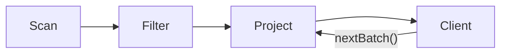
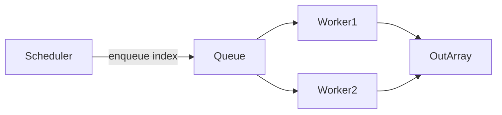

# Chapter 7: Execution Pipeline

A query lives in two phases. **Compilation** turns a declarative request (SQL, LINQ) into a **physical plan** — a data structure naming operators, algorithms, and parameters. **Execution** walks that plan, reads tables, runs kernels, and produces a **result**. The execution pipeline is where declared intent becomes bytes on the wire through the CPU.

**Part I** surveys how the industry runs queries: iterator trees, vectorized batches, compiled code generation, pull versus push dataflow, physical relational operators, and the trade-off between pipelining and materialization. **Part II** documents RainDB's concrete pipeline — `IPhysicalPlan`, `DefaultQueryExecutor`, result types, parallelism knobs, and determinism guarantees.

---

# Part I: Concepts and Theory

## 7.1 Query execution models

An **execution model** defines how operators call each other and move tuples or vectors through the plan.

### Iterator model (Volcano / tuple-at-a-time)

The **Volcano** model (Graefe, 1990) composes **iterator objects** behind a minimal interface:

```
interface Operator {
    open()
    next() -> Row | END
    close()
}
```

Parents **pull** rows by looping on `next()`. A filter above a scan:

```
Filter.next():
    loop:
        row = child.next()
        if row == END: return END
        if predicate(row): return row
```

| Strength | Weakness |
|----------|----------|
| Uniform composition | Virtual call per row |
| Easy pipelining | Poor CPU cache utilization |
| Extensible operator set | Hard to SIMD without batching |

PostgreSQL, early SQLite, and many teaching systems use Volcano-style iterators.

### Vectorized model (batch-at-a-time)

**Vectorized** execution moves **batches** — hundreds to thousands of rows per `nextBatch()` call:

```
interface VectorOperator {
    open()
    nextBatch() -> Batch | END
    close()
}
```

Inner loops become tight scans over dense arrays, which SIMD and hardware prefetch can accelerate. Columnar storage fits naturally: a batch is a set of parallel column vectors.

| Engine | Vector width (typical) |
|--------|------------------------|
| DuckDB | 2048–65536 rows |
| ClickHouse | block = column chunk |
| RainDB | one `IColumnarBatch` per table segment |

RainDB Phase 1 vectorizes over **existing columnar batches**, not single rows.

### Compiled / code-generation model

**Query compilation** lowers a plan to **native code** (LLVM, machine code, or JVM bytecode) with operators fused into one loop:

```
// conceptual generated loop
for batch in table:
    for i in 0..batch.len:
        if batch.col_amount[i] > 100:
            output.col_region.append(batch.col_region[i])
```

HyPer, Umbra, optional DuckDB paths, and Weld-style systems compile plans. Payoffs:

- Remove virtual dispatch per row or batch
- Let LLVM fuse loops and auto-vectorize
- Specialize per query shape

Trade-offs: compile latency, instruction cache pressure, harder debugging. RainDB Phase 1 uses **interpreted plan dispatch** (`DefaultQueryExecutor` switch) plus hand-tuned SIMD — a middle ground.

### Model comparison summary

| Model | Unit | Dispatch | SIMD | Compile time |
|-------|------|----------|------|--------------|
| Iterator | 1 row | High | Poor | None |
| Vectorized | N rows | Medium | Good | None |
| Compiled | N rows | Low/inlined | Excellent | High |

---

## 7.2 Pull versus push pipelines

Data can flow **pull-driven** (consumer asks) or **push-driven** (producer sends).

### Pull (demand-driven)

The **root** operator drives the tree:

```
result = root.nextBatch()
  └─ root pulls from child.nextBatch()
       └─ child pulls from scan.nextBatch()
```

Volcano is pull-native. Benefits:

- Natural **pipelining** — produce a batch, consume immediately
- **Lazy** evaluation — `LIMIT` can stop early
- Implicit backpressure — parent requests when ready

### Push (supply-driven)

Producers invoke consumers through callbacks or queues:

```
scan.onBatch(b => filter.onBatch(b => project.onBatch(b => sink)))
```

Push helps **parallel** and **streaming** pipelines:

- Scan threads enqueue morsels
- Workers compete for work
- I/O and compute overlap more easily

RainDB's channel scheduler (Chapter 8) **pushes batch indices** to workers while each worker **pulls** from `table.Batches[i]` — a hybrid.

### Mermaid: pull pipeline



### Mermaid: push morsel queue



---

## 7.3 Physical operators in relational algebra

Algebra defines *what* to compute; **physical operators** are concrete algorithms with measurable cost.

### Core unary operators

| Algebra | Symbol | Physical operators | Role |
|---------|--------|-------------------|------|
| Scan | — | Sequential scan, index scan | Read base table |
| Selection | σ | Filter, index seek | Predicate on rows |
| Projection | π | Project | Column subset / expression |

`SELECT a, b FROM t WHERE c > 10` becomes:

```
π_{a,b}( σ_{c>10}( Scan(t) ) )
```

### Binary operators

| Algebra | Physical algorithms |
|---------|---------------------|
| Join (⋈) | Nested loop, hash join, sort-merge join |
| Union | Concat, deduplicating hash |
| Group-by | Hash aggregate, sort aggregate |

RainDB Phase 1 ships hash join, sort-merge join, hash aggregate, sort/top-N, and vectorized scan/filter/project.

### Operator interface pattern

Physical nodes consume and produce **columnar batches** (RainDB) or **row streams** (Volcano):

```
Scan(table) -> Batch*
Filter(pred, Batch) -> Batch'
Project(cols, Batch') -> Batch''
```

One logical query admits many physical plans — the **optimizer** (or test harness) picks the implementation.

---

## 7.4 Query plan as data structure

A **physical plan** is an immutable **tree or DAG** describing *how* to execute. It is data, not running code — an interpreter or compiler consumes it.

### Plan node contents (typical)

```
ScanNode {
    table_id: ObjectId
    output_columns: [0, 2, 5]
    filters: [ col2 > 100, col0 = 'US' ]
}

HashJoinNode {
    probe: ScanNode(...)
    build: ScanNode(...)
    keys: ([0], [1])
    algorithm: Hash
}
```

### Plans versus interpreters

| Approach | Plan role |
|----------|-----------|
| Interpreter | Executor `switch`es on plan record types |
| JIT compiler | Plan lowers to LLVM / IL |
| Stored procedures | Plan cached and reused |

RainDB defines **records** implementing `IPhysicalPlan` with `Explain()` for debugging. `DefaultQueryExecutor` interprets them.

### Immutability benefits

- Safe to share across planner threads
- Cacheable on `(sql, schema_version)`
- Stable EXPLAIN output
- No leaked operator state between queries

---

## 7.5 Materialization versus pipelining

**Pipelining** hands batches directly from producer to consumer. **Materialization** stores an intermediate relation before the next operator starts.

### Pipelined execution

```
Scan --batch--> Filter --batch--> Project --batch--> Client
         (no full table copy between operators)
```

Traits:

- Smaller **memory footprint** for selective queries
- Potential **CPU overlap** across operators when threaded
- Awkward for **multi-pass** algorithms (sort, hash join build)

### Materialized execution

```
Join --> full wide result in memory --> HashAggregate
```

RainDB's `GroupedJoinPhysicalPlan` **materializes** join output, wraps it in `EphemeralColumnarTableSource`, then aggregates — straightforward but RAM-heavy.

| Materialize when | Pipeline when |
|------------------|---------------|
| Operator needs a second pass | Single-pass filter/project |
| Intermediate reused | Tight memory budget |
| Simpler Phase 1 engine | Selective, streaming output |

### Spill as materialization to disk

When hash aggregate or sort exceeds RAM, operators **spill** to disk — materialization on a slower medium. RainDB's `ISpillWriter` port reserves a hook for that path.

---

## 7.6 Deterministic parallelism in OLAP

Parallel schedules are **non-deterministic** (thread finish order) but **results must be deterministic** (modulo allowed FP reordering).

### Sources of non-determinism

| Source | Affects result? |
|--------|-----------------|
| Thread completion order | Only if merge is wrong |
| Hash table iteration order | Group output order, not per-group values |
| FP add order | Yes for floats unless compensated |
| Random sort tie-break | Needs a stable rule |

### Deterministic merge patterns

**Index-stable output:** worker `w` writes `output[i]` for a fixed batch index `i`:

```
parallel for i in 0..n-1:
    output[i] = process(input[i])
```

**Deterministic reduction:** fold partials in ascending batch order:

```
total = partial[0]
for i in 1..n-1:
    total = combine(total, partial[i])
```

RainDB's `VectorizedScanEngine` uses both for project and aggregate paths.

### OLAP parallelism granularity

| Granularity | Description |
|-------------|-------------|
| Query-level | Different queries on different cores |
| Operator-level | Parallel hash build/probe |
| Morsel-level | Parallel batches inside scan |

**Morsel-driven parallelism** (Leis et al.) assigns small **morsels** dynamically for load balance. RainDB assigns one table batch per morsel with static index partitioning.

### Cancellation

Parallel loops should respect **cancellation tokens** — exit cleanly without corrupting shared state. RainDB forwards `context.CancellationToken` to `Parallel.For` and channel workers.

---

## 7.7 Separation of compilation and execution

Production engines draw a hard line:

```
┌──────────────┐     ┌──────────────┐     ┌──────────────┐
│   Parser     │ ──► │   Binder     │ ──► │   Planner    │
│  (syntax)    │     │  (catalog)   │     │  (physical)  │
└──────────────┘     └──────────────┘     └──────┬───────┘
                                                  │
                                                  ▼
                                           IPhysicalPlan
                                                  │
                                                  ▼
                                           IQueryExecutor
```

The executor **never parses SQL**. It takes a plan plus `IExecutionContext` (catalog, buffers, spill, cancellation). Tests call `ExecutePhysicalAsync(plan)` directly, skipping compilation.

---

## 7.8 Result delivery models

Execution can surface several **result shapes**:

| Shape | Use case |
|-------|----------|
| Columnar batches | `SELECT` returning rows |
| Scalar aggregate | `SELECT SUM(x)` |
| Empty | `EXPLAIN` only, unsupported plans |
| Streaming cursor | Future: incremental client read |

Every shape must **release resources** — pooled buffers, native handles — through `Dispose` / `DisposeAsync`.

---

## 7.9 Summary: Part I checklist

1. **Iterator vs vectorized vs compiled** — RainDB is vectorized with interpreted dispatch.
2. **Pull vs push** — Parents pull batches; parallel morsels push indices to workers.
3. **Physical operators** — Scan, filter, project, join, aggregate implement algebra.
4. **Plan as data** — Immutable records, not self-executing objects.
5. **Pipeline vs materialize** — RainDB pipelines per-batch scan/filter/project; grouped join materializes.
6. **Deterministic parallelism** — Fixed output slots and ordered partial combines.

---

# Transition to Part II: RainDB Implementation

RainDB separates **`IPhysicalPlan`** (what to run) from **`IQueryExecutor`** (how to run it). **`DefaultQueryExecutor`** matches seven plan types and delegates to `VectorizedScanEngine`, `HashAggregateEngine`, `JoinExecutionEngine`, and `SortTopNEngine`. Results implement **`IQueryResult`** with async disposal. **`RainDbExecutionContext`** carries catalog, buffer pools, spill writer, and cancellation into every engine.

---

# Part II: RainDB Implementation

## 7.10 Separation of planning and execution

```
  SQL / LINQ string
        │
        ▼
  ISqlCompiler / ILinqCompiler  ──►  IPhysicalPlan
        │
        ▼
  IQueryExecutor.ExecuteAsync(plan, context)
        │
        ├── VectorizedScanEngine
        ├── HashAggregateEngine
        ├── JoinExecutionEngine
        ├── SortTopNEngine
        └── (fallback) EmptyQueryResult
        │
        ▼
  IQueryResult  (columnar batches, single aggregate, or empty)
```

**Single responsibility:** Parsers and binders live in `RainDB.Sql` and `RainDB.Linq`. Operators live in `RainDB.Query.Execution`. The executor never parses SQL.

**Composition root:** `RainDbEngine` constructs `DefaultQueryExecutor` and exposes:

```csharp
public IExecutionContext CreateSession(CancellationToken cancellationToken = default) =>
    new RainDbExecutionContext(Catalog, BufferPool, AlignedBufferPool, SpillWriter, cancellationToken);

public async ValueTask<IQueryResult> ExecuteSqlAsync(string sql, CancellationToken ct = default)
{
    var ctx = CreateSession(ct);
    var plan = await SqlCompiler.CompileAsync(sql, Catalog, ct);
    return await Executor.ExecuteAsync(plan, ctx);
}
```

Physical plan tests call `ExecutePhysicalAsync(plan)` directly, bypassing SQL.

---

## 7.11 IPhysicalPlan: the operator contract

```csharp
// src/RainDB.Abstractions/Execution/IPhysicalPlan.cs
public interface IPhysicalPlan
{
    string Explain(string indent = "");
}
```

Every plan implements **`Explain`** for debugging and `EXPLAIN` output. There is no `Execute` on the plan itself — the visitor is `DefaultQueryExecutor`.

Plans are **immutable records/classes** constructed at compile time. They hold `TableId` values, column indices, filter structs, and options — no runtime mutable state.

---

## 7.12 Physical plan taxonomy

RainDB ships seven plan types in `src/RainDB.Query/Plans/`:

| Plan | File | Executes via |
|------|------|--------------|
| `VectorizedScanPhysicalPlan` | `VectorizedScanPhysicalPlan.cs` | `VectorizedScanEngine` |
| `HashAggregatePhysicalPlan` | `HashAggregatePhysicalPlan.cs` | `HashAggregateEngine` |
| `JoinPhysicalPlan` | `JoinPhysicalPlan.cs` | `JoinExecutionEngine` |
| `SortTopNPhysicalPlan` | `SortTopNPhysicalPlan.cs` | `SortTopNEngine.ExecuteTableAsync` |
| `JoinSortTopNPhysicalPlan` | `JoinSortTopNPhysicalPlan.cs` | `SortTopNEngine.ExecuteJoinAsync` |
| `GroupedJoinPhysicalPlan` | `GroupedJoinPhysicalPlan.cs` | Join engine → ephemeral table → hash aggregate |
| `ExplainOnlyPhysicalPlan` | `ExplainOnlyPhysicalPlan.cs` | **Not executed** — falls through to empty result |

### Plan summaries

- **`VectorizedScanPhysicalPlan`** — single-table scan; `OutputColumnIndices`, optional `Filters` (AND), optional global `Aggregate`, `Options`. Returns `IAggregateQueryResult` when `Aggregate` is set.
- **`HashAggregatePhysicalPlan`** — `GROUP BY` via `GroupKeyColumnIndices` + `Aggregates[]`; `OutputColumns` slot layout; optional `SpillPartialEntryThreshold`.
- **`JoinPhysicalPlan`** — inner equi-join (`PhysicalJoinAlgorithm.Hash` or `SortMerge`); probe/build `TableId`, key index arrays, `OutputSchema`, optional per-side filters.
- **`SortTopNPhysicalPlan`** — filter, project, `SortKeys`, `Limit` on one table.
- **`JoinSortTopNPhysicalPlan`** — nested `Join` + sort/limit on join output.
- **`GroupedJoinPhysicalPlan`** — `Join` + `HashAggregatePhysicalPlan` composite (§7.15).
- **`ExplainOnlyPhysicalPlan`** — `Label` only; executor returns `EmptyQueryResult`.

---

## 7.13 Shared plan building blocks

### ColumnCompareFilter

```csharp
public readonly record struct ColumnCompareFilter(
    int ColumnIndex,
    ScalarCompareOp Op,
    long ImmediateBits,
    byte[]? Utf8LiteralBytes = null);
```

Fixed-width predicates pack immediates in `ImmediateBits` (`int` cast for `Int32`, `BitConverter` for `Float64`). UTF-8 uses `Utf8LiteralBytes` with only `Eq` / `Ne`.

### AggregateSpec

```csharp
public readonly record struct AggregateSpec(int SourceColumnIndex, AggregateKind Kind);
```

`SourceColumnIndex == -1` means `COUNT(*)`.

### VectorizedScanExecutionOptions

```csharp
public readonly record struct VectorizedScanExecutionOptions
{
    /// <summary>-1 = Environment.ProcessorCount; 0 = serial; 1 = one worker.</summary>
    public int MaxDegreeOfParallelism { get; init; }

    /// <summary>Channel-based morsel scheduler vs Parallel.For.</summary>
    public bool UseChannelScheduler { get; init; }

    /// <summary>AVX2 horizontal sum for unfiltered Float64 SUM.</summary>
    public bool UseAvx2DoubleSum { get; init; }
}
```

Used by scan, hash aggregate, and sort engines for parallel batch processing.

### SortKeyPhysicalSpec

```csharp
public readonly record struct SortKeyPhysicalSpec(int ColumnIndex, bool Descending);
```

---

## 7.14 DefaultQueryExecutor: complete walkthrough

```csharp
// src/RainDB.Query/Execution/DefaultQueryExecutor.cs
public sealed class DefaultQueryExecutor : IQueryExecutor
{
    public async ValueTask<IQueryResult> ExecuteAsync(IPhysicalPlan plan, IExecutionContext context)
    {
        ArgumentNullException.ThrowIfNull(plan);
        ArgumentNullException.ThrowIfNull(context);
        ArgumentNullException.ThrowIfNull(context.AlignedBufferPool);
        _ = plan.Explain();

        if (plan is VectorizedScanPhysicalPlan vs) { ... }
        if (plan is HashAggregatePhysicalPlan ha) { ... }
        if (plan is JoinPhysicalPlan join) { ... }
        if (plan is SortTopNPhysicalPlan st) { ... }
        if (plan is JoinSortTopNPhysicalPlan jst) { ... }
        if (plan is GroupedJoinPhysicalPlan grouped) { ... }

        IQueryResult r = new EmptyQueryResult(0);
        return r;
    }
}
```

Every branch follows the same **catalog resolution** pattern before delegating to an engine.

| Branch | Plan | Engine | Result |
|--------|------|--------|--------|
| 1 | `VectorizedScanPhysicalPlan` | `VectorizedScanEngine` | columnar or scalar aggregate |
| 2 | `HashAggregatePhysicalPlan` | `HashAggregateEngine` | columnar groups |
| 3 | `JoinPhysicalPlan` | `JoinExecutionEngine` | columnar wide rows |
| 4 | `SortTopNPhysicalPlan` | `SortTopNEngine.ExecuteTableAsync` | columnar, ≤ limit |
| 5 | `JoinSortTopNPhysicalPlan` | `SortTopNEngine.ExecuteJoinAsync` | columnar, ≤ limit |
| 6 | `GroupedJoinPhysicalPlan` | Join → ephemeral → hash aggregate | columnar groups |

### Branch 6 — GroupedJoinPhysicalPlan

```csharp
if (plan is GroupedJoinPhysicalPlan grouped)
{
    // resolve probe + build from grouped.Join
    var joinResult = await JoinExecutionEngine.ExecuteAsync(
        grouped.Join, probeCols2, buildCols2, context).ConfigureAwait(false);
    try
    {
        if (joinResult is not IColumnarQueryResult colResult)
            throw new InvalidOperationException(
                "Join execution must return a columnar result for grouped join.");
        var ephemeral = new EphemeralColumnarTableSource(
            grouped.Aggregate.TableId,
            "_grouped_join_",
            grouped.Join.OutputSchema,
            colResult.Batches);
        return await HashAggregateEngine.ExecuteAsync(
            grouped.Aggregate, ephemeral, context).ConfigureAwait(false);
    }
    finally
    {
        await joinResult.DisposeAsync().ConfigureAwait(false);
    }
}
```

**Critical lifetime detail:** `joinResult` is disposed in `finally` after aggregation is invoked. The hash aggregate must consume or copy batch data during `ExecuteAsync` — it cannot defer reads past the join result disposal.

### Fallback — ExplainOnly and unknown plans

```csharp
IQueryResult r = new EmptyQueryResult(0);
return r;
```

`ExplainOnlyPhysicalPlan` and any future unrecognized plan type return zero rows. `Explain()` was already called at the start for tracing side effects.

---

## 7.15 GroupedJoinPhysicalPlan in depth

SQL pattern: `SELECT ... FROM a JOIN b ... GROUP BY ...`

The compiler emits a **composite plan** rather than registering an intermediate table:

```
GroupedJoinPhysicalPlan
├── JoinPhysicalPlan          (materialize join wide rows)
└── HashAggregatePhysicalPlan (group keys index into join output schema)
```

**Why not catalog the join output?**

- Avoids name management and persistence for single-query intermediates
- Reuses `HashAggregateEngine` unchanged — it only needs `IColumnarTableSource`
- `EphemeralColumnarTableSource` wraps join batches with `grouped.Join.OutputSchema`

**Aggregate.TableId:** Synthetic id embedded in the hash aggregate plan — **not** registered in `ICatalog`. Used only to satisfy `HashAggregatePhysicalPlan.TableId` and for explain strings.

**Column index alignment:** Group key and aggregate source indices in `HashAggregatePhysicalPlan` refer to columns in **`Join.OutputSchema`**, not the original probe/build tables. The SQL binder must compute the wide schema and map `GROUP BY` expressions to output ordinals.

**Memory profile:** Full join materialization before aggregation — acceptable for Phase 1 inner joins on in-memory data; streaming grouped join would require a different physical plan.

---

## 7.16 IQueryResult type hierarchy

```csharp
// src/RainDB.Abstractions/Execution/IQueryResult.cs
public interface IQueryResult : IAsyncDisposable
{
    long RowCount { get; }
}
```

All results are async-disposable to release pooled column memory.

### IColumnarQueryResult

```csharp
public interface IColumnarQueryResult : IQueryResult
{
    IReadOnlyList<IColumnarBatch> Batches { get; }
}
```

Implementation:

```csharp
// src/RainDB.Query/Results/ColumnarAndAggregateResults.cs
public sealed class ColumnarMaterializedQueryResult : IColumnarQueryResult
{
    public ColumnarMaterializedQueryResult(IReadOnlyList<IColumnarBatch> batches)
    {
        long rows = 0;
        foreach (var b in batches)
            rows += b.RowCount;
        RowCount = rows;
    }

    public ValueTask DisposeAsync()
    {
        foreach (var batch in _batches)
            foreach (var col in batch.Columns)
                if (col is IDisposable d)
                    d.Dispose();
        return ValueTask.CompletedTask;
    }
}
```

Used by: scan (non-aggregate), join, sort, hash aggregate.

### IAggregateQueryResult

```csharp
public interface IAggregateQueryResult : IQueryResult
{
    RainDbType ResultType { get; }
    double Float64Value { get; }
    long Int64Value { get; }
    long ContributingRowCount { get; }
    bool ValueIsNull { get; }
}
```

Used by: `VectorizedScanEngine` global aggregates (`SELECT SUM(x) FROM t`).

**Reading values:** Check `ValueIsNull` first (SQL NULL for empty `SUM`). Use `Int64Value` for integer/count results, `Float64Value` for floating aggregates.

### EmptyQueryResult

```csharp
// src/RainDB.Query/Results/EmptyQueryResult.cs
internal sealed class EmptyQueryResult : IQueryResult
{
    public EmptyQueryResult(long rowCount = 0) => RowCount = rowCount;
    public ValueTask DisposeAsync() => ValueTask.CompletedTask;
}
```

### Result type by plan

| Plan | Typical `IQueryResult` |
|------|---------------------|
| `VectorizedScanPhysicalPlan` (no agg) | `IColumnarQueryResult` |
| `VectorizedScanPhysicalPlan` (with agg) | `IAggregateQueryResult` |
| `HashAggregatePhysicalPlan` | `IColumnarQueryResult` |
| `JoinPhysicalPlan` | `IColumnarQueryResult` |
| `SortTopNPhysicalPlan` | `IColumnarQueryResult` |
| `JoinSortTopNPhysicalPlan` | `IColumnarQueryResult` |
| `GroupedJoinPhysicalPlan` | `IColumnarQueryResult` |
| `ExplainOnlyPhysicalPlan` | `EmptyQueryResult` |

Callers should use pattern matching:

```csharp
await using var result = await engine.ExecuteSqlAsync("SELECT COUNT(*) FROM t");
if (result is IAggregateQueryResult agg)
    Console.WriteLine(agg.Int64Value);
else if (result is IColumnarQueryResult col)
    foreach (var batch in col.Batches) { ... }
```

---

## 7.17 IExecutionContext resources

```csharp
public interface IExecutionContext
{
    ICatalog Catalog { get; }
    IBufferPool BufferPool { get; }
    IAlignedBufferPool AlignedBufferPool { get; }
    ISpillWriter SpillWriter { get; }
    CancellationToken CancellationToken { get; }
}
```

Every engine receives the same context:

- **Catalog** — table resolution (Chapter 5)
- **Buffer pools** — projection and operator temp buffers (Chapter 6)
- **SpillWriter** — hash aggregate partial spill hook; default `NoOpSpillWriter`
- **CancellationToken** — honored in parallel batch loops and channel workers

`DefaultQueryExecutor` requires non-null `AlignedBufferPool` even for aggregate-only plans because join and scan paths may run in the same session.

---

## 7.18 Execution options and parallelism

`VectorizedScanExecutionOptions` propagates to engines that process **per-batch morsels**:

```csharp
private static int EffectiveDop(int maxDegreeOfParallelism) =>
    maxDegreeOfParallelism < 0 ? Environment.ProcessorCount
    : maxDegreeOfParallelism == 0 ? 1
    : maxDegreeOfParallelism;
```

| `MaxDegreeOfParallelism` | Behavior |
|--------------------------|----------|
| `-1` | Use all logical processors |
| `0` | Serial (1 worker) |
| `1` | Serial |
| `N > 1` | Up to N parallel batch workers |

**`UseChannelScheduler`:** When true, batch indices flow through a bounded `Channel<int>` with `dop` worker tasks. When false, `Parallel.For` schedules batch indices.

**`UseAvx2DoubleSum`:** Fast path for unfiltered, non-null `Float64` `SUM` in `VectorizedScanEngine.PartialAgg`.

Join and sort engines have their own internal parallelism characteristics; they receive `Options` where applicable through nested plans.

---

## 7.19 Determinism guarantees

RainDB distinguishes **result determinism** from **execution schedule determinism**.

### Deterministic results

**Batch output order:** `VectorizedScanEngine.ProjectAllBatchesAsync` writes to `outArr[i]` by batch index. Parallel workers process batches concurrently but **assign results by index**, so `Batches` order matches `table.Batches` order regardless of completion order.

**Channel scheduler:** The writer enqueues indices `0 .. n-1` in order. Workers may process out of order, but each writes `outArr[i]` for a fixed `i` — merge order is deterministic.

**Sort operators:** `SortTopNEngine` produces a total order defined by `SortKeys` — deterministic given fixed input.

**Hash join vs sort-merge join:** Tests assert hash and sort-merge produce the same row counts for equi-join keys (`PhysicalPlanCorrectnessTests`).

**Grouped aggregates:** Hash table iteration order may vary, but group **keys** determine identity — aggregate values are deterministic per key.

**Partial aggregate combine:** `ComputeAggregateAsync` merges `partials[i]` in ascending batch index order.

### Non-deterministic scheduling

Which thread processes batch 3 before batch 1 affects timing only, not `outArr` contents for scan/project.

**Floating point:** `Float64` sum order can theoretically differ under parallel partial aggregation; `VectorizedScanEngine` combines partials in batch index order for aggregates.

### Filters and NULL

`SelectionEvaluator` and SQL semantics define deterministic predicate results. NULL cells never match equality filters.

---

## 7.20 Error handling philosophy

The executor throws **`InvalidOperationException`** for catalog misses rather than returning empty results. This surfaces binding bugs and stale plans early.

Engines throw for:

- Plan/table id mismatch (`ValidatePlan`)
- Unsupported aggregate type combinations
- Join key arity mismatch (caught at plan construction)

There is no partial result on failure — callers should dispose results in `await using` only on success paths (grouped join disposes join result in `finally` even on aggregate failure).

---

## 7.21 Explain output

Every plan implements `Explain`. Example outputs:

```
VectorizedScan(table=abc123...) PROJECT[0,2] FILTER[col1Eq]
HashAggregate(table=...) KEYS[0] AGGS[Sum(1)]
HashJoin(probe=..., build=...) KEYS[0]=[0]
GroupedJoin
  HashJoin(...)
  HashAggregate(...) KEYS[...] AGGS[...]
```

`DefaultQueryExecutor` calls `plan.Explain()` before dispatch — useful when tracing is added to context later.

---

## 7.22 End-to-end execution trace

Consider `SELECT region, amount FROM sales WHERE amount > 100`:

```
1. SqlCompiler.CompileAsync
   → VectorizedScanPhysicalPlan(
       TableId = sales.Id,
       OutputColumnIndices = [regionIdx, amountIdx],
       Filters = [ amount > 100 ])

2. DefaultQueryExecutor branch 1
   → catalog.TryGetTable(plan.TableId) → MemoryTable

3. VectorizedScanEngine.ExecuteAsync
   → ProjectAllBatchesAsync (parallel over table.Batches)
   → per batch: SelectionEvaluator + ProjectGather

4. ColumnarMaterializedQueryResult
   → caller iterates Batches
   → DisposeAsync returns pooled chunks
```

Global aggregate variant skips step 4's columnar materialization and returns `AggregateQueryResult` instead.

---

## 7.23 Quick reference

| Symbol | Location |
|--------|----------|
| `IPhysicalPlan` | `src/RainDB.Abstractions/Execution/IPhysicalPlan.cs` |
| `IQueryExecutor` | `src/RainDB.Abstractions/Execution/IQueryExecutor.cs` |
| `DefaultQueryExecutor` | `src/RainDB.Query/Execution/DefaultQueryExecutor.cs` |
| `IQueryResult` | `src/RainDB.Abstractions/Execution/IQueryResult.cs` |
| `IColumnarQueryResult` | `src/RainDB.Abstractions/Execution/IColumnarQueryResult.cs` |
| `IAggregateQueryResult` | `src/RainDB.Abstractions/Execution/IAggregateQueryResult.cs` |
| `RainDbExecutionContext` | `src/RainDB.Query/Runtime/RainDbExecutionContext.cs` |
| `EphemeralColumnarTableSource` | `src/RainDB.Query/Execution/EphemeralColumnarTableSource.cs` |
| Plan types | `src/RainDB.Query/Plans/*.cs` |

The execution pipeline is the bridge between declarative plans and imperative columnar engines. Chapter 8 zooms into the most common leaf operator: `VectorizedScanEngine`.
